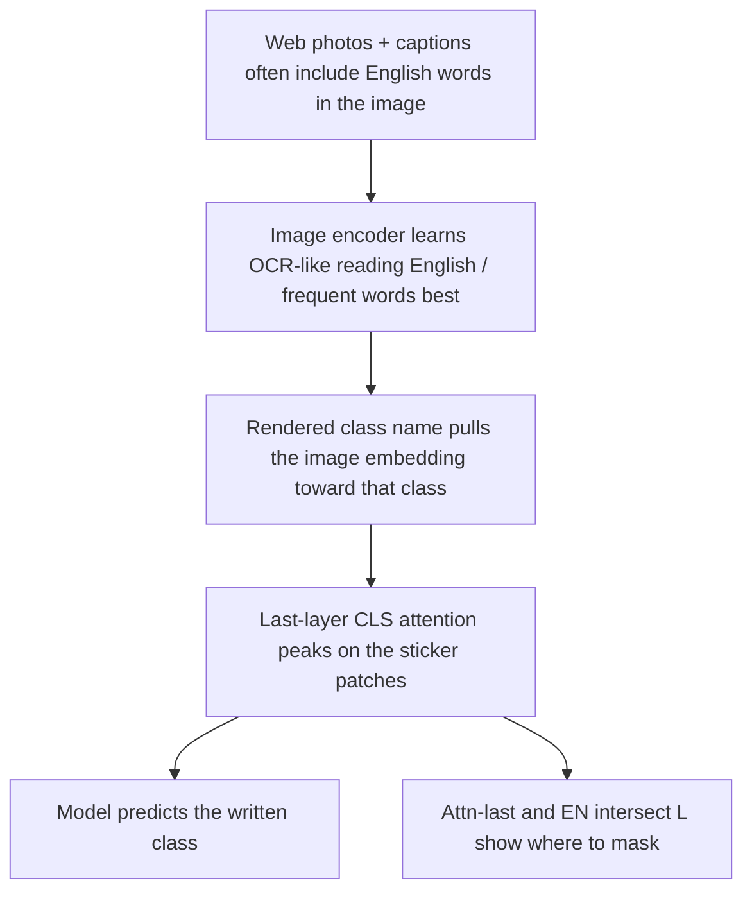

# Why Does CLIP Focus on Typographic Text (Even Though It’s “Just Letters”)?

**Purpose:** Plain-language mechanism note for the paper’s Introduction / Methods.  
**Scope:** Why CLIP attends to and is swayed by class-name overlays painted on an image.  
**Deeper sources:** [`../claude_experiments/TYPOGRAPHIC_MECHANISM_UPGRADE.md`](../../claude_experiments/TYPOGRAPHIC_MECHANISM_UPGRADE.md), [`research_diary.md`](../research_diary.md) (Latin saliency + Attn-last), [`paper_draft.md`](../paper_draft.md).

---

## Short answer

CLIP does **not** treat sticker letters as meaningless decoration. During web training it learned that **written words in an image are often a valid clue about what the image is**. So when someone paints `"dog"` on a photo of a cat, the image encoder pulls the embedding toward the dog concept, last-layer attention peaks on the sticker, and the top-1 label flips — even though a human still sees a cat with some letters on it.

In one line: **letters are a trained classification feature, not noise.**

---

## 1. What a typographic attack is

CLIP-style models classify by comparing an **image embedding** to **text embeddings** of class names (“a photo of a dog”, …). A **typographic attack** does not need gradients or invisible noise. You just **draw a wrong class name** onto the pixels (a white box with black text, a sticker, a sign). The object stays the same; the prediction often does not.

The classic demo (Goh et al., Distill 2021 / OpenAI-era CLIP demos): put a paper saying “iPod” on an apple, and the model says “iPod.”

From a human point of view this feels odd — “they’re only letters.” From the model’s point of view the letters are **more of the same signal** it was rewarded for using: visual patterns that match language.

---

## 2. Why letters can outweigh the object

### 2.1 Training turns text-in-image into a feature

Contrastive image–text training pushes the image encoder so that pictures and matching captions land nearby. Real web photos often contain readable text that agrees with the caption (product packaging, memes, street signs, screenshots). The ViT therefore learns **glyph detectors**: patterns of Latin (and some other) characters that move the embedding toward the related concept.

So when an attacker overlays a **class name that already exists in the label set**, they are injecting a cue the model already trusts — sometimes more strongly than the object pixels, especially if the sticker is large and high-contrast.

**Intro punchline:** the attack works because reading in-image text was useful in training, not because the model “forgot” it was looking at an image.

### 2.2 Reading ability is uneven (English / frequency bias)

Not every script is read equally well. On a **shared multilingual CLIP**, isolating reading from object competition — render **only the word** on a blank gray background — shows a clear ladder (OCR probe; chance ≈ 10%):

| Writing language | Script | Reads → English concept | Reads → own-language label |
| --- | --- | ---: | ---: |
| English | Latin | **100%** | 100% |
| German / French / Spanish | Latin | 40–67% | ~93–100% |
| Chinese / Korean / Japanese | CJK | 13–23% | 13–30% |
| Hindi | Devanagari | 7% | 13% |

Two further checks rule out easy alternatives:

1. **Romanization:** writing Korean/Japanese/Chinese words in Latin letters (e.g. “gae”, “inu”) still only reaches ~20–23% → English concept. So it is mostly **which word / how often it appeared in training**, not “Latin shapes look special” by themselves.
2. **Override dose-response:** on real photos, growing the font makes **English** attacks much stronger (roughly 39% → 71% ASR), while huge non-English text stays weak (≤ ~4%). Weak reading can recognize a word in isolation yet still lose to a real object; only strong (mostly English) reading wins the tug-of-war.

**Mechanism sentence:** typographic success tracks how well the encoder maps in-image words to concepts; that ability is dominated by English vocabulary frequency in web data.

Full tables and scripts: [`../claude_experiments/TYPOGRAPHIC_MECHANISM_UPGRADE.md`](../../claude_experiments/TYPOGRAPHIC_MECHANISM_UPGRADE.md).

### 2.3 Separate per-language CLIPs: Latin is still the universal threat

The defense paper uses **separate** EN / ZH / KO / JA CLIP models (not one shared multilingual encoder). The same story shows up as an attack landscape:

- **English overlays** hurt every model badly (early n=200 4×4: EN ASR ~94.5%, KO ~86%, JA ~90%, ZH ~65% under EN attack).
- **Native-script overlays** (Hangul, CJK) transfer poorly to foreign models — often treated as irrelevant texture rather than a class label.

Why? All four ViTs still saw lots of **Latin / English** co-occurring with image content in web-scale data, so Latin class names remain classification-relevant across the ensemble. Hangul/CJK usually do not, except on models trained to rely on them. ChineseCLIP is partly an exception: it is **less hijacked by Latin** than OpenAI EN CLIP even before defense (higher residual accuracy under EN stickers), consistent with Chinese-caption training giving Latin overlays less label weight.

Optional fairness gloss: a language looking “robust” to typographic attack is often just the encoder **not reading that script well** — the same gap that hurts legitimate multilingual utility. See [`../claude_experiments/RESEARCH_DIRECTION_fairness_security_tradeoff.md`](../../claude_experiments/RESEARCH_DIRECTION_fairness_security_tradeoff.md).

---

## 3. Why saliency “focuses” on the sticker (attention hijack)

Reading ability explains **why the label flips**. Attention maps explain **where the model is looking** when it flips — which is what the spatial defense uses.

### 3.1 The attack redirects last-layer attention

In a ViT, the **CLS token’s attention in the last block** is a direct answer to: “which patches mattered right before the decision?” Under a typographic attack, that mass concentrates on the sticker patches. The overlay does not merely add a weak bias somewhere in the network; it **hijacks the focus** of the decision pathway.

That is why blacking out or blurring the sticker region often restores the object class: you removed the cue the model was actually using.

### 3.2 Why Attn-last beats GradCAM for this threat

| Signal | What it measures | Behavior on typographic stickers |
| --- | --- | --- |
| **Attn-last** | CLS attention in the final transformer block (free with the forward pass) | Sharp, sparse peaks on the text; tight masks; strong defended accuracy |
| **Attn-rollout** | Attention multiplied across layers (blended with identity) | In between — smoother, less precise |
| **GradCAM** | Gradients flowed back to early activations | Smeared across sticker **and** object → larger, messier masks that also hurt clean images |

Intuition: Attn-last reads the hijacked attention **one hop** from the decision. GradCAM must push a gradient through all layers, which blurs the spatial story.

Empirically (EN∩ZH intersection defense setting): Attn-last reached higher defended accuracy with much lower coverage than GradCAM (diary: ~72.6% vs ~33.1% defended, ~7.7% vs ~26.6% coverage — exact protocol in [`research_diary.md`](../research_diary.md) / attention-defense notes).

### 3.3 Attack detector: spiky vs spread

Typographic stickers make Attn-last heatmaps **spiky** (mass in a few hot peaks). Clean images look **spread**. That shape difference is what the gated detector uses so occlusion runs mainly when a sticker is present (high fire rate on attack, low on clean). Details: [`../lib/notebooks/attack_detector/`](../../lib/notebooks/attack_detector/).

### 3.4 Text-reading heads help explain, but occlusion is what recovers accuracy

Published interventions (Dyslexify, SamplingTAR) mine **heads** that attend from CLS to sticker patches (“text-reading heads”). Ablating those heads alone barely restores EN accuracy (~12–20%). Hybrids that **blur the attended patches** jump to ~67% EN — still below gated black occlusion (~73% EN atk), but enough to show the important lever is **spatial focus on the letters**, not head surgery by itself.

**Methods punchline:** localize where hijacked attention agrees across **EN ∩ L**, shape those peaks into sticker boxes (`cc_bbox`), fill with black, reclassify — and gate that repair with the spiky/spread detector.

---

## 4. Putting the layers together

| Layer | Claim | What it explains |
| --- | --- | --- |
| 1. Training | In-image words co-occur with captions → glyphs become class cues | Why “just letters” can dominate an object |
| 2. Frequency / English bias | OCR probe + romanization + font-size override | Why English stickers are strongest |
| 3. Cross-model Latin salience | Separate EN/ZH/KO/JA attack matrix | Why EN anchors the threat model and EN ∩ L defense |
| 4. Attention hijack | Attn-last peaks on stickers; GradCAM smears; detector is spiky | Why we mask with Attn-last (and gate) |

Nothing here requires new runs for the outline: OCR probe / romanization / override live under `claude_experiments/`; Latin asymmetry, Attn-last vs GradCAM, detector, and head-hybrid numbers live in the diary / homework / baseline docs.

---

## 5. How to put this into the paper

Use this note as a **source**, not as a dump into one section. Split by job:

| Paper section | What to take from this note | How much |
| --- | --- | --- |
| **Intro §1.1 (motivation)** | Typographic attack = model *reads* overlay as a label; cite Goh / typographic lit; contrast with invisible adversarial noise; one sentence that letters are a trained cue | 1 short paragraph |
| **Intro §1.2.1 (English-centric threat)** | Latin / English is the universal cross-model attacker; native scripts transfer poorly; why every defense pairing includes EN | 1 paragraph + key ASR numbers |
| **Intro (optional)** | 2–3 sentence mechanism preview: training-frequency reading → attention on stickers → spatial defense | No OCR tables |
| **Methods §2.3 (attack construction)** | Dual-box Pure E / E+L / Pure L only; one sentence pointing back to EN-centric threat | Operational, not a theory essay |
| **Methods §2.4 (saliency / gate)** | Attention hijack → prefer Attn-last over GradCAM; spiky vs spread detector; EN ∩ L + `cc_bbox_black` | 1 paragraph + figure pointer |
| **Related Work / Discussion / appendix** | Full OCR-probe, romanization, override tables; fairness↔security “robustness = can’t read” gloss | Optional depth |

### Placement rules

1. **Intro sells the phenomenon; Methods sells the measurement.** Intro: “CLIP reads stickers because training made text a cue, and English is the worst case.” Methods: “Therefore we read last-layer attention, intersect EN with partner L, and occlude.”
2. **Do not put full OCR / romanization tables in Methods** unless this paper claims those probes as a contribution. For the Thread B defense paper, treat them as **supporting mechanism** (cite prior experiment or appendix) and keep Methods on Attn-last + gate + `cc_bbox_black`.
3. **One figure idea for Methods:** attacked image → Attn-last (spiky on sticker) vs clean (spread) → EN ∩ L mask → black fill → restored class. That single figure carries Layer 4 without a long prose detour.
4. **Tone:** keep the “just letters” intuition in Intro (reader empathy), then immediately reframe as trained visual evidence — do not leave the paradox unexplained.

### Suggested outline sync target

When drafting prose, expand [`paper_draft.md`](../paper_draft.md) §1.1 / §1.2.1 from Layers 1–3, and add a short Methods bullet block **“Why Attn-last localizes stickers”** from Layer 4. This file remains the long-form explanation you compress from.
