# Phase A/B gated occlusion figures

Open this file with **Markdown Preview** (`Ctrl+Shift+V`) to see images. Source editor only shows the image syntax as text.

Canonical copies also live under `lib/notebooks/attack_detector/results/{L}/multi/`.

## ZH

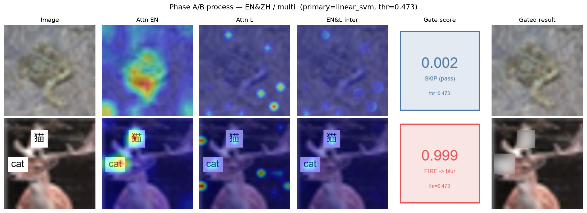

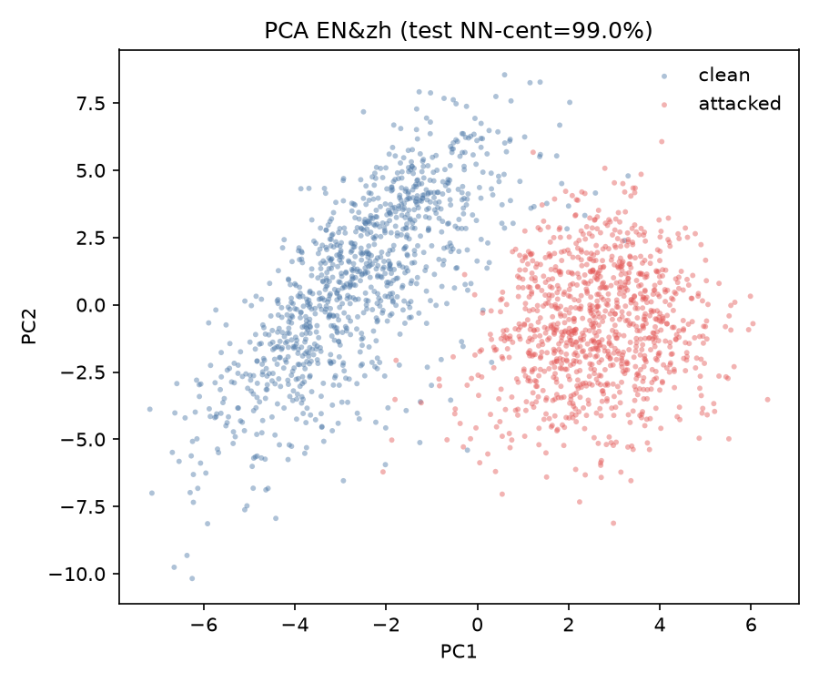

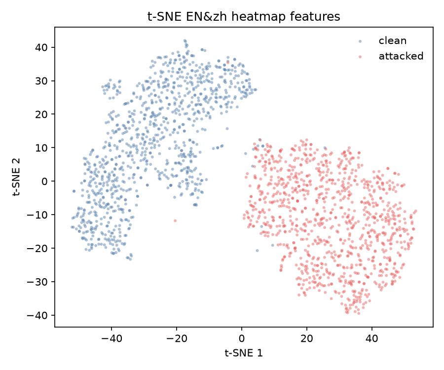

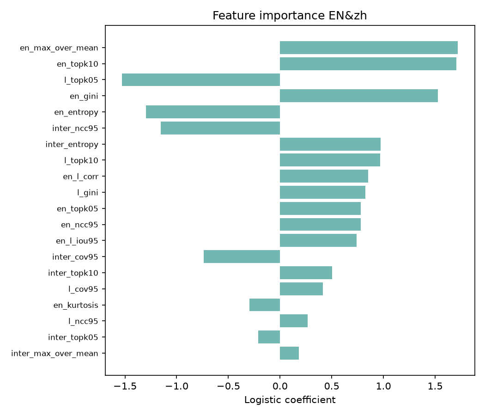

## KO

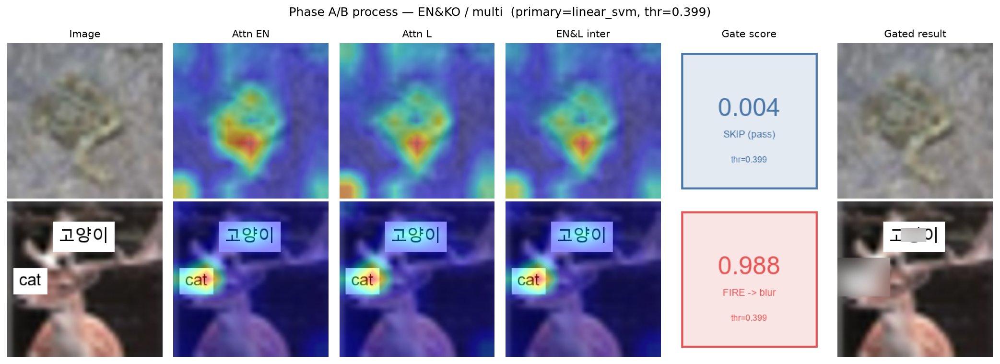

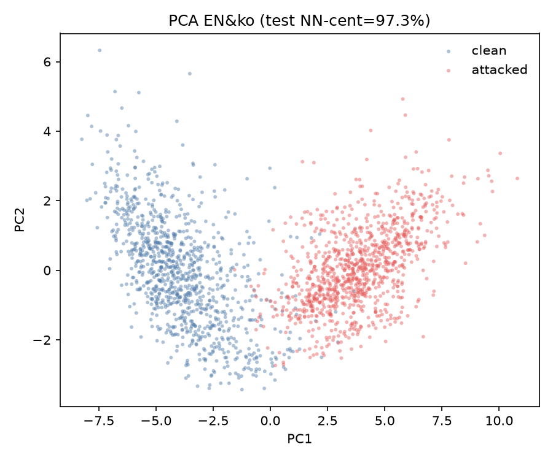

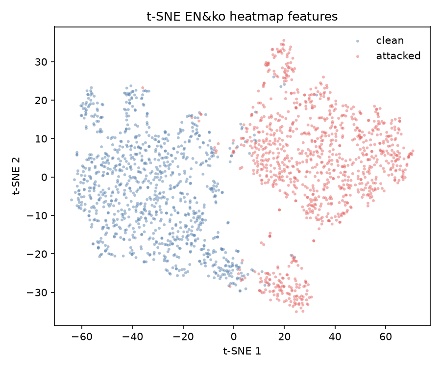

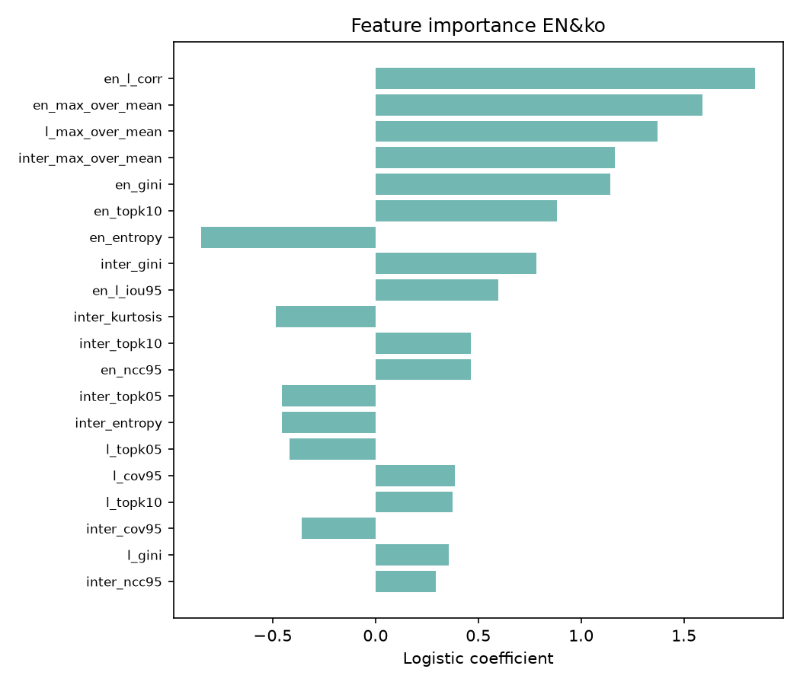

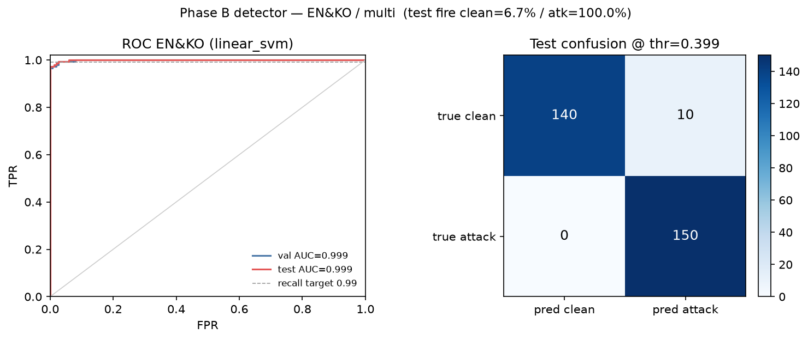

## JA

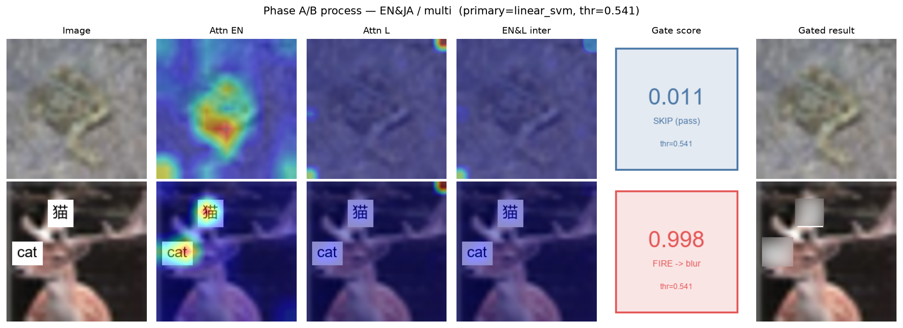

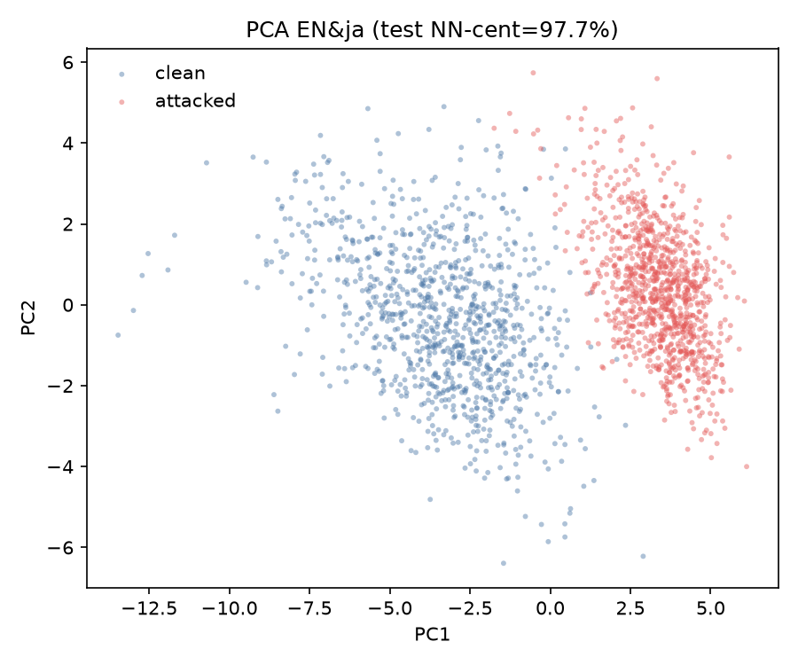

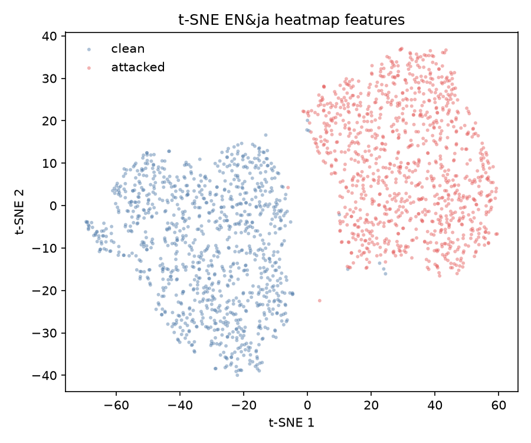

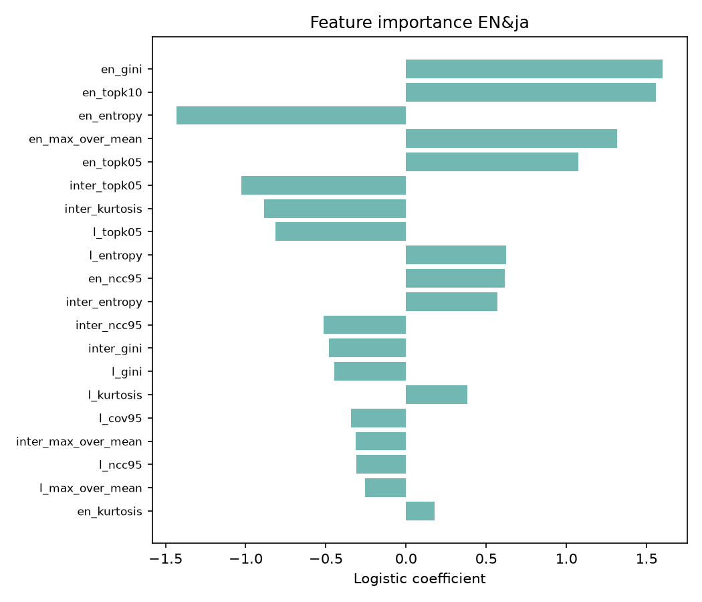

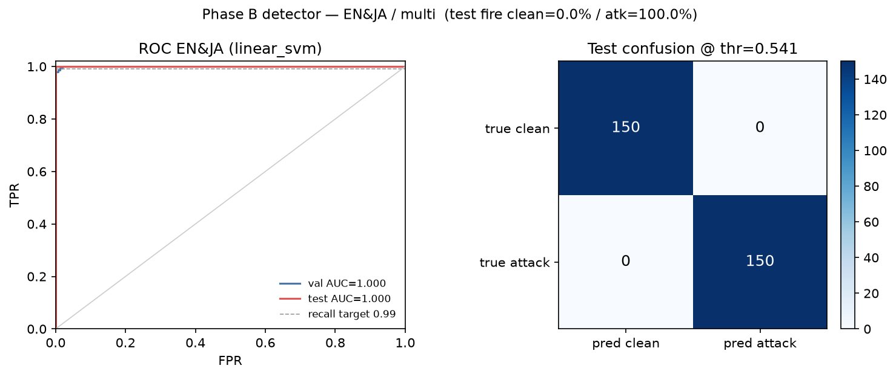
