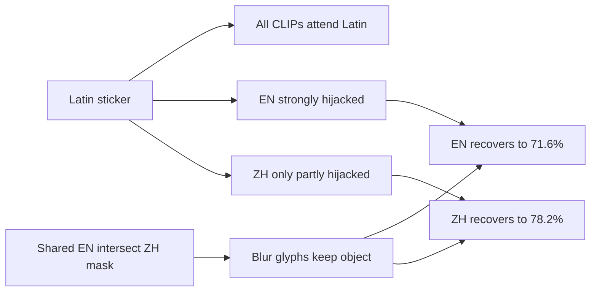

# Homework Summary — July 25, 2026

**Project:** Defending multilingual CLIP classifiers against typographic (text-overlay) attacks on CIFAR-10.  
**Audience:** Quick briefing for professor meeting — what was done **today**.

> Older briefings: [`homework_summary_archive.md`](homework_summary_archive.md).  
> Protocol: [`PROTOCOL.md`](../lib/notebooks/PROTOCOL.md).  
> Baselines: [`baseline_comparison.md`](baseline_comparison.md).  
> Current stack / failure modes: [`failure_analysis.md`](failure_analysis.md).  
> Full diary for today: [`research_diary.md`](research_diary.md) (2026-07-25 entries).

**Shared protocol for all tables below unless noted:** frozen dual-box CIFAR-10 n=1000 (`CIFAR10_BALANCED_1000_SAMPLE` + `attack_pos`), 224×224, attack = `multi`, thr ≥ 0.95, CUDA.  
**MIXED2000:** `0.5 * attacked_acc + 0.5 * clean_policy_acc`.

---

## One-paragraph overview

Today I locked the production defense as **gated `cc_bbox_black`**: the Attn-last detector gate is a core pipeline stage (not optional), and the occlusion fill is solid **black** (blur / mean / ViT-token neglect are ablations). On English CLIP, gated black reaches **72.9% atk / 85.8% clean / 79.35% MIXED2000** — **+1.45pp** MIXED over gated blur, but still **−2.30pp** vs Defense-Prefix’s EN MIXED **81.65%**. An occlusion-only chase (incl. OCR∪Attn) could not clear that bar (best **79.70%**). I also finished a fair **ZH Defense-Prefix** (ZH **44.5%**, EN+ZH mean **59.2%**), Dyslexify/SamplingTAR **hybrids** (EN **66.9% / 67.3%**), detector Phase A/B visualization for ZH/KO/JA, a failure-analysis write-up, synced the paper outline to match the new stack, and wrote up **why ZH recovers higher than EN after the same occlusion** (Latin-script / training asymmetry + floors — not a ZH-favoring mask).

---

## What was done

### 1. EN fill ablations — neglect vs blur vs mean vs black

Gated Attn `cc_bbox`, EN score. Prefer **black**; still below DP EN MIXED **81.65%**.

| Fill (gated) | EN atk | EN clean | EN MIXED2000 | vs DP |
| --- | ---: | ---: | ---: | --- |
| neglect | 60.5% | 85.9% | 73.20% | below |
| blur | 69.9% | 85.9% | 77.90% | below |
| mean | 70.4% | 85.9% | 78.15% | below |
| **black** | **72.9%** | **85.8%** | **79.35%** | −2.30pp |
| Defense-Prefix (bar) | 73.8% | 89.5% | **81.65%** | — |

Full data (oracle, always-on, DP+spatial escalate): [`research_diary.md` § 2026-07-25 — EN neglect vs Gaussian blur](research_diary.md#L2604).

---

### 2. Occlusion-only chase of DP EN MIXED 81.65% (no DP in winner)

Best attention-only vs OCR∪Attn (logged only). Did **not** beat DP.

| Arm | EN atk | ASR | EN MIXED2000 | vs DP |
| --- | ---: | ---: | ---: | --- |
| gated `cc_bbox` black (ours) | **72.9%** | 3.7% | **79.35%** | −2.30pp |
| gated OCR∪`cc_bbox` black | 73.6% | 3.1% | **79.70%** | −1.95pp |
| Defense-Prefix (bar) | 73.8% | 16.4% | **81.65%** | — |

Full data (ensembles, pick counts, ceiling math): [`research_diary.md` § 2026-07-25 — Occlusion-only chase of DP EN MIXED2000](research_diary.md#L2670).

---

### 3. ZH Defense-Prefix (ChineseCLIP CIFAR retrain)

Fair ZH DP token; EN+ZH mean collapses vs spatial peers.

| Lang | Defended acc | ASR | Clean Δ | MIXED2000 |
| --- | ---: | ---: | ---: | ---: |
| EN (prior) | **73.8%** | 16.4% | +0.5pp | **81.65%** |
| ZH (new) | **44.5%** | 52.5% | +0.4pp | **68.15%** |
| Mean EN+ZH | **59.2%** | — | +0.45pp | **74.90%** |

Full data (train protocol, Gate A): [`research_diary.md` § 2026-07-25 — ZH Defense-Prefix](research_diary.md#L2510).

---

### 4. Dyslexify / SamplingTAR hybrids (heads + attn-guided blur)

Occlusion, not head ablation alone, drives recovery. Still below gated black.

| Method | Mode | EN atk | Clean Δ | MIXED2000 |
| --- | --- | ---: | ---: | ---: |
| Dyslexify | heads | 20.0% | 0.0pp | 52.95% |
| Dyslexify | **hybrid** | **66.9%** | −8.1pp | **72.35%** |
| SamplingTAR | heads | 11.6% | +0.2pp | 48.85% |
| SamplingTAR | **hybrid** | **67.3%** | −8.3pp | **72.45%** |

Full data (heads, `score_frac`, smoke ladder): [`research_diary.md` § 2026-07-25 — Dyslexify / SamplingTAR hybrids](research_diary.md#L2724).

---

### 5. Detector Phase A/B visualization (ZH / KO / JA)

Gallery: [`docs/figures/attack_detector/gallery.html`](figures/attack_detector/gallery.html).

| Partner | PCA NN-cent. test | Test AUC | Fire clean / atk (n=1000) |
| --- | ---: | ---: | ---: |
| ZH | 99.0% | **1.000** | 0.4% / 99.8% |
| KO | 97.3% | **0.999** | 2.5% / 99.4% |
| JA | 97.7% | **1.000** | 0.3% / 99.8% |

Full data (thresholds, CMs, figure list): [`research_diary.md` § 2026-07-25 — Phase A/B gated occlusion visualization](research_diary.md#L2547).

---

### 6. Failure analysis + paper outline sync

- [`failure_analysis.md`](failure_analysis.md) — locked “ours” as gated `cc_bbox_black`; quote/do-not-claim list (79.35% = MIXED, not atk-only).
- [`paper_draft.md`](paper_draft.md) — gate = core; fill = black; lead gated Clean Δ + MIXED2000 + EN gated-black.

No single diary entry for this write-up pass; numbers live in the Jul 25 diary sections above + [`failure_analysis.md`](failure_analysis.md).

---

### 7. Why ZH > EN after occlusion, and EN headroom vs baselines

**Verdict**

1. **ZH higher post-occlusion accuracy is mostly script/training asymmetry + higher ZH floors**, not a better ZH-specific mask.
2. **Pure EN occlusion already beats every EN baseline except Defense-Prefix.** Clearing DP’s EN MIXED2000 **81.65%** without DP text tokens looks infeasible from current ceilings; **DP + spatial** is the only path that has cleared it.

**Same defense, two models** (`cc_bbox_blur`: EN∩ZH Attn-last ∩ thr≥0.95 → top-2 CC → bbox → Gaussian blur r=12; dual-box `multi`, n=1000):

| Model | Clean | Atk (no def) | After occlusion |
| --- | ---: | ---: | ---: |
| **EN** OpenAI ViT-B/32 | 85.9% | ~4.3–4.5% | **71.6%** |
| **ZH** ChineseCLIP ViT-B/16 | 91.4% | ~6.4–7.3% | **78.2%** |

Sources: [`baseline_comparison.md`](baseline_comparison.md); diary Latin-script asymmetry (~L894–1032) + `cc_bbox_blur` results.

**Mechanism (in order of importance)**

| Factor | Claim |
| --- | --- |
| Latin universally class-relevant | Web-trained CLIPs treat English overlays as classification signal; Hangul/CJK overlays mostly do not transfer the other way |
| ChineseCLIP less sensitive to Latin even before defense | Under EN attack ZH historically ~27–33% vs EN ~5%; Chinese-caption training → Latin overlay carries less label signal |
| Higher ZH floors amplify post-defense gap | Clean 91.4% vs 85.9%; slightly higher undefended atk → same residual sticker leakage hurts EN more |
| Not primarily patch size | EN 7×7 (B/32) vs ZH 14×14 (B/16); swapping EN→ViT-B/16 did **not** help defense (`vit16_en/`) |
| Mask is shared, not ZH-favoring | Dual-box oracle: covering the **EN** sticker matters for both; ZH-only occlusion barely helps. Same mask → ZH still +6.6pp → residual Latin remains more toxic to EN |

**Can EN occlusion beat all other EN baselines?**

| EN baseline | EN atk / MIXED2000 | Ours best occlusion-only | Status |
| --- | ---: | ---: | --- |
| Dyslexify heads / hybrid | 20.0% / 66.9% (MIXED ~72.35%) | gated OCR∪`cc_bbox` black **73.6%** atk, **79.70%** MIXED | **Already beat** |
| SamplingTAR heads / hybrid | 11.6% / 67.3% (MIXED ~72.45%) | same | **Already beat** |
| OCR + blur | 72.8% EN; MIXED ~79.05% | 73.6% / **79.70%** | **Already beat** (narrowly) |
| **Defense-Prefix** | **73.8%** atk, clean 89.5%, **81.65%** MIXED | 73.6% / **79.70%** | **Not beaten** (−1.95pp MIXED) |

Paper **mean EN+ZH** view: ours always-on blur **74.9%** already beats OCR **73.8%** and DP mean **59.2%** (ZH DP collapses to 44.5%).

**What was already tried for EN today** (see §§1–2): fill ranking black > blur > mean ≫ neglect; gated black **79.35%** / OCR∪ black **79.70%**; oracle GT+black EN atk only **74.6%** ≪ **77.4%** needed to clear DP at gated clean ≈85.9%; conf-drop ensemble does not beat always-black; **DP + patch-zero** reaches MIXED **86.65%** (only successful “beat DP” path).

**Realistic further options**

| Path | Likely outcome | Notes |
| --- | --- | --- |
| More occlusion tuning (thr, dilate, fills, OCR∪) | **Unlikely to clear 81.65%** | Oracle already below needed atk |
| Emphasize mean EN+ZH + Clean Δ in paper | **Already wins that leaderboard** | Matches [`baseline_comparison.md`](baseline_comparison.md) |
| DP + spatial for EN-only SOTA | **Already clears DP** (86.65%) | Different claim than occlusion-only |
| Cross-model disagreement / ZH vote to rescue EN | Untested | Ensemble family, not better EN occlusion |
| Train EN adapter / stronger EN backbone | Open, expensive | Outside current stack |

**Recommendation:** Treat EN-only DP as a different defense class. For the occlusion paper claim, keep emphasizing **mean EN+ZH + Clean Δ**. If the goal is literally best EN MIXED2000, ship **DP+spatial**, not more fill ablations. Do **not** re-run fill/OCR∪ chases. Optional high-signal test still open: when gate fires and EN/ZH top-1 disagree after occlusion, take ZH’s class (or conf-weighted mix) and score whether EN MIXED2000 can exceed **81.65%** without DP tokens. Otherwise close the occlusion-only EN chase on the oracle ceiling (**74.6% ≪ 77.4%**).

---

## Numbers to quote in a meeting

| Claim | Number |
| --- | --- |
| EN gated black (atk / clean / MIXED) | **72.9% / 85.8% / 79.35%** |
| Gate fire (atk / clean) | **99.8% / 0.4%** |
| vs gated blur (EN MIXED) | **+1.45pp** (79.35 − 77.90) |
| vs DP EN MIXED2000 | **−2.30pp** (79.35 vs 81.65) |
| Oracle GT + black EN atk ceiling | **74.6%** |
| EN atk needed to clear DP at clean 85.9% | ≳ **77.4%** |
| Best OCR∪Attn black MIXED (not production) | **79.70%** |
| Fill ranking (gated EN MIXED) | black > mean > blur > neglect |
| ZH DP defended / ASR / Clean Δ | **44.5% / 52.5% / +0.4pp** |
| DP EN+ZH mean | **59.2%** |
| Dyslexify hybrid EN / MIXED / Clean Δ | **66.9% / 72.35% / −8.1pp** |
| SamplingTAR hybrid EN / MIXED / Clean Δ | **67.3% / 72.45% / −8.3pp** |
| DP + patch-zero hybrid EN MIXED (different system) | **86.65%** |
| Always-on blur EN / ZH defended (same mask) | **71.6% / 78.2%** |
| Occlusion-only EN vs DP EN MIXED (best OCR∪) | **79.70%** vs **81.65%** (−1.95pp) |

---

## Next steps

1. Write the paper (outline already synced to gated black).
2. Optional experiments: Pure E / Pure L under the gate; partner ZH/KO/JA black re-run for bilingual MIXED with production fill; close residual ~**13pp** EN atk→clean gap (72.9% vs ~85.9%).
3. Do **not** re-chase occlusion-only vs DP with more fills (oracle closed that). Optional only: ZH-disagreement vote after gated occlusion for EN MIXED > 81.65% without DP.

---

## One breath

> Detect with Attn-last heatmap shape, localize where EN ∩ L agree, black-fill the sticker boxes, reclassify. EN gated black is **72.9% atk / 85.8% clean / 79.35% MIXED2000** — better than blur (**+1.45pp** MIXED), still short of DP’s **81.65%** on EN alone (−2.30pp); bilingual means still favor spatial once ZH DP (**44.5%**) is included. ZH recovers higher than EN after the same mask (**78.2% vs 71.6%**) mainly from Latin-script / training asymmetry, not a ZH-favoring mask. Head surgery alone fails; hybrids (~67% EN) confirm occlusion is what recovers accuracy.

---

## Key paths

| Work | Path |
| --- | --- |
| EN fill / black ranking + leaderboard JSON | `lib/notebooks/en_neglect_vs_blur/results/` |
| Occlusion vs DP chase JSON | `lib/notebooks/en_occlusion_beat_dp/results/summary_n1000.json` |
| ZH + EN Defense-Prefix merged | `lib/notebooks/paper_baselines/defense_prefix/results/comparison_summary_final_n1000_en_zh.json` |
| Dyslexify hybrid | `lib/notebooks/paper_baselines/dyslexify/results/comparison_summary_final_n1000_hybrid.json` |
| SamplingTAR hybrid | `lib/notebooks/paper_baselines/sampling_tar/results/comparison_summary_final_n1000_hybrid.json` |
| Phase A/B roll-up | `lib/notebooks/attack_detector/results/phase_ab_viz_rollups.json` |
| Detector figures gallery | `docs/figures/attack_detector/gallery.html` |
| Failure analysis | `docs/failure_analysis.md` |
| Paper outline | `docs/paper_draft.md` |
| Baseline leaderboard | `docs/baseline_comparison.md` |
| Archive (Jul 20–24 and earlier) | `docs/homework_summary_archive.md` |
| Diary (today) | `docs/research_diary.md` (2026-07-25) |
