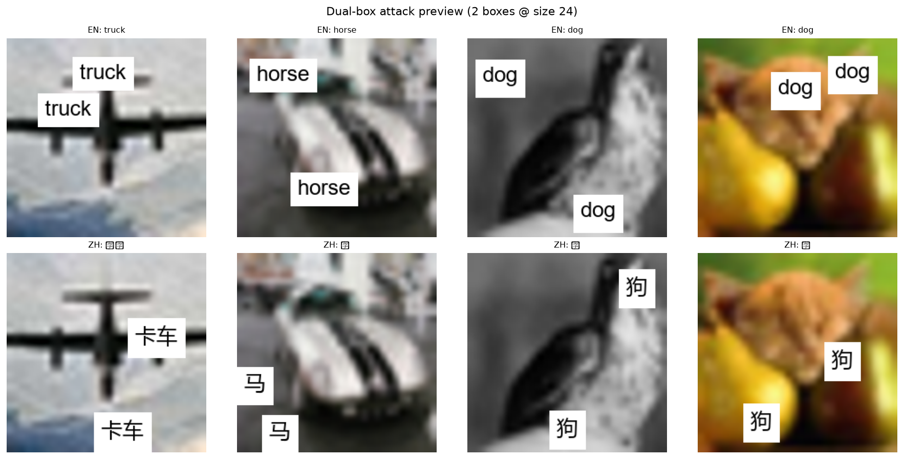

# Paper Draft — Outline Only

**Working title (placeholder):** Cross-Lingual Attention Intersection as a Spatial Defense Against Typographic Attacks on Multilingual CLIP  
**Status:** Outline / idea map — not prose. Expand each bullet into paragraphs later.  
**Scope of this draft:** Thread B defense line (separate per-language CLIPs + typographic attacks + saliency masking). Thread A (shared multilingual CLIP + PGD) can be mentioned briefly as motivation / contrast, not as the main contribution.

---

## 1. Introduction

### 1.1 Motivation — why this problem matters
- Vision–language models (CLIP-style) do zero-shot image classification by matching images to text class names.
- **Typographic attacks:** overlaying adversarial class-name text on the image can flip the prediction even though the object is unchanged (cite typographic-attack / CLIP vulnerability literature).
- Unlike invisible pixel-level adversarial noise, these attacks are human-visible but still fool models that “read” text in the image.
- Practical risk: any deployed CLIP-like classifier that sees photos containing text (signs, stickers, UI overlays).

### 1.2 Multilingual angle — why languages enter the story
- Prior idea: use **multiple languages** so an attack tuned to one language fails on others (shared-encoder multilingual CLIP defenses vs separate encoders).
- Short contrast (1–2 sentences): on a **shared** image encoder, language disagreement often fails as a detector under gradient attacks (Thread A finding — cite as background, not main result).
- This paper focuses on **separate per-language CLIP models** (EN, ZH, KO, JA) under **typographic** (text-overlay) attacks.

### 1.3 Gap — detection alone is not enough
- Prediction disagreement across models can flag some attacks (modest AUC), but does not restore the correct label.
- Need a **spatial defense**: find and neutralize the text sticker(s), then reclassify.
- Existing saliency tools (GradCAM) are a natural candidate but may be costly / imprecise for small text boxes.

### 1.4 Core idea (contribution preview)
- Cross-lingual **attention agreement**: mask where English CLIP and a partner-language CLIP both attend (intersection).
- Prefer **last-layer attention** over GradCAM (cheaper + more accurate in our setting).
- Post-process the mask into sticker-shaped regions and soft-occlude with blur (`cc_bbox_blur`).
- Evaluate under uni- and multilingual dual-box attacks; transfer EN/ZH recipe to KO and JA.

*Figure idea (intro / method teaser): attacked image → Attn-last EN/ZH → intersection → CC+bbox → blur fill.*

### 1.5 Contributions (bullet list for the paper’s claim set)
- Show that **EN ∩ L attention intersection** recovers accuracy under dual-box typographic attacks on CIFAR-10.
- Show **Attn-last beats GradCAM** on accuracy, compute cost, and clean-image side effects (with ZH-only as the caveat).
- Introduce / validate **`cc_bbox_blur`** (connected-component bbox snap + blur fill) as a cheap refinement over raw attention masks.
- Show transfer of the defense to **KO and JA** partner models; document and partially mitigate higher clean-image damage.
- Provide a **negative baseline**: coarse grid occlusion (even with conf-drop scoring) remains weaker and much more expensive than attention.

### 1.6 Paper roadmap (one sentence)
- Section 2 methods → Section 3 results (EN/ZH ablations, then 4-lang transfer) → Section 4 conclusion / limitations / next steps.

---

## 2. Method / Materials

### 2.1 Dataset and evaluation protocol
- **Dataset:** CIFAR-10; balanced 1000-image evaluation set (tune thresholds on a 100-image subset, freeze, then full n=1000).
- **Metrics:**
  - Top-1 accuracy after attack / after defense (per model and mean of the pair).
  - Attack success rate (ASR) where useful.
  - **Clean Δ:** accuracy change when the same defense is applied to unattacked images (side-effect cost).
  - **Coverage:** fraction of pixels masked (tight vs over-masking).
  - **Cost:** forward/backward passes per image (GradCAM vs attention vs grid search).

### 2.2 Models (separate per-language CLIPs)
- **EN:** OpenAI ViT-B/32 via `open_clip`.
- **ZH:** Chinese-CLIP ViT-B/16 (`OFA-Sys/chinese-clip-vit-base-patch16`).
- **KO:** `Bingsu/clip-vit-base-patch32-ko`.
- **JA:** `llm-jp/llm-jp-clip-vit-base-patch16` (note: earlier CLYP Japanese model was broken / near-chance — replaced).
- Clean accuracy ballpark to report: EN ~86%, ZH ~91%, KO ~90%, JA ~93%.

### 2.3 Attack construction (typographic)
- Method: render adversarial class name as text on the image (`draw_word`); no gradients.
- **Dual-box geometry** (main threat model for the defense study):
  - Two non-overlapping white text boxes, random placement, font size fixed in experiments (e.g. 24).
  - Attack types:
    - `uni_en`: both boxes English
    - `uni_l`: both boxes in partner language L
    - `multi`: one English + one L
- Earlier single-box 4×4 confusion matrices (EN/ZH/KO/JA × models) can be cited as attack-landscape background if space allows.

*Figure idea: dual-box typographic attack geometry (EN + partner language).*

### 2.4 Defense pipeline (main method)
Describe as a fixed sequence:

1. **Saliency maps** from EN model and partner model L (on the attacked image).
2. **Intersection** EN ∩ L (agreement = spatial cue that both models are “looking at” the same suspicious region).
3. **Percentile threshold** on the intersection heatmap (tuned on n=100 for attacked EN accuracy; for KO/JA later prefer thr ≥ 0.95).
4. Optional **dilation**.
5. **Mask shaping (`cc_bbox`):** keep top-2 connected components → snap each to axis-aligned bounding box (match sticker rectangles).
6. **Fill (`blur`):** Gaussian blur inside the mask (vs mean-color fill) — smash glyphs, preserve more object structure.
7. **Reclassify** both models on the defended image.

Name the full stack: **`cc_bbox_blur`** on top of Attn-last intersection.

*Figure: qualitative stages on several multilingual dual-box examples.*

*Figure: after CC+bbox shaping, blur fill vs hard mean fill.*

### 2.5 Saliency variants compared
- **GradCAM** (cost ~6) — prior / production-style baseline.
- **Attn-rollout** (cost ~4).
- **Attn-last** (cost ~4) — primary signal.
- Same intersection + masking wrapper for fair comparison.

*Figure: GradCAM vs Attn-last vs Attn-rollout on the same attacked images.*

### 2.6 Baselines and ablations to include in Methods (not full results here)
- **No defense** (attacked accuracy floor).
- **Grid occlusion search:** 4×4 patches; old max-confidence scoring vs **confidence-drop** scoring; mean vs blur fill; note high pass count (~62+).
- Heatmap ablations that failed or helped little (to justify design choices):
  - Union masks (EN ∪ L) — hurts clean images.
  - Disagreement / peakiness gating — rarely fires or too aggressive.
  - Peaked-heads only; EN ViT-B/16 instead of B/32 — no gain / worse clean Δ.
  - Attention + conf-drop hybrid — better than full grid, worse than plain Attn-last at higher cost.
- KO/JA clean-damage variants: thr floor 0.95, tighter dilate, no bbox snap, coverage cap.

*Figure idea (optional): qualitative grid-occlusion baseline.*

### 2.7 Implementation notes (short)
- Notebooks live under `lib/notebooks/` (`attention_defense`, `heatmap_defense_improvements`, `four_lang_cc_bbox_blur`, `ko_ja_clean_damage`).
- Thresholds chosen on tune set; report frozen thr / coverage alongside accuracy.
- Pipeline figure regenerator: `four_lang_cc_bbox_blur/make_pipeline_viz.py`.

---

## 3. Results

*Outline of result blocks / figures / tables — fill with exact numbers when writing.*

### 3.1 Attack landscape (brief, optional subsection)
- Idea: English text overlays are a **universal** threat across EN/ZH/KO/JA models; native-script attacks are often weaker on KO/JA.
- Point to 4×4 accuracy / ASR matrix from CIFAR-10 typographic study if needed for context.
- Disagreement detector: works modestly (above chance) but is not the main contribution of this paper.

### 3.2 Main result — Attn-last vs GradCAM vs Attn-rollout (EN/ZH)
- Table idea: attack type × method → mean defended acc, coverage, clean Δ, cost.
- Key claims to support with numbers:
  - Multilingual EN+ZH: Attn-last ~**72.6%** mean vs GradCAM ~**33%**; lower coverage; better clean Δ.
  - Unilingual EN+EN: same ranking (Attn-last ~**67.6%**).
  - Unilingual ZH+ZH: Attn-last still best or tied on accuracy (~**62.5%**), but clean damage / coverage worsen — discuss as limitation of EN attention on Chinese glyphs.
- Figure idea: bar chart of mean acc by method × attack; optional coverage / clean-Δ panel.

### 3.3 Grid-search baseline (why not “just occlude patches”)
- Old max-conf scoring barely beats no defense (~12%).
- Conf-drop scoring jumps to ~**48%** mean — proves scoring mattered — still far behind Attn-last and ~10× cost.
- Hit-pattern analysis (multi attack): covering **English** box matters much more than covering Chinese alone; hit-both best (~68% conditional).
- Role in paper: model-agnostic sanity check / upper bound on naive search, not a competing production method.

### 3.4 Heatmap refinements — path to `cc_bbox_blur`
- Ablation table: baseline Attn-last → blur_fill → cc_bbox → **cc_bbox_blur**.
- Headline numbers: **`cc_bbox_blur` ~74.9% mean, clean Δ ~−1.5pp, cost 4** (vs Attn-last 72.6% / worse clean Δ).
- Negative ablations in one compact table or appendix: gating, union, ViT-B/16, hybrid — “we tried X; it failed because Y.”
- Residual gap: still ~10–15pp below clean accuracy — leave as open problem.

### 3.5 Four-language transfer (L ∈ {zh, ko, ja})
- Design matrix: for each L, evaluate `uni_en` / `uni_l` / `multi` with EN ∩ L `cc_bbox_blur`.
- Claims:
  - ZH multi **reproduces** the EN/ZH winner (sanity check of pipeline).
  - Hard attacks (EN+EN, multi) recover to mid-60s–mid-70s mean for KO/JA as well.
  - `uni_l` often weak on KO/JA already (defense can slightly hurt); ZH `uni_l` is the exception where defense helps more.
  - KO/JA suffer larger **clean Δ** than ZH (especially when thr was tuned too low).
- Figure idea: 3×3 style panel (language × attack) of attacked vs defended mean acc + clean Δ.

### 3.6 KO/JA clean-damage mitigation
- Show baseline vs thr_floor_095 / tight_dilate / no_bbox.
- Main story: thr=0.90 on `uni_en` was self-inflicted overshoot; flooring at **0.95** recovers large clean Δ without losing defended acc (sometimes gains).
- Geometry tweaks shave residual clean damage to roughly **−7 to −11pp**; still not ZH’s −1.5pp.
- Interpretation for discussion: remaining gap is **heatmap quality** of EN∩KO / EN∩JA, not just threshold choice.

### 3.7 Summary table for the reader (results closer)
- One “leaderboard” table: method / languages / attack / mean def / clean Δ / cost.
- Highlight recommended config: Attn-last + `cc_bbox_blur`, thr ≥ 0.95; KO/JA may prefer slightly tighter geometry.

---

## 4. Conclusion

### 4.1 What we showed
- Cross-lingual attention intersection is a practical **spatial** defense for typographic attacks on separate CLIPs — not only a disagreement alarm.
- Last-layer attention outperforms GradCAM in this dual-box setting on accuracy and cost.
- Simple mask post-processing (bbox snap + blur) improves the accuracy / clean-image tradeoff without extra model passes.
- The recipe transfers beyond Chinese to Korean and Japanese for attack recovery; clean-image cost is the main language-dependent failure mode.

### 4.2 Limitations (must-include honesty)
- Evaluated on CIFAR-10 dual-box stickers — not ImageNet-scale scenes, not adaptive attackers that place text to evade attention.
- ZH-only stickers remain harder for the EN half of the intersection.
- KO/JA clean Δ still worse than ZH after mitigation.
- Residual gap to clean accuracy (~10–15pp on EN/ZH) unsolved.
- Grid / hybrid search not competitive enough to recommend despite scoring fixes.

### 4.3 Broader implications
- Separate encoders + spatial agreement may complement prediction-disagreement detectors.
- Soft occlusion (blur) is preferable to hard mean-fill when preserving object evidence matters.
- English text remains the dominant transfer threat across models — defenses should prioritize localizing Latin-script stickers.

### 4.4 Next steps / future work
- Write full paper prose + paper-ready figures from existing notebooks.
- Close residual gap to clean (better saliency, adaptive thresholds, or selective apply-only-when-attacked).
- Stronger KO/JA backbones or better EN∩L heatmap fusion.
- Test on higher-res datasets / more realistic text placements.
- Optional: combine disagreement gate (detect) with `cc_bbox_blur` (repair) in one pipeline.
- Optional contrast paragraph with Thread A (shared encoder) if the venue wants multilingual defense narrative.

### 4.5 Closing sentence (idea)
- Multilingual CLIP defenses need not stop at “do the languages agree?” — asking **where** they agree to look, then blurring that region, recovers most accuracy under typographic attack at low compute cost.

---

## Appendix ideas (optional, not required for first draft)

- Full ablation tables and failed ideas.
- Model cards / Hugging Face IDs and prompt templates.
- Example defended images (attacked → heatmap → mask → blur → prediction) — see `four_lang_cc_bbox_blur/results/pipeline_*.png`.
- Conf-drop grid hit-pattern contingency table.
- Notebook index for reproducibility.

---

## Writing checklist (when expanding outline → prose)

- [ ] Lock final title and abstract (150–200 words from §1.4–1.5 + headline numbers).
- [ ] Related Work subsection (CLIP typographic attacks; GradCAM / attention rollout; multilingual / ensemble defenses; occlusion-based defenses).
- [ ] Insert exact tables from `docs/research_diary.md` (2026-07-16 → 2026-07-19) and notebook `results/*.json`.
- [ ] Decide whether Thread A appears only in Related Work / Discussion or is omitted.
- [x] Figures linked in outline (method diagram / pipeline; main bar charts; 4-lang transfer; qualitative examples) — replace/replot at paper DPI later if needed.
