# Paper Draft — Outline Only

**Working title (placeholder):** Cross-Lingual Attention Intersection as a Spatial Defense Against Typographic Attacks on Multilingual CLIP  
**Status:** Outline / idea map — not prose. Expand each bullet into paragraphs later.  
**Scope of this draft:** Thread B defense line (separate per-language CLIPs + typographic attacks + saliency masking). Thread A (shared multilingual CLIP + PGD) can be mentioned briefly as motivation / contrast, not as the main contribution.

---

## 1. Introduction

### 1.1 Motivation — why this problem matters
- Vision–language models (CLIP-style) do zero-shot image classification by matching images to text class names.
- **Typographic attacks:** overlaying adversarial class-name text on the image can flip the prediction even though the object is unchanged (cite typographic-attack / CLIP vulnerability literature).
- Unlike invisible pixel-level adversarial noise, these attacks are human-visible but still fool models that “read” text in the image.
- Practical risk: any deployed CLIP-like classifier that sees photos containing text (signs, stickers, UI overlays).

### 1.2 Multilingual angle — four languages from the start
- Prior idea: use **multiple languages** so an attack tuned to one language fails on others (shared-encoder multilingual CLIP defenses vs separate encoders).
- Short contrast (1–2 sentences): on a **shared** image encoder, language disagreement often fails as a detector under gradient attacks (Thread A finding — cite as background, not main result).
- This paper uses **four separate per-language CLIP models — English (EN), Chinese (ZH), Korean (KO), Japanese (JA)** — under **typographic** (text-overlay) attacks.
- Defense is always **EN ∩ L**: English CLIP attention intersected with a partner-language CLIP `L ∈ {ZH, KO, JA}`. All three partners are first-class throughout Methods and Results (not an EN/ZH study with late transfer).

### 1.3 Gap — detection alone is not enough
- Prediction disagreement across models can flag some attacks (modest AUC), but does not restore the correct label.
- Need a **spatial defense**: find and neutralize the text sticker(s), then reclassify.
- Existing saliency tools (GradCAM) are a natural candidate but may be costly / imprecise for small text boxes.

### 1.4 Core idea (contribution preview)
- Cross-lingual **attention agreement**: mask where English CLIP and partner CLIP L both attend (intersection), for each `L ∈ {ZH, KO, JA}`.
- Prefer **last-layer attention** over GradCAM (cheaper + more accurate in our setting).
- Post-process the mask into sticker-shaped regions and soft-occlude with blur (`cc_bbox_blur`).
- Evaluate under three dual-box attack types — **Pure E**, **E + L**, **Pure L** — on all three partner languages.

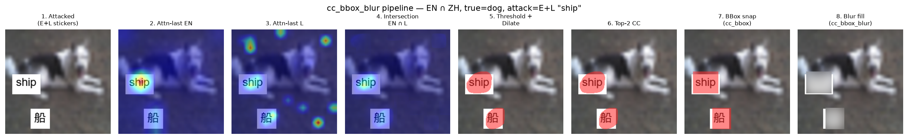

*Figure idea (intro / method teaser): attacked image → Attn-last EN ∩ L → intersection → CC+bbox → blur fill (shown for partner languages ZH / KO / JA).*

### 1.5 Contributions (bullet list for the paper’s claim set)
- Show that **EN ∩ L attention intersection** (`L ∈ {ZH, KO, JA}`) recovers accuracy under dual-box typographic attacks on CIFAR-10.
- Show **Attn-last beats GradCAM** on accuracy, compute cost, and clean-image side effects (Pure L / ZH-only as the main caveat).
- Introduce / validate **`cc_bbox_blur`** (connected-component bbox snap + blur fill) as a cheap refinement over raw attention masks.
- Show the recipe works for **all three partners (ZH, KO, JA)**; document and partially mitigate higher clean-image damage on KO/JA.
- Show the defense causes only a **minor Clean Δ** on unattacked images (≈ −1.5 pp for EN∩ZH).
- Provide a **negative baseline**: coarse grid occlusion — even with **confidence-drop scoring** or **exhaustive** 2-patch search — remains weaker and much more expensive than attention.

### 1.6 Paper roadmap (one sentence)
- Section 2 methods (4 models, 3 attack types, dataset, grid baselines) → Section 3 results (clean Δ + 4-lang transfer first; EN∩ZH ablations as the detailed case study) → Section 4 conclusion / limitations / next steps.

---

## 2. Method / Materials

### 2.1 Dataset and evaluation protocol
- **Source dataset:** CIFAR-10 (10 object classes: airplane, automobile, bird, cat, deer, dog, frog, horse, ship, truck), loaded via HuggingFace `uoft-cs/cifar10` (standard test split).
- **How the evaluation set was created:**
  - From the CIFAR-10 test split, build a **balanced 1000-image sample**: exactly **100 images per class**, drawn randomly within each class with seed 0, then shuffled.
  - Saved as [`lib/notebooks/image_samples/CIFAR10_BALANCED_1000_SAMPLE.json`](../lib/notebooks/image_samples/CIFAR10_BALANCED_1000_SAMPLE.json) (indices + true labels).
  - Replaces an earlier seed-0 random 1000 draw that was class-imbalanced (e.g. cat over-represented, horse under-represented).
  - **Attack geometry frozen in the same JSON** under `attack_pos`: per-image top-left anchors for the two dual-box slots (`en` = slot 0, `l` = slot 1), baked once with a fixed reference box size so every defense notebook shares identical sticker placement.
- **Protocol:**
  - Upscale images to 224×224 for overlays and CLIP inference.
  - Tune percentile thresholds on a **100-image** subset (10 per class), freeze, then evaluate full **n=1000**.
  - Report Clean Δ on the same 1000 images **without** attack stickers, run through the identical mask pipeline.
- **Metrics:**
  - Top-1 accuracy after attack / after defense (per model and mean of the EN+L pair).
  - Attack success rate (ASR) where useful.
  - **Clean Δ:** accuracy change when the same defense is applied to unattacked images (side-effect cost).
  - **Coverage:** fraction of pixels masked (tight vs over-masking).
  - **Cost:** forward/backward passes per image (GradCAM vs attention vs grid search).

### 2.2 Models (separate per-language CLIPs)
- **EN:** OpenAI ViT-B/32 via `open_clip`.
- **ZH:** Chinese-CLIP ViT-B/16 (`OFA-Sys/chinese-clip-vit-base-patch16`).
- **KO:** `Bingsu/clip-vit-base-patch32-ko`.
- **JA:** `llm-jp/llm-jp-clip-vit-base-patch16` (note: earlier CLYP Japanese model was broken / near-chance — replaced).
- Clean accuracy ballpark to report: EN ~86%, ZH ~91%, KO ~90%, JA ~93%.
- Defense always pairs **EN with one partner L** (never a ZH-only pipeline).

### 2.3 Attack construction (typographic)
- Method: render adversarial class name as text on the image (`draw_word`); no gradients.
- **Dual-box geometry** (main threat model):
  - Two non-overlapping white text boxes at frozen `attack_pos` coordinates.
  - Font size fixed (24 @ 224×224 in defense experiments).
- **Three attack types** (poster names; notebook codes in parentheses):

| Poster name | Notebook code | Box 0 | Box 1 |
|---|---|---|---|
| **Pure E** | `uni_en` | English | English |
| **E + L** | `multi` | English | Partner language L |
| **Pure L** | `uni_l` | Partner L | Partner L |

- For each partner `L ∈ {ZH, KO, JA}`, evaluate all three attack types under the same EN ∩ L defense.
- Earlier single-box 4×4 confusion matrices (attack language × model) provide attack-landscape background.

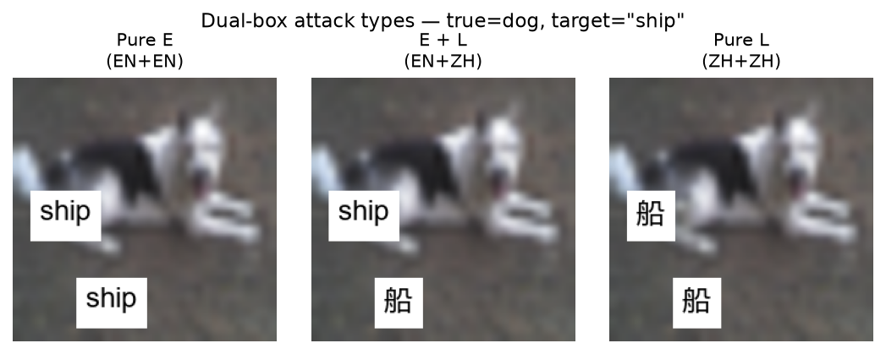

*Figure: dual-box typographic attack geometry — Pure E / E+L / Pure L (partner L = ZH here; same layout for KO/JA).*

#### 2.3.1 Why English appears in every pairing
- In the 4×4 typographic landscape, **English overlays are the universal / highest-ASR threat** across models (EN ASR ~94.5%, KO ~86%, JA ~90%, ZH ~65% under EN attack on n=200).
- Native-script Pure L attacks are weak on KO/JA (ASR near zero on foreign models; limited self-fooling).
- Framing: **English was the most affected attack language across the ensemble**, so defense evaluation centers on **Pure E** and **E + L**; Pure L is retained for completeness and to expose EN-attention limits on non-Latin glyphs.

### 2.4 Defense pipeline (main method)
Describe as a fixed sequence for any partner `L ∈ {ZH, KO, JA}`:

1. **Saliency maps** from EN model and partner model L (on the attacked image).
2. **Intersection** EN ∩ L (agreement = spatial cue that both models are “looking at” the same suspicious region).
3. **Percentile threshold** on the intersection heatmap (tuned on n=100 for attacked EN accuracy; prefer thr ≥ 0.95, especially for KO/JA).
4. Optional **dilation**.
5. **Mask shaping (`cc_bbox`):** keep top-2 connected components → snap each to axis-aligned bounding box (match sticker rectangles).
6. **Fill (`blur`):** Gaussian blur inside the mask (vs mean-color fill) — smash glyphs, preserve more object structure.
7. **Reclassify** both models on the defended image.

Name the full stack: **`cc_bbox_blur`** on top of Attn-last intersection.

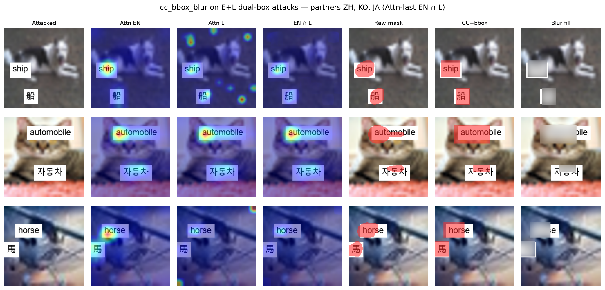

*Figure: qualitative stages on E+L dual-box examples for partners ZH, KO, and JA.*

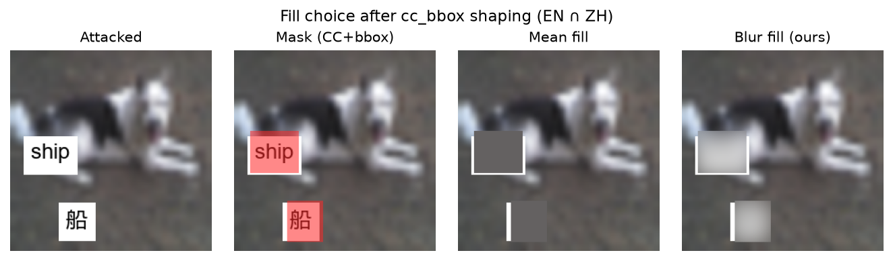

*Figure: after CC+bbox shaping, blur fill vs hard mean fill.*

### 2.5 Saliency variants compared
- **GradCAM** (cost ~6) — prior / production-style baseline.
- **Attn-rollout** (cost ~4).
- **Attn-last** (cost ~4) — primary signal.
- Same EN ∩ L intersection + masking wrapper for fair comparison (detailed ablation case study: EN∩ZH).

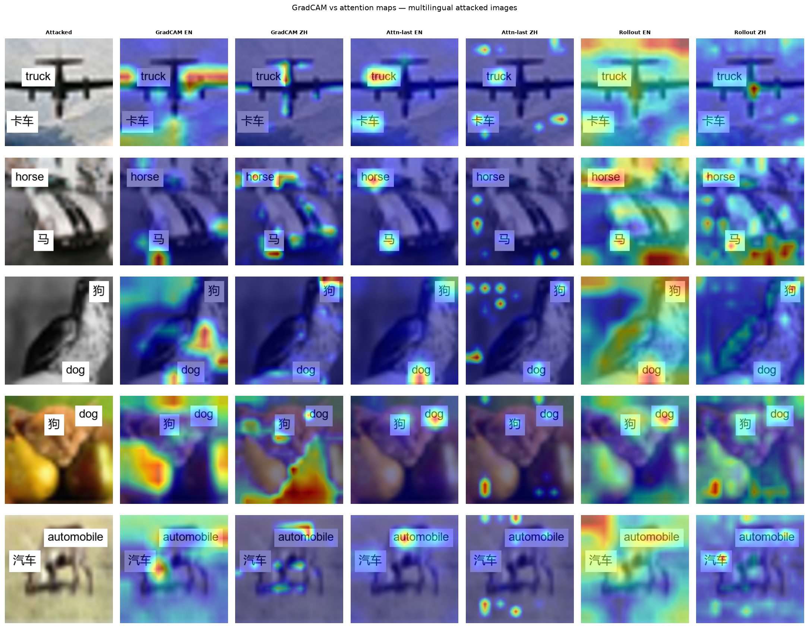

*Figure: GradCAM vs Attn-last vs Attn-rollout on the same attacked images.*

### 2.6 Baselines and ablations to include in Methods (not full results here)
- **No defense** (attacked accuracy floor).
- **Grid occlusion search** (4×4 patches) — two axes to report:
  1. **Scoring:** old **max-confidence** (keep occlusion that maximizes mean confidence) vs **confidence-drop** of the pre-defense top class.
  2. **Search:** **greedy** 2-patch vs **exhaustive** search over all C(16,2)=120 patch pairs.
  - High pass count (~62 greedy; ~240 exhaustive).
- Heatmap ablations that failed or helped little (to justify design choices):
  - Union masks (EN ∪ L) — hurts clean images.
  - Disagreement / peakiness gating — rarely fires or too aggressive.
  - Peaked-heads only; EN ViT-B/16 instead of B/32 — no gain / worse clean Δ.
  - Attention + conf-drop hybrid — better than full grid, worse than plain Attn-last at higher cost.
- KO/JA clean-damage variants: thr floor 0.95, tighter dilate, no bbox snap, coverage cap.

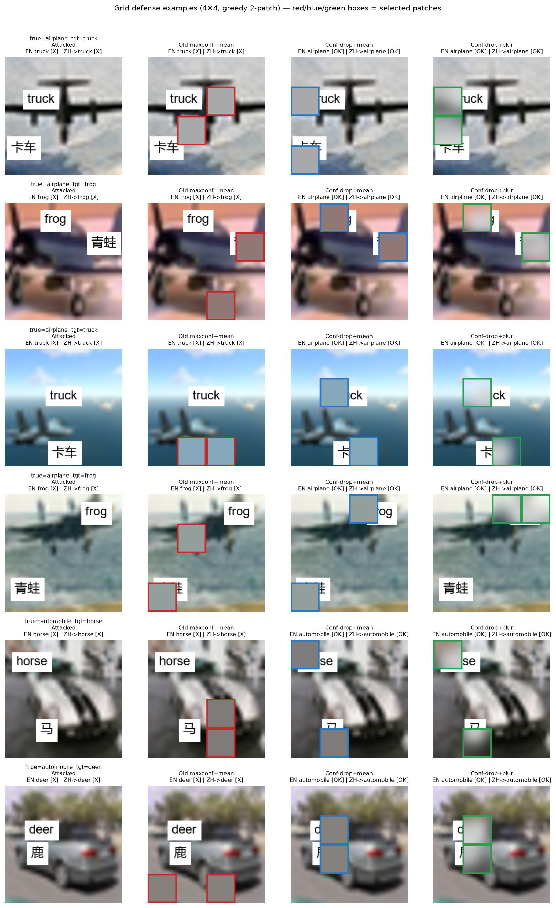

*Figure idea (optional): qualitative grid-occlusion baseline.*

### 2.7 Implementation notes (short)
- Notebooks live under `lib/notebooks/` (`attention_defense`, `heatmap_defense_improvements`, `four_lang_cc_bbox_blur`, `ko_ja_clean_damage`, grid: `_en_zh/en_zh_multi_uni_attack/_test_grid` + `_test_exhaustive_grid`).
- Thresholds chosen on tune set; report frozen thr / coverage alongside accuracy.
- Pipeline figure regenerator: `four_lang_cc_bbox_blur/make_pipeline_viz.py` (EN ∩ ZH / KO / JA examples).

---

## 3. Results

*Outline of result blocks / figures / tables — fill with exact numbers when writing. Headline Clean Δ and 4-lang numbers use the pre-protocol-freeze EN∩ZH `cc_bbox_blur` winner (74.9% / −1.5 pp) as the consistent quote set; note protocol-freeze thr shifts separately if needed.*

### 3.1 Clean-image side effects (no attack) — lead claim
- Apply the same `cc_bbox_blur` defense to **unattacked** images; measure Clean Δ.
- **EN ∩ ZH:** Clean Δ ≈ **−1.5 pp** — only a minor drop; defense does not meaningfully deteriorate clean performance.
- Contrast: GradCAM intersection Clean Δ ≈ **−25 to −35 pp** on the same protocol.
- **EN ∩ KO / EN ∩ JA** (after thr ≥ 0.95 mitigation): Clean Δ ≈ **−7 to −11 pp** (improved from −18 / −23 pp when thr was allowed to fall to 0.90). Still larger than ZH; do not claim “no deterioration” for KO/JA.
- Poster takeaway: on the best partner (ZH), the method is nearly clean-safe; residual KO/JA cost is heatmap quality, not the blur fill itself.

### 3.2 Attack landscape (brief)
- English text overlays are a **universal** threat across EN/ZH/KO/JA models; native-script Pure L attacks are often weaker on KO/JA.
- Point to 4×4 accuracy / ASR matrix from CIFAR-10 typographic study if needed for context.
- Disagreement detector: works modestly (above chance) but is not the main contribution of this paper.

### 3.3 Four-language transfer (L ∈ {ZH, KO, JA}) — main defense result
- Design matrix: for each L, evaluate **Pure E / Pure L / E + L** with EN ∩ L `cc_bbox_blur`.
- Claims:
  - ZH **E + L** **reproduces** the EN/ZH winner (sanity check of pipeline): mean **~74.9%**, Clean Δ **−1.5 pp**.
  - Hard attacks (Pure E, E + L) recover to mid-60s–mid-70s mean for KO/JA as well.
  - Pure L often already weak on KO/JA (defense can slightly hurt); ZH Pure L is the exception where defense helps more.
  - KO/JA suffer larger Clean Δ than ZH (see §3.1 / §3.6).
- Figure: language × attack panel of attacked vs defended mean acc + clean Δ.

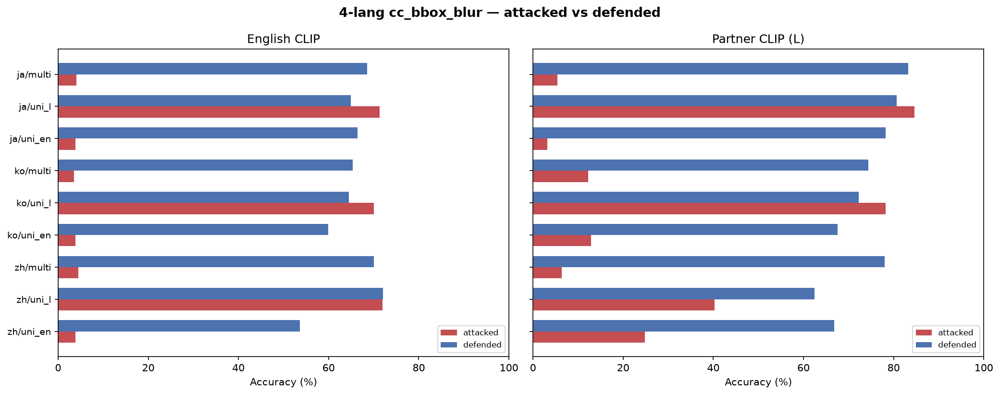

### 3.4 Attn-last vs GradCAM vs Attn-rollout (EN∩ZH case study)
- Detailed saliency comparison under the same intersection wrapper (supports the Attn-last choice used for all partners).
- Key claims:
  - **E + L (EN+ZH):** Attn-last ~**72.6%** mean vs GradCAM ~**33%**; lower coverage; better clean Δ.
  - **Pure E (EN+EN):** same ranking (Attn-last ~**67.6%**).
  - **Pure L (ZH+ZH):** Attn-last still best or tied on accuracy (~**62.5%**), but clean damage / coverage worsen — limitation of EN attention on Chinese glyphs.
- Figure idea: bar chart of mean acc by method × attack; optional coverage / clean-Δ panel.

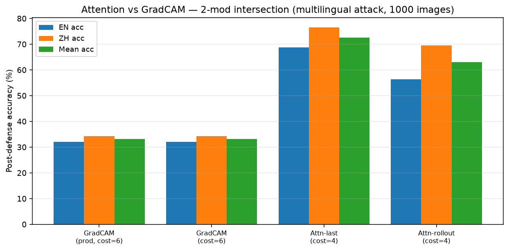

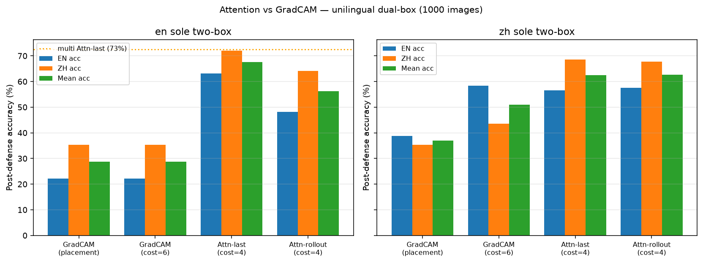

### 3.5 Grid-search baseline — confidence-drop **and** exhaustive search
- **Scoring axis (n=1000, greedy 2-patch, E+L EN+ZH):**
  - Old **max-confidence** scoring: ~**11–12%** mean — barely above no defense.
  - **Confidence-drop** scoring: ~**48.5%** mean @ cost 62 — proves scoring mattered; still far behind Attn-last / `cc_bbox_blur` (~73–75%) and ~10× cost.
- **Search axis (tune n=100, old max-conf scoring):**
  - Greedy 2-patch: ~**11.0%** mean.
  - **Exhaustive** C(16,2)=120 pairs: ~**11.5%** mean (~240 passes, ~6× slower).
  - Conclusion: search completeness is **not** the failure mode — a coarse 4×4 grid cannot reliably isolate stickers.
- Hit-pattern analysis (E+L): covering the **English** box matters much more than covering the partner-language box alone; hit-both best (~68% conditional).
- Role in paper: model-agnostic sanity check / upper bound on naive search, not a competing production method.

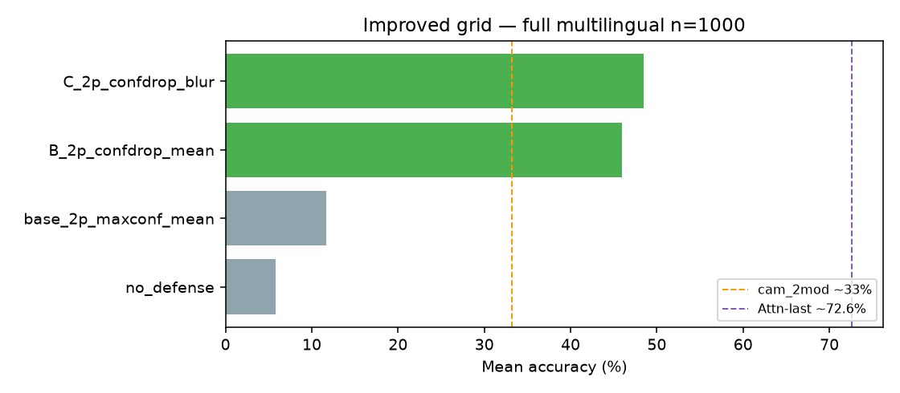

*Figure: conf-drop vs max-conf grid variants (n=1000). Pair with exhaustive-grid table from `_test_exhaustive_grid/results/comparison.json`.*

### 3.6 Heatmap refinements — path to `cc_bbox_blur`
- Ablation table (EN∩ZH E+L): baseline Attn-last → blur_fill → cc_bbox → **cc_bbox_blur**.
- Headline numbers: **`cc_bbox_blur` ~74.9% mean, clean Δ ~−1.5 pp, cost 4** (vs Attn-last 72.6% / worse clean Δ).
- Negative ablations in one compact table or appendix: gating, union, ViT-B/16, hybrid — “we tried X; it failed because Y.”
- Residual gap: still ~10–15 pp below clean accuracy — leave as open problem.

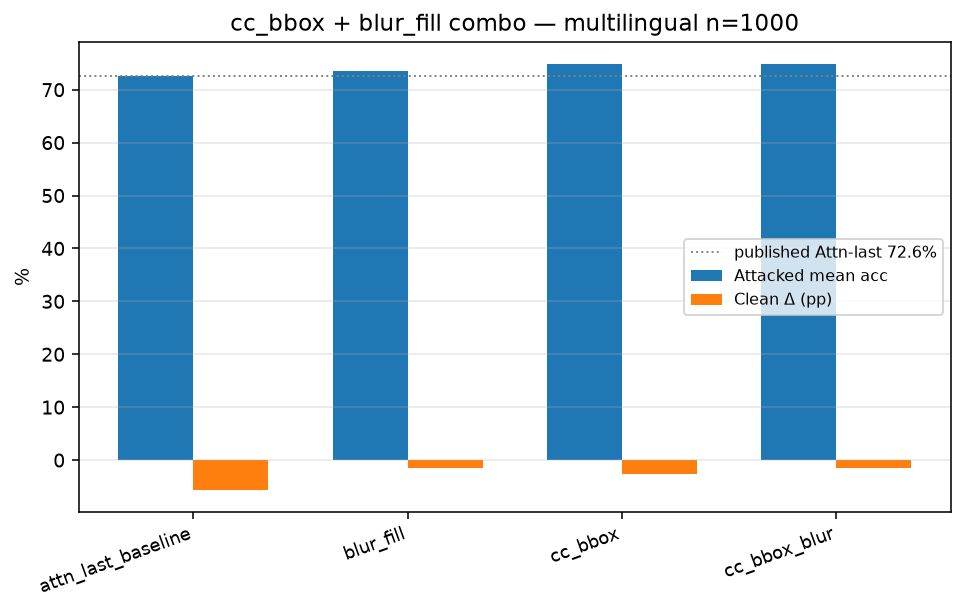

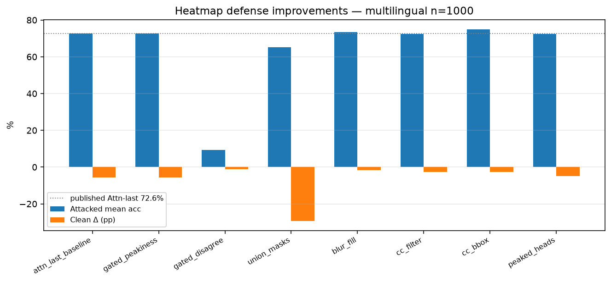

### 3.7 KO/JA clean-damage mitigation
- Show baseline vs thr_floor_095 / tight_dilate / no_bbox.
- Main story: thr=0.90 on Pure E was self-inflicted overshoot; flooring at **0.95** recovers large Clean Δ without losing defended acc (sometimes gains).
- Geometry tweaks shave residual clean damage to roughly **−7 to −11 pp**; still not ZH’s −1.5 pp.
- Interpretation: remaining gap is **heatmap quality** of EN∩KO / EN∩JA, not just threshold choice.

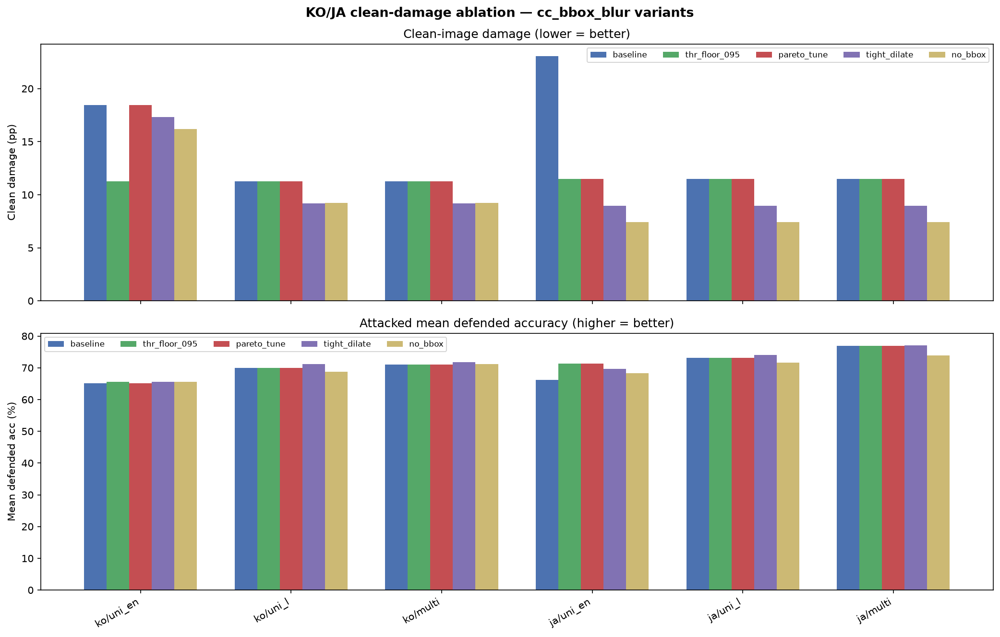

### 3.8 Summary table for the reader (results closer)
- One “leaderboard” table: method / partner L / attack (Pure E / E+L / Pure L) / mean def / clean Δ / cost.
- Highlight recommended config: Attn-last + `cc_bbox_blur`, thr ≥ 0.95; KO/JA may prefer slightly tighter geometry.

---

## 4. Conclusion

### 4.1 What we showed
- Cross-lingual attention intersection (EN ∩ L for ZH/KO/JA) is a practical **spatial** defense for typographic attacks on separate CLIPs — not only a disagreement alarm.
- Last-layer attention outperforms GradCAM in this dual-box setting on accuracy and cost.
- Simple mask post-processing (bbox snap + blur) improves the accuracy / clean-image tradeoff without extra model passes; Clean Δ ≈ −1.5 pp for EN∩ZH.
- The recipe works for Chinese, Korean, and Japanese partners on Pure E / E+L recovery; clean-image cost is the main language-dependent failure mode.
- Grid search fails as a production defense whether scored by max-confidence, confidence-drop, or searched exhaustively.

### 4.2 Limitations (must-include honesty)
- Evaluated on CIFAR-10 dual-box stickers — not ImageNet-scale scenes, not adaptive attackers that place text to evade attention.
- Pure L (especially ZH-only) stickers remain harder for the EN half of the intersection.
- KO/JA Clean Δ still worse than ZH after mitigation.
- Residual gap to clean accuracy (~10–15 pp on EN/ZH) unsolved.
- Grid / hybrid search not competitive enough to recommend despite scoring and exhaustive-search fixes.

### 4.3 Broader implications
- Separate encoders + spatial agreement may complement prediction-disagreement detectors.
- Soft occlusion (blur) is preferable to hard mean-fill when preserving object evidence matters.
- English text remains the dominant transfer threat across models — defenses should prioritize localizing Latin-script stickers.

### 4.4 Next steps / future work
- Write full paper prose + paper-ready figures from existing notebooks.
- Close residual gap to clean (better saliency, adaptive thresholds, or selective apply-only-when-attacked).
- Stronger KO/JA backbones or better EN∩L heatmap fusion.
- Test on higher-res datasets / more realistic text placements.
- Optional: combine disagreement gate (detect) with `cc_bbox_blur` (repair) in one pipeline.
- Optional contrast paragraph with Thread A (shared encoder) if the venue wants multilingual defense narrative.

### 4.5 Closing sentence (idea)
- Multilingual CLIP defenses need not stop at “do the languages agree?” — asking **where** they agree to look, then blurring that region, recovers most accuracy under typographic attack at low compute cost.

---

## Appendix ideas (optional, not required for first draft)

- Full ablation tables and failed ideas.
- Model cards / Hugging Face IDs and prompt templates.
- Example defended images (attacked → heatmap → mask → blur → prediction) — see `four_lang_cc_bbox_blur/results/pipeline_*.png` (ZH/KO/JA).
- Conf-drop grid hit-pattern contingency table; exhaustive-grid comparison JSON.
- Notebook index for reproducibility.

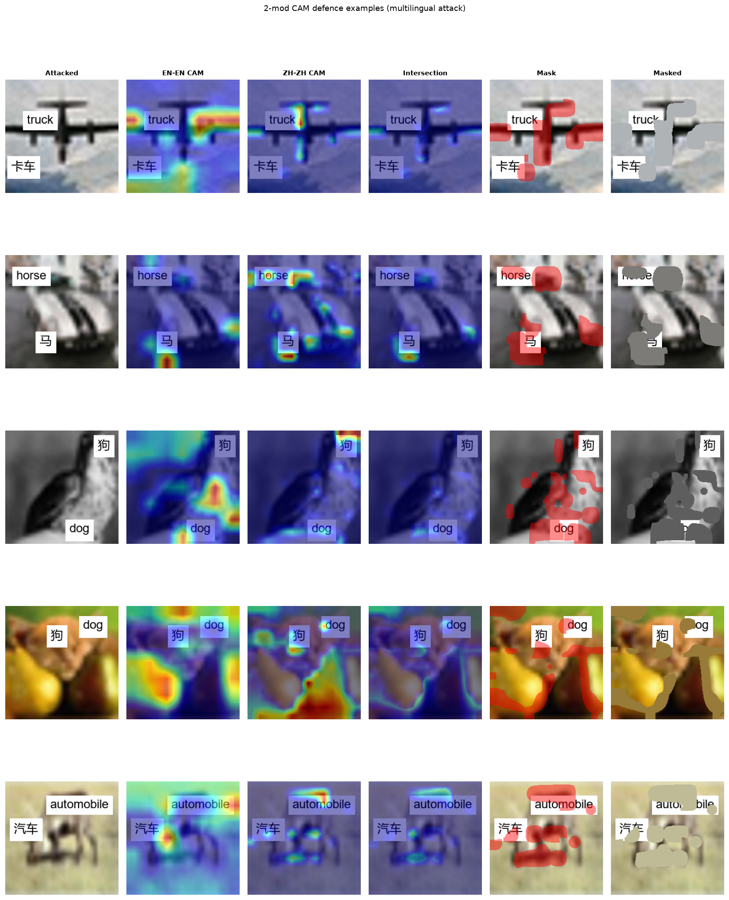

---

## Writing checklist (when expanding outline → prose)

- [ ] Lock final title and abstract (150–200 words from §1.4–1.5 + headline numbers).
- [ ] Related Work subsection (CLIP typographic attacks; GradCAM / attention rollout; multilingual / ensemble defenses; occlusion-based defenses).
- [ ] Insert exact tables from `docs/research_diary.md` (2026-07-16 → 2026-07-19) and notebook `results/*.json`.
- [ ] Decide whether Thread A appears only in Related Work / Discussion or is omitted.
- [x] Figures linked in outline (method diagram / pipeline; main bar charts; 4-lang transfer; qualitative examples) — replace/replot at paper DPI later if needed.
- [x] Four languages (EN/ZH/KO/JA) front-loaded in Intro + Methods.
- [x] Attack types named Pure E / E + L / Pure L with English-justification callout.
- [x] Dataset source + balanced-sample construction specified.
- [x] Grid baseline covers conf-drop **and** exhaustive search.
- [x] Clean Δ elevated as a lead Results claim.
