# Paper Draft — First-pass prose (in progress)

**Working title (placeholder):** Cross-Lingual Attention Intersection as a Spatial Defense Against Typographic Attacks on Multilingual CLIP  
**Status:** §1 expanded to first-pass prose; §2–§3 still outline-heavy with locked tables. Tables: [`tables_index.md`](tables_index.md).  
**Scope of this draft:** Thread B defense line (separate per-language CLIPs + typographic attacks + saliency masking). Thread A (shared multilingual CLIP + PGD) can be mentioned briefly as motivation / contrast, not as the main contribution.  
**Last synced:** 2026-07-30 — Raw CLIP + content-occlusion gated cells in tables; figures frozen for draft (black fill).

---

## Abstract (draft)

Vision–language classifiers such as CLIP can be fooled by typographic attacks that overlay adversarial class names on an otherwise unchanged image. We defend four separate per-language CLIP models (English, Chinese, Korean, Japanese) by intersecting last-layer attention maps between English and a partner language, shaping the agreed region with connected-component bounding boxes, and filling it with solid black—but only when an Attn-last heatmap-shape detector predicts an attack. On a frozen dual-box CIFAR-10 protocol (n=1000), undefended models collapse to **7.1%** mean accuracy; gated `cc_bbox_black` recovers partner bilingual MIXED2000 scores of **81.65 / 78.35 / 82.53%** (ZH/KO/JA) with near-zero clean-image damage. Ablations show that glyphs—not white pads—drive both hijack and localization, and that the detector gate is required to avoid large clean drops on KO/JA.

---

## 1. Introduction

### 1.1 Motivation — why this problem matters

Vision–language models in the CLIP family perform zero-shot image classification by matching an image embedding to a bank of text embeddings for class names. That same text-reading ability creates a striking failure mode: **typographic attacks** overlay an adversarial class name on the image and flip the prediction even though the depicted object is unchanged. Unlike invisible pixel-level adversarial noise, these overlays are obvious to humans, yet they remain effective against models that treat written labels as strong visual evidence. Any deployed CLIP-like classifier that consumes photos containing signs, stickers, or UI text is therefore exposed.

### 1.2 Multilingual angle — four languages from the start

A natural hope is that **multiple languages** make attacks harder: an overlay tuned to one language might fail on another. On a *shared* image encoder, however, language disagreement is often a weak detector under gradient attacks (Thread A; background only). This paper instead studies **four separate per-language CLIP models**—English (EN), Chinese (ZH), Korean (KO), and Japanese (JA)—under typographic (text-overlay) attacks. The defense is always **EN ∩ L**: English CLIP attention intersected with a partner-language CLIP \(L \in \{\mathrm{ZH}, \mathrm{KO}, \mathrm{JA}\}\). All three partners are first-class throughout Methods and Results, not a late transfer from an EN/ZH case study.

#### 1.2.1 Why English anchors every pairing (and most attacks)

Early 4×4 typographic landscape experiments (attack language × model) showed that **English overlays are the universal, highest-ASR threat** across all four models. Native-script stickers transfer poorly to foreign models, and Pure L attacks on KO/JA are often already weak. We therefore always pair EN with partner L for the spatial defense, and we center evaluation on **Pure E** and **E + L** (the hard cases). Pure L remains for completeness and to expose EN-attention limits on non-Latin glyphs—not because native-only stickers are the main threat. In short: English text is the dominant cross-model typographic threat, so every defense pairing includes the English CLIP and every hard attack includes at least one English sticker.

#### 1.2.2 Why CLIP “reads” stickers — glyphs, not blank pads

Typographic attacks look like painted labels to humans, but the model’s failure mode is more specific: **last-layer attention locks onto the letterforms**, not onto a generic rectangular anomaly. Web-trained CLIP image towers see Latin (and other) glyphs co-occurring with captions throughout pretraining, so class-name overlays become strong visual evidence for the written label. That explains both the high ASR of English stickers across languages (§1.2.1) and why a spatial defense that finds **where both models attend** can neutralize the attack without OCR.

Two controlled checks support this claim (details in §2.3.2; numbers in §3.2.1 and [`tables_index.md`](tables_index.md) Table 2). First, blank white pads barely hijack classification and are poorly localized, while black letters alone nearly match the full sticker’s ASR and gated recovery (text_only gated EN **75.8%** vs full **72.9%**). Second, readable non-text animal stickers can still fool the classifier, and EN attention often finds them, but **bilingual EN∩ZH agreement stays weak until letters appear**. The production intersection mask is therefore a **typographic / glyph** localizer, not a universal anomaly detector. CLIP is distracted by readable text; our defense finds those glyphs via cross-lingual attention agreement, not by looking for white rectangles.

### 1.3 Gap — detection alone is not enough

Prediction disagreement across models can flag some attacks, but disagreement alone does not restore the correct label. What is needed is a **spatial defense**: find and neutralize the sticker region(s), then reclassify. Saliency tools such as GradCAM are natural candidates, yet they can be costly or imprecise for small text boxes. Always-on spatial repair also risks **clean-image damage**—especially for EN∩KO and EN∩JA—so the defense must include a learned **attack detector** that applies occlusion only when stickers are present. The gate is a core pipeline stage, not an optional post-hoc addon.

### 1.4 Core idea (contribution preview)

We mask where English CLIP and partner CLIP L both attend (intersection) for each \(L \in \{\mathrm{ZH}, \mathrm{KO}, \mathrm{JA}\}\), preferring **last-layer attention** over GradCAM. The agreed region is post-processed into sticker-shaped boxes (`cc_bbox`) and occluded with **solid black fill** (blur / mean / neglect are fill ablations). An Attn-last heatmap-shape detector **gates** occlusion so Clean Δ stays near zero while attacked accuracy is retained. We call the full stack gated **`cc_bbox_black`**. Evaluation uses three dual-box attack types—**Pure E**, **E + L**, **Pure L**—on all three partners, and compares against OCR+blur, Defense-Prefix, Dyslexify- / SamplingTAR-style head ablations (plus attn-blur hybrids), and coarse grid occlusion. Locked numbers live in [`tables_index.md`](tables_index.md).

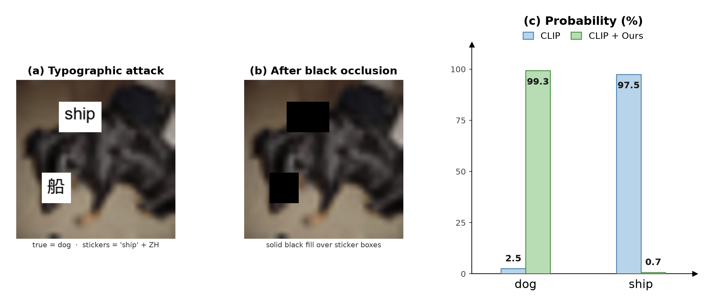

*Figure 1 (paper). Dual-box typographic attack, black occlusion, and EN CLIP class probabilities before vs after defense.*

### 1.5 Contributions

1. **EN ∩ L attention intersection** (\(L \in \{\mathrm{ZH}, \mathrm{KO}, \mathrm{JA}\}\)) recovers accuracy under dual-box typographic attacks on a frozen, class-balanced CIFAR-10 n=1000 set; Raw CLIP mean atk is only **7.1%**.
2. **Attn-last beats GradCAM** on accuracy, compute, and clean-image side effects (Pure L / ZH-only as the main caveat).
3. **`cc_bbox` + solid black fill**, applied only when an Attn-last **detector gate** fires, is the production stack (gated Clean Δ **0.0 / −0.2 / 0.0 pp** for ZH/KO/JA); always-on KO/JA Clean Δ ≈ **−11 pp** motivates the gate.
4. The recipe transfers across partners: bilingual MIXED2000 under gated black is **81.65 / 78.35 / 82.53%** (ZH/KO/JA); EN MIXED **79.35%** (atk **72.9%** / clean **85.8%**). Fill ranking on EN: **black > mean > blur > neglect**.
5. On the same protocol, ours leads cross-language MIXED averages; OCR+blur is the closest spatial peer; Defense-Prefix wins EN-only MIXED (**81.65%** vs our **79.35%**) but collapses once ZH is included; head ablations fail and hybrids still trail.
6. Glyphs—not blank pads—drive hijack and EN∩ZH localization; gated black recovers typographic stickers well, hybrid partially, animal-only poorly. Production geometry is **font 24 / 2 boxes**.

### 1.6 Paper roadmap

Section 2 describes the dataset, models, attack construction, and the gated `cc_bbox_black` pipeline. Section 3 reports main results (Table 1), attack and method ablations (Tables 2–4), and qualitative examples. Section 4 concludes with limitations. Full ablation narrative: [`ablation_study.md`](ablation_study.md).

---

## 2. Method / Materials

### 2.1 Dataset and evaluation protocol
- **Source dataset:** CIFAR-10 (10 object classes: airplane, automobile, bird, cat, deer, dog, frog, horse, ship, truck), loaded via HuggingFace `uoft-cs/cifar10` (standard test split).
- **Evaluation set (current, frozen):**
  - From the CIFAR-10 test split, build a **balanced 1000-image sample**: exactly **100 images per class**, drawn randomly within each class with seed 0, then shuffled.
  - Saved as [`lib/notebooks/image_samples/CIFAR10_BALANCED_1000_SAMPLE.json`](../lib/notebooks/image_samples/CIFAR10_BALANCED_1000_SAMPLE.json) (indices + true labels).
  - Replaces an earlier seed-0 random 1000 draw that was class-imbalanced (e.g. cat over-represented, horse under-represented), and supersedes early Thread B STL-10 / n=200 exploratory runs for all main claims.
  - **Attack geometry frozen in the same JSON** under `attack_pos`: per-image top-left anchors for the two dual-box slots (`en` = slot 0, `l` = slot 1), baked once with a fixed reference box size (`131×44`) so every defense / baseline notebook shares identical sticker placement (see [`PROTOCOL.md`](../lib/notebooks/PROTOCOL.md)).
- **Protocol knobs (production setting, 2026-07-21+):**
  - Upscale images to 224×224 for overlays and CLIP inference.
  - Tune percentile thresholds on a **100-image** subset (10 per class), then set `threshold = max(threshold_free, 0.95)` for the full **n=1000** run; log both values.
  - Report Clean Δ on the same 1000 images **without** attack stickers under the **gated** pipeline (always-on Clean Δ kept as ablation).
  - Cite thr-floor four_lang always-on numbers for localization/transfer evidence; EN∩ZH always-on blur case-study **74.9% / −1.5 pp** remains useful design history (pre-freeze RNG geometry).
- **Metrics:**
  - Top-1 accuracy after attack / after defense (per model and mean of the EN+L pair).
  - Attack success rate (ASR) where useful.
  - **Clean Δ:** accuracy change when the same defense policy is applied to unattacked images (side-effect cost).
  - **MIXED2000:** `0.5 * attacked_acc + 0.5 * clean_policy_acc` on the same 1000 indices once clean + once attacked (equal weight).
  - **Coverage:** fraction of pixels masked (tight vs over-masking).
  - **Cost:** forward/backward / OCR / intervention passes per image.

### 2.2 Models (separate per-language CLIPs)
- **EN:** OpenAI ViT-B/32 via `open_clip`.
- **ZH:** Chinese-CLIP ViT-B/16 (`OFA-Sys/chinese-clip-vit-base-patch16`).
- **KO:** `Bingsu/clip-vit-base-patch32-ko`.
- **JA:** `llm-jp/llm-jp-clip-vit-base-patch16` (note: earlier CLYP Japanese model was broken / near-chance — replaced).
- Clean accuracy ballpark on the balanced n=1000: EN ~85.9%, ZH ~91.4%, KO ~89.6%, JA ~92.5%.
- Defense always pairs **EN with one partner L** (never a ZH-only pipeline).

### 2.3 Attack construction (typographic)
- Method: render adversarial class name as text on the image (`draw_word`); no gradients.
- **Dual-box geometry** (main threat model):
  - Two non-overlapping white text boxes at frozen `attack_pos` coordinates.
  - **Font size fixed at 24** @ 224×224 for all main / baseline tables. Sensitivity to font size (12 / 24 / 40) and box count (1 / 2 / 3) is reported in the attack-geometry ablation ([`ablation_study.md`](ablation_study.md) §B.3–B.4; [`attack_geometry_ablation/`](../lib/notebooks/attack_geometry_ablation/)) — do not treat other sizes as production.
- **Three attack types** (poster names; notebook codes in parentheses):

| Poster name | Notebook code | Box 0 | Box 1 |
|---|---|---|---|
| **Pure E** | `uni_en` | English | English |
| **E + L** | `multi` | English | Partner language L |
| **Pure L** | `uni_l` | Partner L | Partner L |

- For each partner `L ∈ {ZH, KO, JA}`, evaluate all three attack types under the same EN ∩ L defense.
- Earlier single-box 4×4 confusion matrices (attack language × model) provide attack-landscape background.

*Figure: evaluation protocol — four CIFAR-10 classes (distinct frozen `attack_pos`) × Clean / Pure E / E+L / Pure L (partner L = ZH shown; identical geometry for KO/JA). Paper asset: [`docs/figures/dataset/`](figures/dataset/).*

#### 2.3.1 English-centric attack design (pointer)
- Rationale already stated in **§1.2.1**; Methods only operationalizes it: slot 0 is always the EN box position; Pure E / E+L / Pure L matrix uses the same frozen geometry for every partner L.
- Brief reminder if needed: English = highest-ASR attack language; Pure L retained as the weak / completeness cell.

#### 2.3.2 Attack-component checks — glyphs vs pads vs non-text stickers

These are **diagnostic attacks** on the same frozen dual-box `attack_pos` (EN∩ZH, `multi` geometry, n=1000, Attn-last thr ≥ 0.95 / dilate 3 / top-2 `cc_bbox`). They justify treating the threat as **readable text**, and treating EN∩ZH attention as a **glyph localizer**.

**A. White pad vs letters vs full typographic sticker**  
Code: [`attack_component_ablation/`](../lib/notebooks/attack_component_ablation/). Same measured GT boxes; three render modes:
- `full` — white rectangle + black class-name text (production sticker).
- `white_only` — white rectangle only (no letters).
- `text_only` — black letters only (no white fill).

Report undefended EN/ZH acc+ASR and Attn-last localization (inbox focus, IoU vs GT union, peak-in-box, det@IoU ≥ 0.1 / 0.3) for EN, ZH, and EN∩ZH.

**Claim to support:** if `text_only` ≈ `full` on ASR and localization, and `white_only` is near-clean / poorly localized, then the model is distracted by **glyphs**, not by the white box.

**B. Animal sticker vs text (content control)**  
Code: [`animal_sticker_ablation/`](../lib/notebooks/animal_sticker_ablation/). Same anchors; animal patches = CIFAR-10 **train** animals (bird/cat/deer/dog/frog/horse) upscaled **32→96** with aspect preserved, pasted **without** a white surround.
- `all_sticker` — both slots animal (same wrong animal class).
- `mixed` — slot 0 animal, slot 1 EN class-name text.
- `all_text` — production EN+ZH typographic dual box.

Same undefended + localization metrics as (A).

**Claim to support:** non-text anomalies can still hijack classification (and EN attention), but **EN∩ZH co-localization strengthens when letters are present** — so bilingual intersection is motivated for typographic stickers, not as a catch-all anomaly mask.

**C. Black occlusion recovery (defense arms on A/B modes)**  
Code: [`animal_sticker_ablation/run_occlusion.py`](../lib/notebooks/animal_sticker_ablation/run_occlusion.py). Same modes as (B). Fill = solid black. Masks: EN∩ZH `cc_bbox` and EN-only `cc_bbox`. Policies: never / always-on / Phase-C gated (gate trained **per mode** on clean vs that mode’s Attn-last features) + GT-oracle black ceiling. Results: [`occlusion_n1000.json`](../lib/notebooks/animal_sticker_ablation/results/occlusion_n1000.json).

**D. Attack geometry (font size; number of boxes)**  
Code: [`attack_geometry_ablation/`](../lib/notebooks/attack_geometry_ablation/). EN∩ZH never / always / gated `cc_bbox_black`, thr ≥ 0.95, n=1000.
- Font ∈ {12, **24**, 40} at dual-box protocol anchors.
- Boxes ∈ {1, **2**, 3} at font 24 (`top_k=2` mask unchanged; third box is a seeded extra EN sticker).

*Figure idea:* Attn overlays ([`gallery_raw_and_attn.png`](../lib/notebooks/animal_sticker_ablation/figures/gallery_raw_and_attn.png)) + occlusion before/after ([`gallery_occlusion.png`](../lib/notebooks/animal_sticker_ablation/figures/gallery_occlusion.png)).

### 2.4 Defense pipeline (main method)
Describe as a fixed sequence for any partner `L ∈ {ZH, KO, JA}`. Production policy is **gated** — occlude only when the detector fires:

0. **Attack detector (core):** Attn-last heatmap-shape classifier decides clean vs attacked (§2.5). If clean → skip to reclassify (no occlusion). If attacked → continue.
1. **Saliency maps** from EN model and partner model L (on the image).
2. **Intersection** EN ∩ L (agreement = spatial cue that both models are “looking at” the same suspicious region).
3. **Percentile threshold** on the intersection heatmap (tuned on n=100; **enforce thr ≥ 0.95**).
4. Optional **dilation** (default 3×3×3; KO/JA may use tighter dilate).
5. **Mask shaping (`cc_bbox`):** keep top-2 connected components → snap each to axis-aligned bounding box (match sticker rectangles).
6. **Fill (primary = black):** solid **black** inside the mask. Ablations: Gaussian **blur**, **mean**-color fill, ViT-token **neglect** (zero) — black wins on gated EN (§3.8).
7. **Reclassify** both models on the defended image.

Name the full production stack: gated **`cc_bbox_black`** (Attn-last intersection + `cc_bbox` + black fill + detector gate). Always-on `cc_bbox_blur` is retained as localization/transfer ablation.

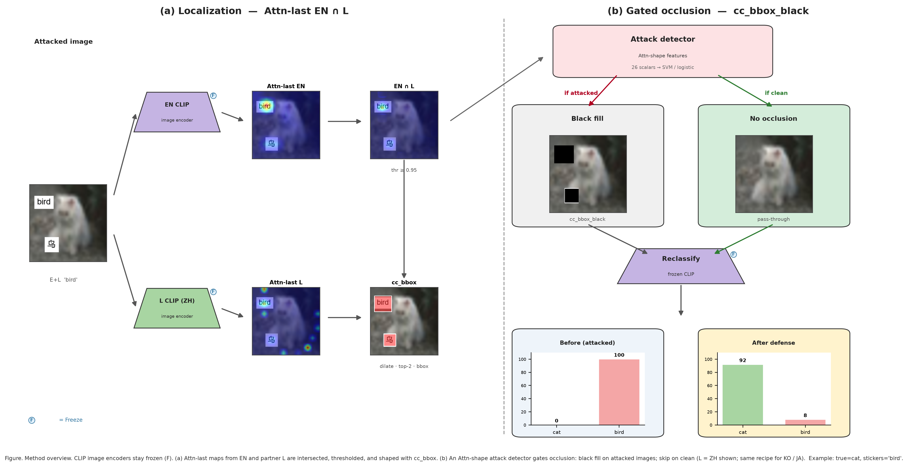

*Figure 2. Method overview. (a) Attn-last EN ∩ L localization → thr / dilate / `cc_bbox`. (b) Attack-detector gate → black fill (attacked) or skip (clean) → reclassify. CLIP encoders frozen; L = ZH shown (same for KO / JA). Script: [`figures/method/make_method_figure.py`](figures/method/make_method_figure.py).*

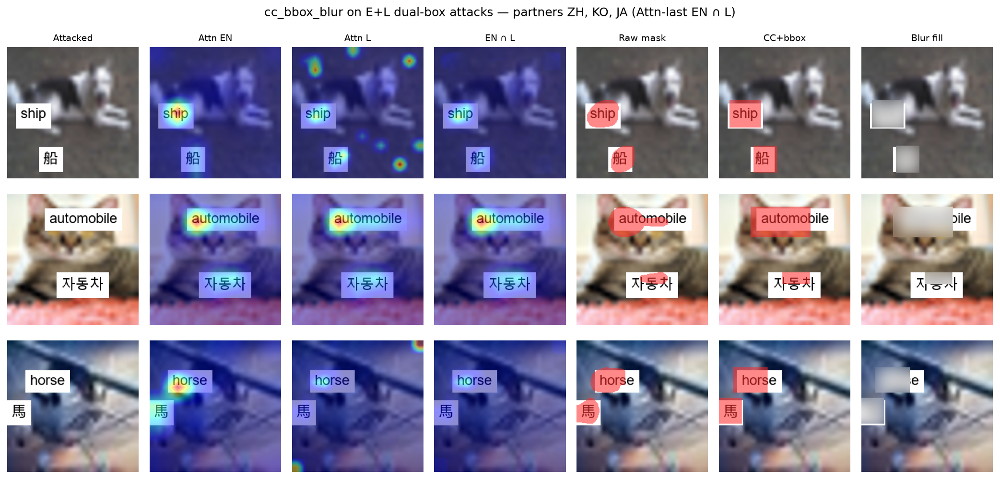

*Figure: qualitative stages on E+L dual-box examples for partners ZH, KO, and JA (pipeline viz currently shows blur fill; production fill is black — reinterpret final stage / regenerate when writing prose).*

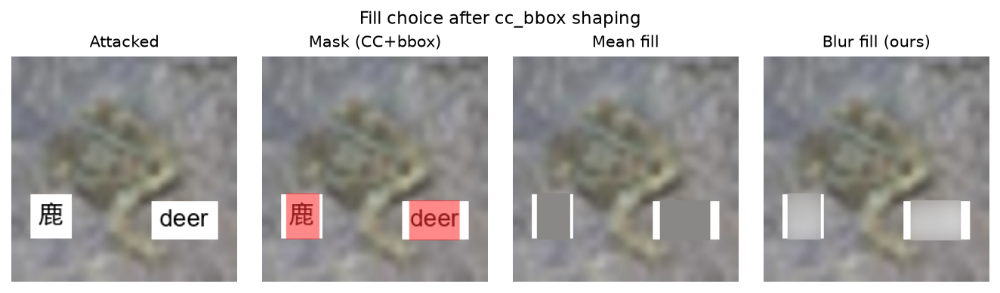

*Figure idea (ablation): after CC+bbox shaping, compare fill modes — blur / mean vs **black** (EN gated ranking in §3.8).*

### 2.5 Attack detector gate (core)
- Motivation: always-on occlusion still hurts clean KO/JA (~−11 pp); production defense must occlude **only when stickers are present**.
- **Features (26 scalars)** from Attn-last EN / L / intersection maps: entropy, top-k mass, Gini, kurtosis, cov95, CC count, EN–L corr/IoU, etc.
- **Classifier:** logistic + calibrated linear SVM; image-level 70/15/15 split; choose val threshold for **attack-recall ≥ 0.99** (keep gated atk drop <1 pp).
- **Production policy:** **`gated` only** for reporting — apply `cc_bbox_black` iff detector says attack.
- **Ablation policies:** `never_defend` / `always_defend` (used to show MIXED2000 gated ≫ always, especially KO/JA).
- Success bar: Clean Δ ≈ 0 under gate; attacked mean acc drops ≤1 pp vs always; MIXED2000 gated ≥ always.
- Code: [`lib/notebooks/attack_detector/`](../lib/notebooks/attack_detector/); evaluated on `multi` for ZH/KO/JA. EN fill ranking: [`en_neglect_vs_blur/`](../lib/notebooks/en_neglect_vs_blur/). Partner fill ranking: [`partner_fill_ablation/`](../lib/notebooks/partner_fill_ablation/).

### 2.6 Saliency variants compared
- **GradCAM** (cost ~6) — prior / production-style baseline.
- **Attn-rollout** (cost ~4).
- **Attn-last** (cost ~4) — primary signal.
- Same EN ∩ L intersection + masking wrapper for fair comparison (detailed ablation case study: EN∩ZH).

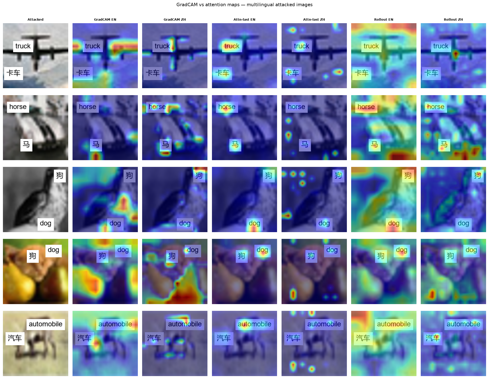

*Figure: GradCAM vs Attn-last vs Attn-rollout on the same attacked images.*

### 2.7 Published baselines (same frozen dual-box protocol)
Living numbers: [`docs/baseline_comparison.md`](baseline_comparison.md). Code: [`lib/notebooks/paper_baselines/`](../lib/notebooks/paper_baselines/). Comparison target for “ours” is **gated `cc_bbox_black`** (EN MIXED2000 / bilingual means); always-on `cc_bbox_blur` 74.9% remains a localization case-study reference, not the recommended system.

| Method | What it does | Scope | Cost |
|---|---|---|---:|
| **OCR + blur** | EasyOCR (`en`+`ch_sim`) boxes → Gaussian blur r=12 → reclassify EN+ZH | EN+ZH | 3 |
| **Defense-Prefix** | Learned prompt prefix token; CLIP frozen. Published ImageNet DP failed Gate A → **retrain 10 ep on CIFAR-10 train** (EN + ZH tokens; eval sample held out) | EN + ZH | 2 |
| **Dyslexify-style** | Mine typographic attention heads; CLS←spatial redirect at inference | EN-only | 2 |
| **Dyslexify hybrid** | Same heads + attn-guided patch blur (`score_frac=0.35`, `top_k=4`) | EN-only | 3 |
| **SamplingTAR-style** | Circuit / head ablation via CLS-attn mass + `fix_attn` | EN-only | 2 |
| **SamplingTAR hybrid** | Same heads + attn-guided patch blur (same hybrid recipe) | EN-only | 3 |

Smoke ladder per method: n=16 sanity → n=100 smoke → **n=1000 final**.

### 2.8 Ablations and negative controls (Methods, not full results)
- Canonical write-up: [`ablation_study.md`](ablation_study.md) (do not re-run frozen cells).
- **No defense** (attacked accuracy floor).
- **Attack components (§2.3.2):** glyphs vs pads; animal / mixed / text localization + **black occlusion recovery**; font size; box count.
- **Always-on vs gated** under the same masks — show MIXED2000 gated > always (esp. KO/JA).
- **Fill ranking (gated EN):** neglect (ViT token zero) / blur / mean / **black** — black is production.
- **Grid occlusion search** (4×4 patches) — two axes to report:
  1. **Scoring:** old **max-confidence** vs **confidence-drop** of the pre-defense top class.
  2. **Search:** **greedy** 2-patch vs **exhaustive** search over all C(16,2)=120 patch pairs.
  - High pass count (~62 greedy; ~240 exhaustive).
- Heatmap ablations that failed or helped little (to justify design choices):
  - Union masks (EN ∪ L) — hurts clean images.
  - Disagreement / peakiness gating — rarely fires or too aggressive (superseded by learned detector).
  - Peaked-heads only; EN ViT-B/16 instead of B/32 — no gain / worse clean Δ.
  - Attention + conf-drop hybrid — better than full grid, worse than plain Attn-last at higher cost.
- KO/JA clean-damage variants (always-on): thr floor 0.95, tighter dilate, no bbox snap, coverage cap — motivate the gate, do not replace it.
- Free-tune vs thr-floor sensitivity under frozen `attack_pos` (protocol note / appendix).
- Optional localization ablation: OCR∪Attn black (EN MIXED2000 **79.70%**) — small lift; production localization stays Attn-only (no OCR).

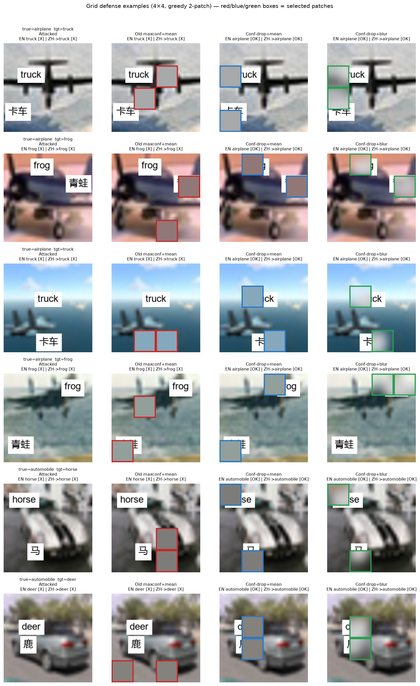

*Figure idea (optional): qualitative grid-occlusion baseline.*

### 2.9 Implementation notes (short)
- Shared protocol: [`lib/notebooks/PROTOCOL.md`](../lib/notebooks/PROTOCOL.md).
- Notebooks: `attention_defense`, `heatmap_defense_improvements`, `four_lang_cc_bbox_blur`, `ko_ja_clean_damage`, `attack_detector`, `en_neglect_vs_blur`, `en_occlusion_beat_dp`, `attack_component_ablation`, `animal_sticker_ablation`, `attack_geometry_ablation`, `paper_baselines/*`, grid: `_test_grid` (+ lineage under `_en_zh/`).
- Living tables: [`4_lang_table.md`](4_lang_table.md) (main + lang detail), [`ablation_study.md`](ablation_study.md) (appendix).
- Thresholds chosen on tune set with thr ≥ 0.95 floor; report frozen thr / coverage alongside accuracy.
- Pipeline figure regenerator: `four_lang_cc_bbox_blur/make_pipeline_viz.py` (EN ∩ ZH / KO / JA examples; **still need black-fill regen** — current PNGs show blur).

---

## 3. Results

Paper tables are locked in [`tables_index.md`](tables_index.md) (Tables 1–4). Detail and appendix narrative: [`4_lang_table.md`](4_lang_table.md); [`ablation_study.md`](ablation_study.md). Headline set: Raw CLIP mean atk **7.1%** (Scope MIXED **48.5%**); gated `cc_bbox_black` EN **72.9% / 85.8% / 79.35% MIXED**; partner bilingual black mean **80.84%** (ZH/KO/JA **81.65 / 78.35 / 82.53%**). The subsections below keep outline bullets for Methods-aligned claims; expand to full prose after Related Work is drafted.

Under undefended dual-box `multi` attacks, all four language models collapse (EN/ZH/KO/JA **4.5 / 6.4 / 11.6 / 6.0%**). The rest of this section asks whether gated black occlusion restores accuracy without harming clean images, how attack geometry and sticker content change that picture, and how our method compares to published baselines.

### 3.1 Clean-image side effects (no attack) — lead claim
- **Production (gated, `multi`):** Clean Δ → **0.0 / −0.2 / 0.0 pp** for ZH / KO / JA — the Clean-Δ story for the paper.
- EN gated black: Clean Δ ≈ **−0.1 pp** (clean **85.8%**; gate fire on clean **0.4%**).
- **Why the gate is necessary (always-on ablation, thr≥0.95):** EN∩ZH ≈ **−1.5 pp**; EN∩KO / EN∩JA ≈ **−11.2 / −11.5 pp** (restored from free-tune collapses to −25 / −23 when thr fell to 0.85/0.90).
- Contrast: GradCAM intersection Clean Δ ≈ **−25 to −35 pp** on the same style of protocol.
- Poster takeaway: the detector gate is the **default** defense policy — not “use when Clean Δ matters.”

### 3.2 Attack landscape (brief)
- English text overlays are a **universal** threat across EN/ZH/KO/JA models; native-script Pure L attacks are often weaker on KO/JA.
- Point to 4×4 accuracy / ASR matrix from CIFAR-10 typographic study if needed for context.
- Disagreement detector: works modestly (above chance) but is not the main contribution — spatial repair **with** the heatmap-shape gate is.

#### 3.2.1 Glyphs vs pads vs animal stickers (supports §1.2.2)

**White / letters / full** (EN∩ZH `cc_bbox`, n=1000; clean floors EN 85.9% / ZH 91.4%):

| Mode | EN ASR | ZH ASR | EN∩ZH IoU | EN∩ZH det@IoU≥0.1 |
|------|-------:|-------:|----------:|------------------:|
| full | **95.3%** | **93.6%** | **0.691** | **100%** |
| white_only | 2.3% | 2.1% | 0.083 | 41.1% |
| text_only | **89.8%** | **84.5%** | **0.669** | **100%** |

**Gated black recovery** ([`content_occlusion_n1000.json`](../lib/notebooks/attack_component_ablation/results/content_occlusion_n1000.json); Table 2 in [`tables_index.md`](tables_index.md)):

| Mode | EN acc (no def) | EN acc (gated) | ZH acc (gated) |
|------|----------------:|---------------:|---------------:|
| white_only | **75.5%** | 70.9% | 75.0% |
| text_only | 9.6% | **75.8%** | **82.7%** |
| full | 4.5% | **72.9%** | **76.5%** |

**Takeaway:** blank pads do not hijack and are weakly localized; letters alone ≈ full sticker on ASR and gated recovery (text_only gated EN **75.8%** ≈ full **72.9%**). Attention follows **glyphs**.

**Animal / mixed / text** (same protocol; animals 96×96, no white pad):

| Mode | EN ASR | ZH ASR | EN∩ZH IoU | EN∩ZH det@IoU≥0.1 | Notes |
|------|-------:|-------:|----------:|------------------:|-------|
| all_sticker | **76.6%** | **87.7%** | 0.117 | 51.1% | EN-only det@.1 **99.3%**; ZH det@.1 **1.1%** |
| mixed | **98.7%** | **97.6%** | 0.310 | **99.8%** | one text box restores bilingual detect |
| all_text | **95.3%** | **93.6%** | **0.691** | **100%** | tightest EN∩ZH |

**Takeaway:** non-text stickers can fool the classifier, but **EN∩ZH localization is text-favoring**.

#### 3.2.2 Black occlusion recovery — sticker / hybrid / text (supports §2.3.2 C)

Gated / always-on / EN-only / oracle GT black on the same three modes ([`occlusion_n1000.json`](../lib/notebooks/animal_sticker_ablation/results/occlusion_n1000.json); full tables in [`ablation_study.md`](ablation_study.md) §A.3 / §B.2).

**Paper Table 3 shape** ([`tables_index.md`](tables_index.md); n=1000):

| Mode | Raw CLIP EN | Ours EN∩ZH | Ours EN-only | EN ASR (EN∩ZH) | Clean Δ EN (EN∩ZH) |
|------|------------:|-----------:|-------------:|---------------:|-------------------:|
| all_text (typographic) | 4.5% | **72.9%** | 68.0% | 3.7% | −0.1 pp |
| mixed (hybrid) | 1.3% | **43.5%** | 40.2% | 27.3% | −0.1 pp |
| all_sticker (visual / animal) | 11.0% | 20.6% | **32.9%** | 54.2% | −1.8 pp |

Oracle GT black ceilings: all_text EN **74.6%**; mixed **64.3%**; all_sticker **56.9%**.

**Claims**
1. Production EN∩ZH black is a **typographic** defense — `all_text` near oracle; `mixed` partial; `all_sticker` barely moves.
2. EN-only helps animals more than bilingual (32.9% vs 20.6%) but costs clean accuracy; still far below oracle → **localization**, not fill, is the bottleneck.
3. Animal-mode gates are leakier on clean (fire_clean **26%**) than typographic spikes (~0–1%).

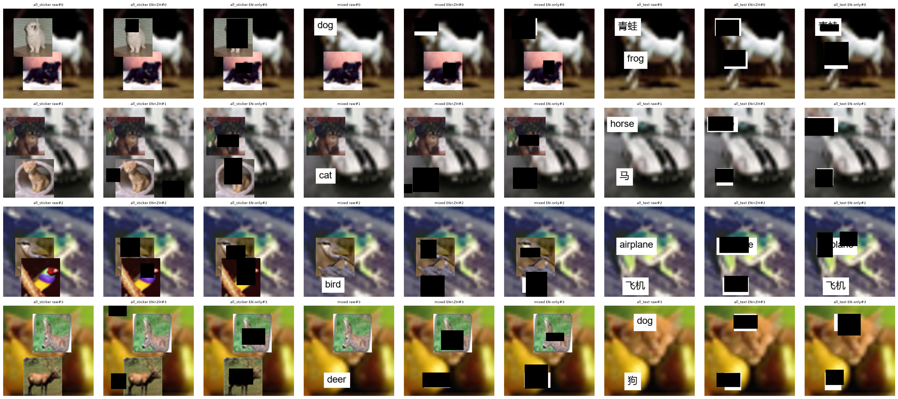

*Figure: raw | EN∩ZH black | EN-only black for animal / mixed / text.*

### 3.3 Four-language transfer (L ∈ {ZH, KO, JA}) — localization evidence
- Design matrix: for each L, evaluate **Pure E / Pure L / E + L** with always-on EN ∩ L `cc_bbox_blur` under **frozen `attack_pos` + thr ≥ 0.95** — shows the mask recipe transfers before gating/black fill.
- Always-on mean defended acc (thr-floor, n=1000):

| Cell | Atk mean | Def mean | Clean Δ |
|---|---:|---:|---:|
| zh / Pure E | 14.3% | **60.2%** | −1.5 |
| zh / Pure L | 56.1% | **67.2%** | −1.5 |
| zh / E+L | 5.5% | **74.0%** | −1.5 |
| ko / Pure E | 8.3% | **63.7%** | −11.2 |
| ko / Pure L | 74.1% | **68.4%** | −11.2 |
| ko / E+L | 7.9% | **69.9%** | −11.2 |
| ja / Pure E | 3.5% | **72.3%** | −11.5 |
| ja / Pure L | 78.0% | **72.8%** | −11.5 |
| ja / E+L | 4.8% | **75.9%** | −11.5 |

- Claims:
  - ZH **E + L** nearly reproduces the EN/ZH case-study winner (74.0% vs 74.9%; −0.9 pp under frozen geometry).
  - Hard attacks (Pure E, E + L) recover to mid-60s–mid-70s mean for KO/JA as well.
  - Pure L often already weak on KO/JA (defense can slightly hurt); ZH Pure L is the exception where defense helps more.
  - Always-on KO/JA Clean Δ is the language-dependent failure mode — **production numbers are gated `cc_bbox_black`** (§3.8); partner bilingual black **81.65% / 78.35% / 82.53%** (ZH/KO/JA). Fill ablations retained; KO blur +0.15pp is not a protocol fork.
- Protocol note (appendix / one paragraph): free thr-tune under freeze had dropped multi thr to 0.85–0.90 and inflated Clean Δ; flooring at 0.95 restored accuracy and clean cost. Report both if reviewing sensitivity.
- Figure: language × attack panel of attacked vs defended mean acc + clean Δ.

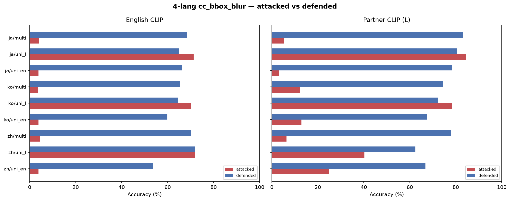

### 3.4 Attn-last vs GradCAM vs Attn-rollout (EN∩ZH case study)
- Detailed saliency comparison under the same intersection wrapper (supports the Attn-last choice used for all partners).
- Key claims:
  - **E + L (EN+ZH):** Attn-last ~**72.6%** mean vs GradCAM ~**33%**; lower coverage; better clean Δ.
  - **Pure E (EN+EN):** same ranking (Attn-last ~**67.6%**).
  - **Pure L (ZH+ZH):** Attn-last still best or tied on accuracy (~**62.5%**), but clean damage / coverage worsen — limitation of EN attention on Chinese glyphs.
- Figure idea: bar chart of mean acc by method × attack; optional coverage / clean-Δ panel.

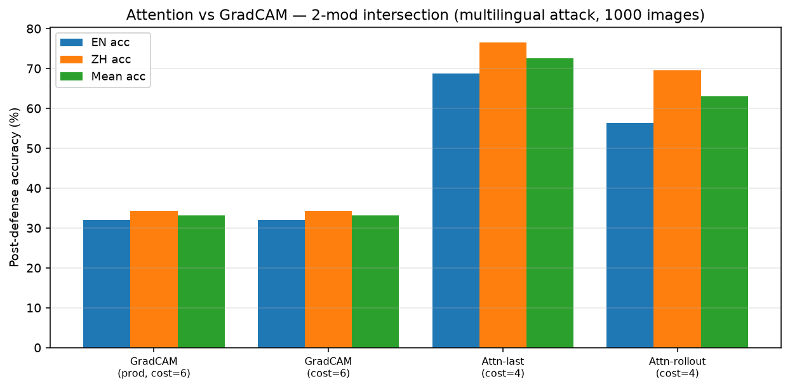

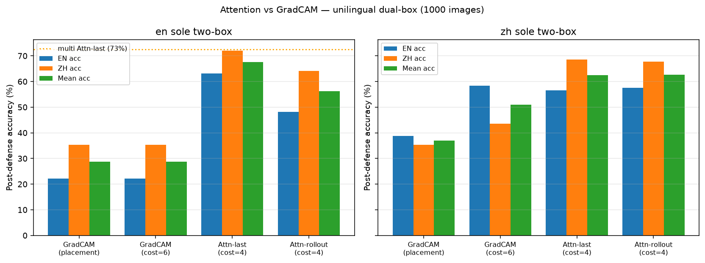

### 3.5 Main results — ours vs baselines (averages + lang detail)

Canonical sources: [`tables_index.md`](tables_index.md) Table 1; [`4_lang_table.md`](4_lang_table.md). Prefer **MIXED2000** as the joint headline; always show Scope (methods do not share identical language coverage).

#### Table A — averages (paper main table)

| Method | Scope | Atk acc (avg) | Clean Δ (avg) | MIXED2000 (avg) | Cost |
|--------|-------|--------------:|--------------:|----------------:|-----:|
| Raw CLIP (no defense) | EN+ZH+KO+JA | **7.1%** | 0.0 pp | **48.5%** | 1 |
| **Gated `cc_bbox_black` (ours)** | EN∩ZH / EN∩KO / EN∩JA | **73.3%** | **≈ 0.0 / −0.2 / 0.0 pp** | **80.84%** | 4 |
| OCR + blur | EN+ZH | 73.8% | −0.7 pp | 80.88% | 3 |
| Defense-Prefix | EN+ZH | 59.2% | +0.5 pp | 74.90% | 2 |
| SamplingTAR hybrid | EN only | 67.3% | −8.3 pp | 72.45% | 3 |
| Dyslexify hybrid | EN only | 66.9% | −8.1 pp | 72.35% | 3 |

Ours avg MIXED = mean of partner bilingual black **81.65 / 78.35 / 82.53%**. Ours avg atk = mean of partner mean-atk **74.7 / 69.4 / 75.9%**. Raw CLIP from four-way `never` (EN/ZH/KO/JA **4.5 / 6.4 / 11.6 / 6.0%**).

#### Table B — language detail (ours gated black)

| Pairing | EN atk | L atk | Mean atk | EN MIXED | Bilingual MIXED | Gate fire (atk / clean) |
|---------|-------:|------:|---------:|---------:|----------------:|-------------------------:|
| EN∩ZH | **72.9%** | **76.5%** | **74.7%** | **79.35%** | **81.65%** | 99.8% / 0.4% |
| EN∩KO | 65.6% | 73.1% | 69.4% | 75.45% | **78.35%** | 99.4% / 2.5% |
| EN∩JA | 68.9% | 82.8% | 75.9% | 77.40% | **82.53%** | 99.8% / 0.3% |

Baseline per-lang cells (OCR/DP EN+ZH with ZH MIXED; hybrids EN-only): [`4_lang_table.md`](4_lang_table.md) Table 1.

#### Talking points
- Lead with **Raw CLIP** collapse (mean atk **7.1%**) so defended gains are absolute, not only relative to peers.
- **Do not claim** occlusion-only beats DP on EN MIXED2000 — gated black EN **79.35%** is **−2.30 pp** vs DP EN **81.65%**.
- **Do claim** cross-language spatial advantage: ours partner-mean MIXED **80.84%** vs DP EN+ZH MIXED **74.90%** / mean atk **59.2%**.
- OCR is the closest spatial peer on EN+ZH MIXED (**80.88%**); no KO/JA OCR port yet.
- Heads-only Dyslexify / SamplingTAR (20.0% / 11.6% EN) are negatives; hybrids (~67% EN / ~72.4% MIXED) confirm occlusion drives recovery but still trail gated black.
- Design-history ref (not production): always-on `cc_bbox_blur` EN∩ZH mean **74.9%**, Clean Δ **−1.5 pp**.

### 3.6 Grid-search baseline — confidence-drop **and** exhaustive search
- **Scoring axis (n=1000, greedy 2-patch, E+L EN+ZH; frozen coords unchanged winner):**
  - Old **max-confidence** scoring: ~**10–12%** mean — barely above no defense.
  - **Confidence-drop** scoring: ~**48.5%** mean @ cost 62 — proves scoring mattered; still far behind Attn-last / gated `cc_bbox_*` (~73–75%) and ~10× cost.
- **Search axis (tune n=100, old max-conf scoring):**
  - Greedy 2-patch: ~**11.0%** mean.
  - **Exhaustive** C(16,2)=120 pairs: ~**11.5%** mean (~240 passes, ~6× slower).
  - Conclusion: search completeness is **not** the failure mode — a coarse 4×4 grid cannot reliably isolate stickers.
- Hit-pattern analysis (E+L): covering the **English** box matters much more than covering the partner-language box alone; hit-both best (~68% conditional).
- Role in paper: model-agnostic sanity check / upper bound on naive search, not a competing production method.

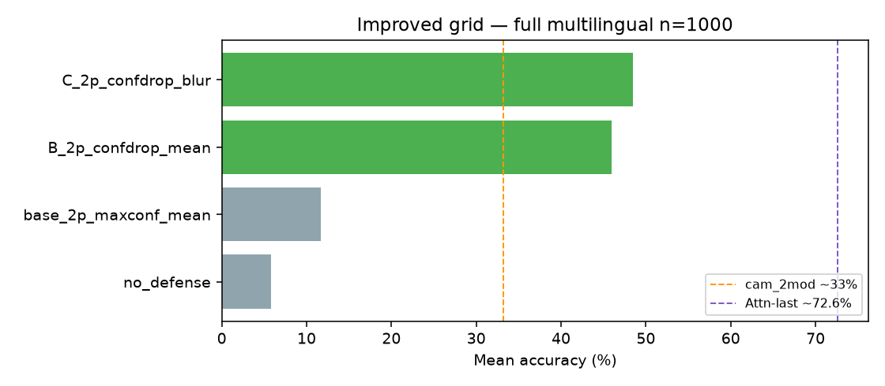

*Figure: conf-drop vs max-conf grid variants (n=1000). Pair with exhaustive-grid table from `_test_exhaustive_grid/results/comparison.json`.*

### 3.7 Heatmap refinements — path to gated `cc_bbox_black`
- Ablation table (EN∩ZH E+L, design history): baseline Attn-last → blur_fill → cc_bbox → **cc_bbox_blur** (always-on **~74.9%** mean / **−1.5 pp**).
- Final production step (gated EN fill ranking): after the same `cc_bbox` masks, **black > mean > blur > neglect**.
- Negative ablations in one compact table or appendix: gating-by-peakiness, union, ViT-B/16, hybrid — “we tried X; it failed because Y.”
- Residual gap: black lifts EN atk by **+3.0 pp** vs gated blur but does **not** close ~**13 pp** EN residual (clean ~85.9% − atk 72.9%); oracle GT boxes + black only reach **74.6%** EN atk — localization/coverage still limits recovery.

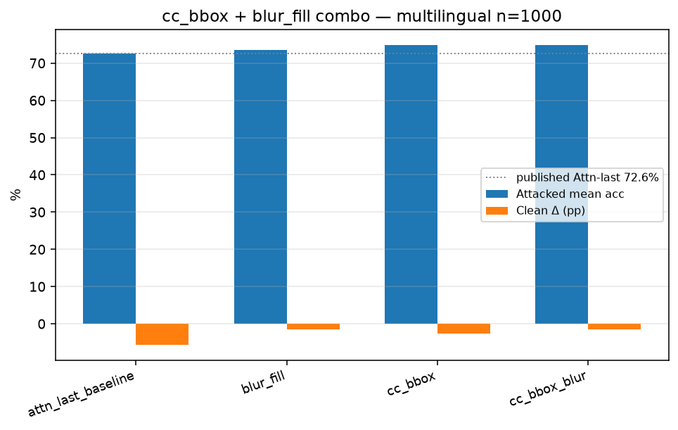

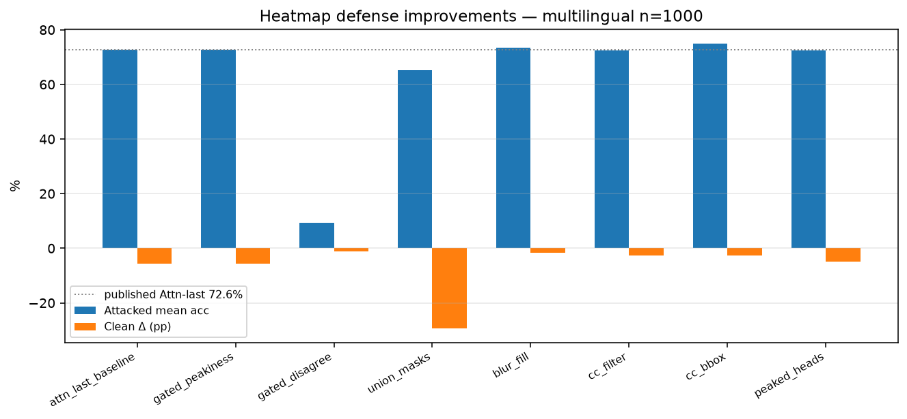

### 3.8 Gated defense — headline results (`multi`)
- Attn-last heatmap features separate clean vs attacked almost perfectly (test AUC ≈ 1.0 for ZH/JA; 0.999 for KO).
- Phase C detector quality (attack-recall target **0.99**; fill in that log was blur — localization/gate story):

| L | Always atk | Gated atk | Δ atk | Always Clean Δ | Gated Clean Δ |
|---|---:|---:|---:|---:|---:|
| zh | 74.0% | **73.9%** | −0.10 | −1.45 | **0.00** |
| ko | 69.9% | **69.45%** | −0.45 | −11.25 | **−0.20** |
| ja | 75.9% | **75.7%** | −0.20 | −11.50 | **0.00** |

- **MIXED2000 always vs gated** (gate evidence; Phase-C logs used blur fill):

| L | Always MIXED2000 | Gated MIXED2000 (blur log) | Gated − always |
|---|---:|---:|---:|
| zh | 80.60% | **81.28%** | +0.68 |
| ko | 73.20% | **78.50%** | +5.30 |
| ja | 76.80% | **82.45%** | +5.65 |

- **Production partner MIXED2000 (gated black)** — quote these going forward:

| L | Gated bilingual MIXED2000 (black) | vs gated blur |
|---|---:|---:|
| zh | **81.65%** | +0.37pp |
| ko | **78.35%** | −0.15pp |
| ja | **82.53%** | +0.08pp |

- **EN gated black headline** (production fill; [`en_neglect_vs_blur`](../lib/notebooks/en_neglect_vs_blur/)):

| Metric | Value |
|---|---:|
| EN attacked acc | **72.9%** |
| EN clean (gated) | **85.8%** |
| EN Clean Δ | **−0.1 pp** |
| EN MIXED2000 | **79.35%** |
| EN ASR (after defense) | 3.7% |
| Gate fire (atk / clean) | 99.8% / 0.4% |

- **Qualitative grids** (Attacked vs Ours): recoveries [`qualitative_figure.png`](figures/qualitative/qualitative_figure.png); failures [`qualitative_failures.png`](figures/qualitative/qualitative_failures.png). Script: [`make_qualitative_figure.py`](figures/qualitative/make_qualitative_figure.py).

*Figure. Qualitative recoveries of gated `cc_bbox_black` on dual-box E+L attacks (ZH / KO / JA). % = CLIP top-1 softmax classification probability.*

*Figure. Qualitative residual failure cases after detector-gated black fill (one per partner).*

- **Fill ranking (gated EN MIXED2000):** neglect **73.20%** < blur **77.90%** < mean **78.15%** < **black 79.35%** (+1.45 pp vs gated blur; +3.0 pp EN atk).
- Defend coverage (full n=1000): attacked 99.4–99.8%; clean false-occlude 0.3–2.5% (KO highest).
- Biggest win: KO/JA Clean Δ **≈ −11 pp → ~0** with <0.5 pp attacked-acc sacrifice; MIXED2000 makes gated the clear winner over always-on.
- Honesty notes: (1) **79.35% is MIXED2000, not attacked-only**; (2) production fill is **black for all langs** — partner bilingual MIXED ZH **81.65%** / KO **78.35%** / JA **82.53%** (KO blur +0.15pp in ablation only; do not fork protocol); (3) Pure E / Pure L under the gate and adaptive placement still open.

*Figure idea: Phase A separation + gated vs always Clean Δ / MIXED2000 bars across ZH/KO/JA + EN fill ranking.*

### 3.9 KO/JA clean-damage mitigation (always-on ablations)
- Show baseline vs thr_floor_095 / tight_dilate / no_bbox.
- Main story: thr=0.90 (or lower) on Pure E / multi was self-inflicted overshoot; flooring at **0.95** recovers large Clean Δ without losing defended acc (sometimes gains).
- Geometry tweaks shave residual always-on clean damage but do not reach ZH’s −1.5 pp — remaining gap is **heatmap quality**.
- Interpretation: always-on residual gap is EN∩KO / EN∩JA heatmap quality, not just threshold choice — **production policy is the detector gate** (§3.8), not a tweaked always-on stack.

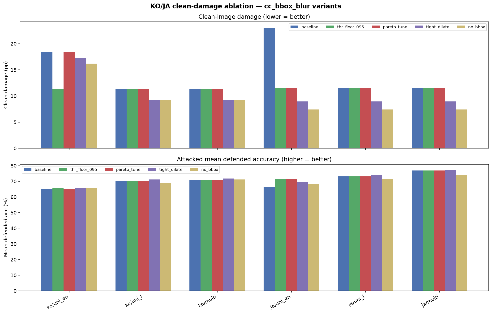

### 3.10 Summary table for the reader (results closer)
- **Locked paper tables:** [`tables_index.md`](tables_index.md) — Table 1 (main + Raw CLIP), Table 2 (attack details), Table 3 (sticker/text/hybrid), Table 4 (occlusion algorithm).
- **Detail / appendix:** [`4_lang_table.md`](4_lang_table.md); [`ablation_study.md`](ablation_study.md).
- Highlight recommended config: **Attn-last + `cc_bbox` + black fill + detector gate**; thr ≥ 0.95; **font 24 / NUM_BOXES=2**.

### 3.11 Attack geometry — font size and number of boxes

Full tables: [`tables_index.md`](tables_index.md) Table 2; [`ablation_study.md`](ablation_study.md) §B.3–B.4. Code: [`attack_geometry_ablation/`](../lib/notebooks/attack_geometry_ablation/). EN∩ZH gated `cc_bbox_black`, n=1000.

**Font (dual-box)**

| Font | never EN ASR | gated EN | gated ZH | Clean Δ EN |
|-----:|-------------:|---------:|---------:|-----------:|
| 12 | 89.9% | **76.0%** | 83.9% | +0.0 pp |
| **24** | **95.3%** | **72.9%** | **76.5%** | −0.1 pp |
| 40 | 96.9% | 58.3% | 56.3% | −0.4 pp |

**Boxes (font 24; `top_k = num_boxes`)**

| Boxes | never EN ASR | gated EN | gated ZH | Clean Δ EN |
|------:|-------------:|---------:|---------:|-----------:|
| 1 | 94.1% | **78.2%** | 82.9% | −0.1 pp |
| **2** | **95.3%** | **72.9%** | **76.5%** | −0.1 pp |
| 3 | 97.5% | **45.9%** | **56.1%** | −0.8 pp |

**Claims:** Font **24** and **2 boxes** stay production (font-24 / boxes-2 cells reproduce EN gated **72.9%**). Font 40 is a harder spatial threat (−14.6 pp gated EN). Three boxes with matched `top_k=3` recover gated EN to **45.9%** (was **8.5%** under production `top_k=2`). Mention font size 24 explicitly in the threat-model paragraph.

---

## 4. Conclusion

### 4.1 What we showed
- Undefended Raw CLIP collapses under dual-box typographic attack (mean atk **7.1%**).
- Cross-lingual attention intersection (EN ∩ L for ZH/KO/JA) is a practical **spatial** defense for typographic attacks on separate CLIPs — not only a disagreement alarm.
- Last-layer attention outperforms GradCAM in this dual-box setting on accuracy and cost.
- Mask post-processing (`cc_bbox`) plus **solid black fill**, applied only when an Attn-last **detector gate** fires, is the production stack (gated `cc_bbox_black`).
- The localization recipe transfers to Chinese, Korean, and Japanese partners; gating solves always-on KO/JA clean damage (Clean Δ ≈ 0; MIXED2000 gated ≫ always).
- Partner-mean bilingual MIXED under gated black: **80.84%** (ZH/KO/JA **81.65 / 78.35 / 82.53%**); EN MIXED **79.35%** (atk **72.9%** / clean **85.8%**).
- On gated EN, **black > mean > blur > neglect**.
- Against published peers (§3.5): ours leads cross-language MIXED averages; OCR is closest on EN+ZH; DP wins EN-only MIXED but collapses with ZH; head ablations fail; hybrids still trail; grid search fails.
- Glyphs — not blank pads — drive hijack and EN∩ZH localization; gated black recovers typographic stickers, partially hybrid, poorly animal-only (§3.2).
- Production threat model is **font 24 / 2 boxes**; larger fonts and 3-box attacks stress the recipe (§3.11).

### 4.2 Limitations (must-include honesty)
- Evaluated on CIFAR-10 dual-box stickers with **frozen** placement — not ImageNet-scale scenes, not adaptive attackers that place text to evade attention or the detector.
- Detector / gated results reported for **E + L (`multi`)**; Pure E / Pure L under the gate still open.
- Pure L (especially ZH-only) stickers remain harder for the EN half of the intersection.
- Partner fill ranking is tighter than EN (KO blur +0.15pp bilingual); protocol still freezes **black for all** so tables stay comparable.
- Residual gap to clean under attack (~**13 pp** EN: 72.9% vs ~85.9%) unsolved — black fill and gating remove clean cost / improve atk, but do not close the residual; oracle GT+black only **74.6%** EN atk.
- Occlusion-only does **not** beat Defense-Prefix on EN MIXED2000 (−2.30 pp).
- EN∩ZH is a **glyph** localizer: blank white pads and animal-only stickers are poorly co-localized / poorly repaired (gated animal EN **20.6%**; EN-only **32.9%** vs oracle **56.9%**). Do not claim universal anomaly detection.
- Three simultaneous stickers need matched `top_k=3` for recovery (gated EN **45.9%**); production stays dual-box / `top_k=2`.
- Font 40 drops gated EN by **−14.6 pp** vs protocol 24 — larger glyphs are harder for the current mask budget.
- Dyslexify / SamplingTAR are style ports (open_clip ViT-B/32 openai), not identical paper checkpoints.
- Grid / hybrid search not competitive enough to recommend despite scoring and exhaustive-search fixes.
- Main-table averages mix scopes (ours 3 partners; OCR/DP EN+ZH; hybrids EN-only) — always show Scope.

### 4.3 Broader implications
- Separate encoders + spatial agreement may complement prediction-disagreement detectors.
- **Selective black occlusion** (detect → localize EN∩L → black out → reclassify) is preferable to always-on blur when partner heatmaps are noisy; soft blur remains a useful ablation, not the production fill.
- English text remains the dominant transfer threat across models — defenses should prioritize localizing **glyphs** (Latin-script stickers), not generic white rectangles (§1.2.2 / §3.2.1).
- Spatial localization beats pure mechanistic head ablation on dual-box typographic attacks in this setting (hybrids confirm occlusion, not heads alone, drives recovery).

### 4.4 Next steps / future work
- Finish expanding §2–§3 outline bullets → full prose; draft Related Work and lock title/abstract.
- Figures are frozen for draft (black fill; [`paper_figures_and_notes.md`](paper_figures_and_notes.md)); replot at camera-ready DPI if needed.
- Close residual gap to clean under attack (better saliency / coverage; still short of the ~77.4% EN atk needed to clear DP EN MIXED at gated clean).
- Extend detector evaluation to Pure E / Pure L and adaptive sticker placement.
- Optional: stronger animal / multi-sticker localization (EN-gated repair; raise `top_k` under 3-box threat) — not required for typographic main claim.
- Test on higher-res datasets / more realistic text placements.
- Optional contrast paragraph with Thread A (shared encoder) if the venue wants multilingual defense narrative.

### 4.5 Closing sentence (idea)
- Multilingual CLIP defenses need not stop at “do the languages agree?” — detect when heatmap shape says “attack,” ask **where** EN and L agree to look, black that region out, and reclassify: most accuracy returns under typographic attack at low compute cost with near-zero clean-image damage.

---

## Appendix ideas (optional, not required for first draft)

- Full ablation tables: [`ablation_study.md`](ablation_study.md) (fill, gate, 4-lang, text vs white, sticker/text/hybrid defense, font size, box count) plus failed ideas (peakiness gate, free-tune vs thr-floor under freeze, always-on vs gated MIXED2000).
- Fill-ranking table (neglect / blur / mean / black) and oracle GT-box ceiling.
- Model cards / Hugging Face IDs and prompt templates.
- Example defended images (attacked → heatmap → mask → **black** → prediction) — update from `four_lang_cc_bbox_blur/results/pipeline_*.png` (ZH/KO/JA).
- Conf-drop grid hit-pattern contingency table; exhaustive-grid comparison JSON.
- Baseline smoke-ladder tables (n=16 / n=100 / n=1000) from `paper_baselines/*/results/`.
- Detector Phase A PCA/t-SNE + feature-importance plots per partner.
- Notebook index for reproducibility (`PROTOCOL.md` + folder README).

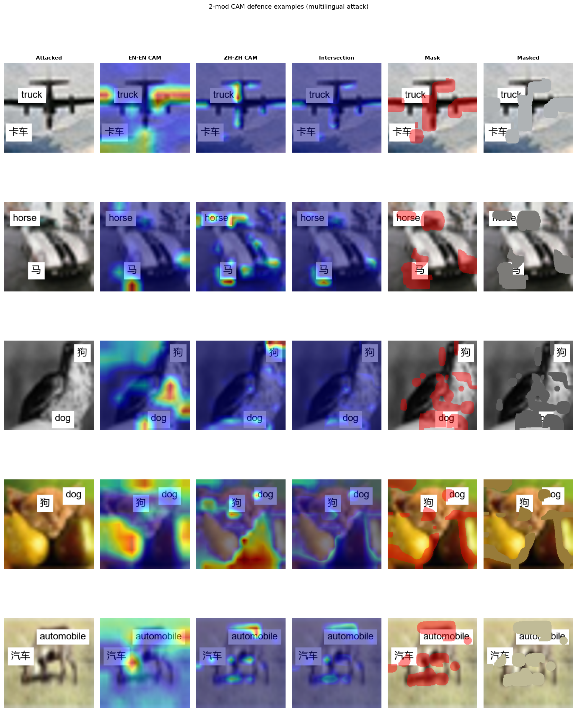

---

## Writing checklist (when expanding outline → prose)

- [x] Abstract draft + §1 first-pass prose (2026-07-30).
- [ ] Lock final title; polish abstract to 150–200 words.
- [ ] Related Work subsection (CLIP typographic attacks; GradCAM / attention rollout; multilingual / ensemble defenses; OCR defenses; Defense-Prefix; Dyslexify / SamplingTAR + hybrids; occlusion-based defenses).
- [ ] Expand §2–§3 remaining outline bullets → full prose.
- [ ] Decide whether Thread A appears only in Related Work / Discussion or is omitted.
- [x] Paper figures frozen for draft (black fill); `detector_pipeline.png` optional / out of main set — [`paper_figures_and_notes.md`](paper_figures_and_notes.md).
- [x] Tables 1–4 locked in [`tables_index.md`](tables_index.md) (Raw CLIP; gated text/white; sticker/hybrid; single Table 4).
- [x] Main avg + lang-detail synced into **§3.5**; animal occlusion **§3.2.2**; font/boxes **§3.11**.
- [x] Four languages (EN/ZH/KO/JA) front-loaded in Intro + Methods.
- [x] Attack types named Pure E / E + L / Pure L; **why English** in **§1.2.1**; **why letters** in **§1.2.2**.
- [x] Dataset + frozen `attack_pos` + thr ≥ 0.95; **font 24 / NUM_BOXES=2** stated as production threat model.
- [x] Grid baseline covers conf-drop **and** exhaustive search.
- [x] Published baselines on §3.5 leaderboard (OCR, DP, Dyslexify/SamplingTAR hybrids).
- [x] Attack detector is a **core** pipeline stage; gated Clean Δ + MIXED2000 for ZH/KO/JA `multi`.
- [x] Primary fill = **black**; EN gated black **72.9% / 85.8% / 79.35% MIXED**; partner mean MIXED **80.84%**.
- [x] Honesty: do not quote 79.35% as attacked-only; do not claim beat DP on EN MIXED; production fill = black for all langs; animal/3-box limits stated.
