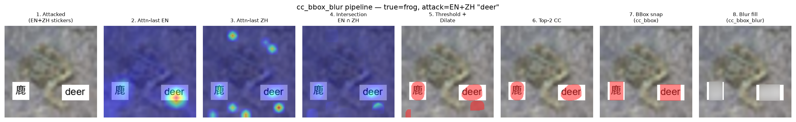
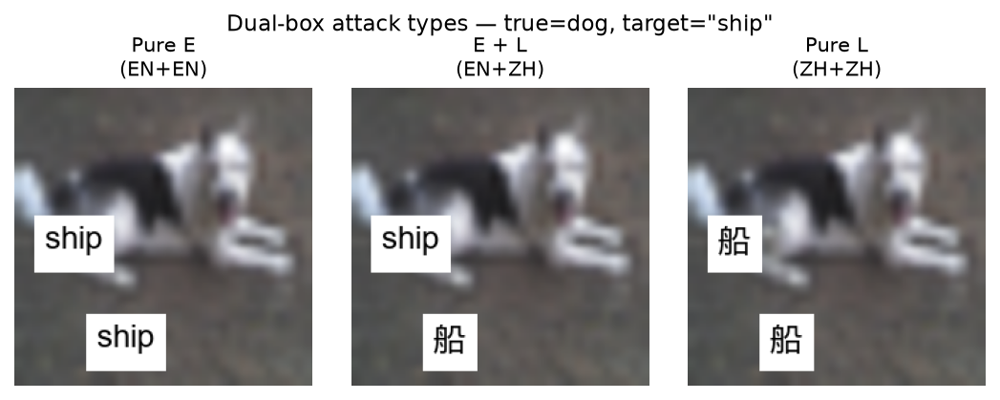

# Paper Draft — Outline Only

**Working title (placeholder):** Cross-Lingual Attention Intersection as a Spatial Defense Against Typographic Attacks on Multilingual CLIP  
**Status:** Outline / idea map — not prose. Expand each bullet into paragraphs later.  
**Scope of this draft:** Thread B defense line (separate per-language CLIPs + typographic attacks + saliency masking). Thread A (shared multilingual CLIP + PGD) can be mentioned briefly as motivation / contrast, not as the main contribution.  
**Last synced:** 2026-07-25 — frozen `attack_pos`, thr ≥ 0.95, **gated Attn-last detector as a core pipeline stage**, primary fill = **solid black** (`cc_bbox_black`), MIXED2000 joint score, and published baselines incl. Dyslexify/SamplingTAR hybrids (`docs/baseline_comparison.md`, `docs/failure_analysis.md`).

---

## 1. Introduction

### 1.1 Motivation — why this problem matters
- Vision–language models (CLIP-style) do zero-shot image classification by matching images to text class names.
- **Typographic attacks:** overlaying adversarial class-name text on the image can flip the prediction even though the object is unchanged (cite typographic-attack / CLIP vulnerability literature).
- Unlike invisible pixel-level adversarial noise, these attacks are human-visible but still fool models that “read” text in the image.
- Practical risk: any deployed CLIP-like classifier that sees photos containing text (signs, stickers, UI overlays).

### 1.2 Multilingual angle — four languages from the start
- Prior idea: use **multiple languages** so an attack tuned to one language fails on others (shared-encoder multilingual CLIP defenses vs separate encoders).
- Short contrast (1–2 sentences): on a **shared** image encoder, language disagreement often fails as a detector under gradient attacks (Thread A finding — cite as background, not main result).
- This paper uses **four separate per-language CLIP models — English (EN), Chinese (ZH), Korean (KO), Japanese (JA)** — under **typographic** (text-overlay) attacks.
- Defense is always **EN ∩ L**: English CLIP attention intersected with a partner-language CLIP `L ∈ {ZH, KO, JA}`. All three partners are first-class throughout Methods and Results (not an EN/ZH study with late transfer).

#### 1.2.1 Why English anchors every pairing (and most attacks)
- Early 4×4 typographic landscape (attack language × model): **English overlays are the universal / highest-ASR threat** across all four models (EN ASR ~94.5%, KO ~86%, JA ~90%, ZH ~65% under EN attack on n=200).
- Native-script attacks (ZH/KO/JA stickers) transfer poorly to foreign models; Pure L on KO/JA is often already weak.
- Therefore the paper **always pairs EN with partner L** for the spatial defense, and centers evaluation on **Pure E** and **E + L** (the hard cases). Pure L is kept for completeness and to expose EN-attention limits on non-Latin glyphs — not because native-only stickers are the main threat.
- One-sentence framing for prose: *English text is the dominant cross-model typographic threat, so every defense pairing includes the English CLIP and every hard attack includes at least one English sticker.*

### 1.3 Gap — detection alone is not enough
- Prediction disagreement across models can flag some attacks (modest AUC), but does not restore the correct label.
- Need a **spatial defense**: find and neutralize the text sticker(s), then reclassify.
- Existing saliency tools (GradCAM) are a natural candidate but may be costly / imprecise for small text boxes.
- Always-on spatial repair still risks **clean-image damage** (especially EN∩KO / EN∩JA) — so the defense itself must include a learned **attack detector** that applies occlusion **only when stickers are present** (not an optional post-hoc addon).

### 1.4 Core idea (contribution preview)
- Cross-lingual **attention agreement**: mask where English CLIP and partner CLIP L both attend (intersection), for each `L ∈ {ZH, KO, JA}`.
- Prefer **last-layer attention** over GradCAM (cheaper + more accurate in our setting).
- Post-process the mask into sticker-shaped regions (`cc_bbox`) and occlude with **solid black fill** (primary); blur / mean / neglect are fill ablations.
- **Gate** occlusion with an Attn-last heatmap-shape detector as a **core pipeline stage** (occlude only when attacked is predicted) → Clean Δ ≈ 0 while keeping attacked accuracy. Full stack name: gated **`cc_bbox_black`**.
- Evaluate under three dual-box attack types — **Pure E**, **E + L**, **Pure L** — on all three partner languages.
- Compare against published peers: OCR+blur, Defense-Prefix, Dyslexify-style / SamplingTAR-style head ablations (+ attn-blur hybrids), plus grid occlusion.

*Figure idea (intro / method teaser): attacked image → Attn-last EN ∩ L → intersection → CC+bbox → **black fill** (blur kept as ablation; shown for partners ZH / KO / JA).*

### 1.5 Contributions (bullet list for the paper’s claim set)
- Show that **EN ∩ L attention intersection** (`L ∈ {ZH, KO, JA}`) recovers accuracy under dual-box typographic attacks on a **frozen, class-balanced CIFAR-10 n=1000** evaluation set.
- Show **Attn-last beats GradCAM** on accuracy, compute cost, and clean-image side effects (Pure L / ZH-only as the main caveat).
- Introduce / validate **`cc_bbox`** mask shaping (connected-component bbox snap) plus **solid black fill** as the production occlusion; always-on blur (`cc_bbox_blur` **74.9% / −1.5 pp**) is design history / ablation.
- Show the localization recipe transfers to **all three partners (ZH, KO, JA)** under a shared protocol (`attack_pos` frozen; thr ≥ 0.95).
- Make an **Attn-last attack detector** a **core** stage of the defense: gated Clean Δ → **0.0 / −0.2 / 0.0 pp** for ZH/KO/JA with ≤0.45 pp attacked-acc drop (`multi`); always-on Clean Δ (−1.5 ZH; ~−11 KO/JA) is the ablation that motivates the gate.
- Report **MIXED2000** = ½ attacked + ½ clean policy acc — the joint score where **gated beats always-on** (esp. KO/JA +5.3 / +5.65 pp).
- Show gated fill ranking on EN: **black > mean > blur > neglect** (EN MIXED2000 **79.35%** black vs **77.90%** blur; atk **72.9%** / clean **85.8%**). **Production fill = black for all langs**; partner bilingual black: ZH **81.65%**, KO **78.35%**, JA **82.53%**.
- On the same protocol: spatial gated defense leads bilingual means; **OCR+blur** is the closest spatial peer; **Defense-Prefix** is strong EN-only (EN MIXED2000 **81.65%**, ours **79.35%**, gap **−2.30 pp**) but weak once ZH is included (DP EN+ZH mean **59.2%**); **Dyslexify / SamplingTAR** heads-only are weak negatives; their attn-blur hybrids (~67% EN) still trail ours.
- Provide an additional **negative baseline**: coarse grid occlusion — even with **confidence-drop scoring** or **exhaustive** 2-patch search — remains weaker and much more expensive than attention.

### 1.6 Paper roadmap (one sentence)
- Section 2 methods (dataset + frozen geometry, 4 models, 3 attack types, gated `cc_bbox_black`, fill ablations, published + grid baselines) → Section 3 results (gated Clean Δ + MIXED2000; fill ranking; 4-lang always-on transfer as localization evidence; EN∩ZH ablations; baseline leaderboard) → Section 4 conclusion / limitations / next steps.

---

## 2. Method / Materials

### 2.1 Dataset and evaluation protocol
- **Source dataset:** CIFAR-10 (10 object classes: airplane, automobile, bird, cat, deer, dog, frog, horse, ship, truck), loaded via HuggingFace `uoft-cs/cifar10` (standard test split).
- **Evaluation set (current, frozen):**
  - From the CIFAR-10 test split, build a **balanced 1000-image sample**: exactly **100 images per class**, drawn randomly within each class with seed 0, then shuffled.
  - Saved as [`lib/notebooks/image_samples/CIFAR10_BALANCED_1000_SAMPLE.json`](../lib/notebooks/image_samples/CIFAR10_BALANCED_1000_SAMPLE.json) (indices + true labels).
  - Replaces an earlier seed-0 random 1000 draw that was class-imbalanced (e.g. cat over-represented, horse under-represented), and supersedes early Thread B STL-10 / n=200 exploratory runs for all main claims.
  - **Attack geometry frozen in the same JSON** under `attack_pos`: per-image top-left anchors for the two dual-box slots (`en` = slot 0, `l` = slot 1), baked once with a fixed reference box size (`131×44`) so every defense / baseline notebook shares identical sticker placement (see [`PROTOCOL.md`](../lib/notebooks/PROTOCOL.md)).
- **Protocol knobs (production setting, 2026-07-21+):**
  - Upscale images to 224×224 for overlays and CLIP inference.
  - Tune percentile thresholds on a **100-image** subset (10 per class), then set `threshold = max(threshold_free, 0.95)` for the full **n=1000** run; log both values.
  - Report Clean Δ on the same 1000 images **without** attack stickers under the **gated** pipeline (always-on Clean Δ kept as ablation).
  - Cite thr-floor four_lang always-on numbers for localization/transfer evidence; EN∩ZH always-on blur case-study **74.9% / −1.5 pp** remains useful design history (pre-freeze RNG geometry).
- **Metrics:**
  - Top-1 accuracy after attack / after defense (per model and mean of the EN+L pair).
  - Attack success rate (ASR) where useful.
  - **Clean Δ:** accuracy change when the same defense policy is applied to unattacked images (side-effect cost).
  - **MIXED2000:** `0.5 * attacked_acc + 0.5 * clean_policy_acc` on the same 1000 indices once clean + once attacked (equal weight).
  - **Coverage:** fraction of pixels masked (tight vs over-masking).
  - **Cost:** forward/backward / OCR / intervention passes per image.

### 2.2 Models (separate per-language CLIPs)
- **EN:** OpenAI ViT-B/32 via `open_clip`.
- **ZH:** Chinese-CLIP ViT-B/16 (`OFA-Sys/chinese-clip-vit-base-patch16`).
- **KO:** `Bingsu/clip-vit-base-patch32-ko`.
- **JA:** `llm-jp/llm-jp-clip-vit-base-patch16` (note: earlier CLYP Japanese model was broken / near-chance — replaced).
- Clean accuracy ballpark on the balanced n=1000: EN ~85.9%, ZH ~91.4%, KO ~89.6%, JA ~92.5%.
- Defense always pairs **EN with one partner L** (never a ZH-only pipeline).

### 2.3 Attack construction (typographic)
- Method: render adversarial class name as text on the image (`draw_word`); no gradients.
- **Dual-box geometry** (main threat model):
  - Two non-overlapping white text boxes at frozen `attack_pos` coordinates.
  - Font size fixed (24 @ 224×224 in defense experiments).
- **Three attack types** (poster names; notebook codes in parentheses):

| Poster name | Notebook code | Box 0 | Box 1 |
|---|---|---|---|
| **Pure E** | `uni_en` | English | English |
| **E + L** | `multi` | English | Partner language L |
| **Pure L** | `uni_l` | Partner L | Partner L |

- For each partner `L ∈ {ZH, KO, JA}`, evaluate all three attack types under the same EN ∩ L defense.
- Earlier single-box 4×4 confusion matrices (attack language × model) provide attack-landscape background.

*Figure: dual-box typographic attack geometry — Pure E / E+L / Pure L (partner L = ZH here; same layout for KO/JA).*

#### 2.3.1 English-centric attack design (pointer)
- Rationale already stated in **§1.2.1**; Methods only operationalizes it: slot 0 is always the EN box position; Pure E / E+L / Pure L matrix uses the same frozen geometry for every partner L.
- Brief reminder if needed: English = highest-ASR attack language; Pure L retained as the weak / completeness cell.

### 2.4 Defense pipeline (main method)
Describe as a fixed sequence for any partner `L ∈ {ZH, KO, JA}`. Production policy is **gated** — occlude only when the detector fires:

0. **Attack detector (core):** Attn-last heatmap-shape classifier decides clean vs attacked (§2.5). If clean → skip to reclassify (no occlusion). If attacked → continue.
1. **Saliency maps** from EN model and partner model L (on the image).
2. **Intersection** EN ∩ L (agreement = spatial cue that both models are “looking at” the same suspicious region).
3. **Percentile threshold** on the intersection heatmap (tuned on n=100; **enforce thr ≥ 0.95**).
4. Optional **dilation** (default 3×3×3; KO/JA may use tighter dilate).
5. **Mask shaping (`cc_bbox`):** keep top-2 connected components → snap each to axis-aligned bounding box (match sticker rectangles).
6. **Fill (primary = black):** solid **black** inside the mask. Ablations: Gaussian **blur**, **mean**-color fill, ViT-token **neglect** (zero) — black wins on gated EN (§3.8).
7. **Reclassify** both models on the defended image.

Name the full production stack: gated **`cc_bbox_black`** (Attn-last intersection + `cc_bbox` + black fill + detector gate). Always-on `cc_bbox_blur` is retained as localization/transfer ablation.

*Figure: qualitative stages on E+L dual-box examples for partners ZH, KO, and JA (pipeline viz currently shows blur fill; production fill is black — reinterpret final stage / regenerate when writing prose).*

*Figure idea (ablation): after CC+bbox shaping, compare fill modes — blur / mean vs **black** (EN gated ranking in §3.8).*

### 2.5 Attack detector gate (core)
- Motivation: always-on occlusion still hurts clean KO/JA (~−11 pp); production defense must occlude **only when stickers are present**.
- **Features (26 scalars)** from Attn-last EN / L / intersection maps: entropy, top-k mass, Gini, kurtosis, cov95, CC count, EN–L corr/IoU, etc.
- **Classifier:** logistic + calibrated linear SVM; image-level 70/15/15 split; choose val threshold for **attack-recall ≥ 0.99** (keep gated atk drop <1 pp).
- **Production policy:** **`gated` only** for reporting — apply `cc_bbox_black` iff detector says attack.
- **Ablation policies:** `never_defend` / `always_defend` (used to show MIXED2000 gated ≫ always, especially KO/JA).
- Success bar: Clean Δ ≈ 0 under gate; attacked mean acc drops ≤1 pp vs always; MIXED2000 gated ≥ always.
- Code: [`lib/notebooks/attack_detector/`](../lib/notebooks/attack_detector/); evaluated on `multi` for ZH/KO/JA. EN fill ranking: [`en_neglect_vs_blur/`](../lib/notebooks/en_neglect_vs_blur/). Partner fill ranking: [`partner_fill_ablation/`](../lib/notebooks/partner_fill_ablation/).

### 2.6 Saliency variants compared
- **GradCAM** (cost ~6) — prior / production-style baseline.
- **Attn-rollout** (cost ~4).
- **Attn-last** (cost ~4) — primary signal.
- Same EN ∩ L intersection + masking wrapper for fair comparison (detailed ablation case study: EN∩ZH).

*Figure: GradCAM vs Attn-last vs Attn-rollout on the same attacked images.*

### 2.7 Published baselines (same frozen dual-box protocol)
Living numbers: [`docs/baseline_comparison.md`](baseline_comparison.md). Code: [`lib/notebooks/paper_baselines/`](../lib/notebooks/paper_baselines/). Comparison target for “ours” is **gated `cc_bbox_black`** (EN MIXED2000 / bilingual means); always-on `cc_bbox_blur` 74.9% remains a localization case-study reference, not the recommended system.

| Method | What it does | Scope | Cost |
|---|---|---|---:|
| **OCR + blur** | EasyOCR (`en`+`ch_sim`) boxes → Gaussian blur r=12 → reclassify EN+ZH | EN+ZH | 3 |
| **Defense-Prefix** | Learned prompt prefix token; CLIP frozen. Published ImageNet DP failed Gate A → **retrain 10 ep on CIFAR-10 train** (EN + ZH tokens; eval sample held out) | EN + ZH | 2 |
| **Dyslexify-style** | Mine typographic attention heads; CLS←spatial redirect at inference | EN-only | 2 |
| **Dyslexify hybrid** | Same heads + attn-guided patch blur (`score_frac=0.35`, `top_k=4`) | EN-only | 3 |
| **SamplingTAR-style** | Circuit / head ablation via CLS-attn mass + `fix_attn` | EN-only | 2 |
| **SamplingTAR hybrid** | Same heads + attn-guided patch blur (same hybrid recipe) | EN-only | 3 |

Smoke ladder per method: n=16 sanity → n=100 smoke → **n=1000 final**.

### 2.8 Ablations and negative controls (Methods, not full results)
- **No defense** (attacked accuracy floor).
- **Always-on vs gated** under the same masks — show MIXED2000 gated > always (esp. KO/JA).
- **Fill ranking (gated EN):** neglect (ViT token zero) / blur / mean / **black** — black is production.
- **Grid occlusion search** (4×4 patches) — two axes to report:
  1. **Scoring:** old **max-confidence** vs **confidence-drop** of the pre-defense top class.
  2. **Search:** **greedy** 2-patch vs **exhaustive** search over all C(16,2)=120 patch pairs.
  - High pass count (~62 greedy; ~240 exhaustive).
- Heatmap ablations that failed or helped little (to justify design choices):
  - Union masks (EN ∪ L) — hurts clean images.
  - Disagreement / peakiness gating — rarely fires or too aggressive (superseded by learned detector).
  - Peaked-heads only; EN ViT-B/16 instead of B/32 — no gain / worse clean Δ.
  - Attention + conf-drop hybrid — better than full grid, worse than plain Attn-last at higher cost.
- KO/JA clean-damage variants (always-on): thr floor 0.95, tighter dilate, no bbox snap, coverage cap — motivate the gate, do not replace it.
- Free-tune vs thr-floor sensitivity under frozen `attack_pos` (protocol note / appendix).
- Optional localization ablation: OCR∪Attn black (EN MIXED2000 **79.70%**) — small lift; production localization stays Attn-only (no OCR).

*Figure idea (optional): qualitative grid-occlusion baseline.*

### 2.9 Implementation notes (short)
- Shared protocol: [`lib/notebooks/PROTOCOL.md`](../lib/notebooks/PROTOCOL.md).
- Notebooks: `attention_defense`, `heatmap_defense_improvements`, `four_lang_cc_bbox_blur`, `ko_ja_clean_damage`, `attack_detector`, `en_neglect_vs_blur`, `en_occlusion_beat_dp`, `paper_baselines/*`, grid: `_test_grid` (+ lineage under `_en_zh/`).
- Thresholds chosen on tune set with thr ≥ 0.95 floor; report frozen thr / coverage alongside accuracy.
- Pipeline figure regenerator: `four_lang_cc_bbox_blur/make_pipeline_viz.py` (EN ∩ ZH / KO / JA examples; update fill stage to black when regenerating for the paper).

---

## 3. Results

*Outline of result blocks / figures / tables — fill with exact numbers when writing. Quote sets: (i) gated `cc_bbox_black` EN **72.9% / 85.8% / 79.35% MIXED2000**; (ii) gated Clean Δ + MIXED2000 always vs gated; (iii) fill ranking black > mean > blur > neglect; (iv) four_lang always-on transfer under frozen `attack_pos` + thr≥0.95 as localization evidence; (v) published baseline leaderboard.*

### 3.1 Clean-image side effects (no attack) — lead claim
- **Production (gated, `multi`):** Clean Δ → **0.0 / −0.2 / 0.0 pp** for ZH / KO / JA — the Clean-Δ story for the paper.
- EN gated black: Clean Δ ≈ **−0.1 pp** (clean **85.8%**; gate fire on clean **0.4%**).
- **Why the gate is necessary (always-on ablation, thr≥0.95):** EN∩ZH ≈ **−1.5 pp**; EN∩KO / EN∩JA ≈ **−11.2 / −11.5 pp** (restored from free-tune collapses to −25 / −23 when thr fell to 0.85/0.90).
- Contrast: GradCAM intersection Clean Δ ≈ **−25 to −35 pp** on the same style of protocol.
- Poster takeaway: the detector gate is the **default** defense policy — not “use when Clean Δ matters.”

### 3.2 Attack landscape (brief)
- English text overlays are a **universal** threat across EN/ZH/KO/JA models; native-script Pure L attacks are often weaker on KO/JA.
- Point to 4×4 accuracy / ASR matrix from CIFAR-10 typographic study if needed for context.
- Disagreement detector: works modestly (above chance) but is not the main contribution — spatial repair **with** the heatmap-shape gate is.

### 3.3 Four-language transfer (L ∈ {ZH, KO, JA}) — localization evidence
- Design matrix: for each L, evaluate **Pure E / Pure L / E + L** with always-on EN ∩ L `cc_bbox_blur` under **frozen `attack_pos` + thr ≥ 0.95** — shows the mask recipe transfers before gating/black fill.
- Always-on mean defended acc (thr-floor, n=1000):

| Cell | Atk mean | Def mean | Clean Δ |
|---|---:|---:|---:|
| zh / Pure E | 14.3% | **60.2%** | −1.5 |
| zh / Pure L | 56.1% | **67.2%** | −1.5 |
| zh / E+L | 5.5% | **74.0%** | −1.5 |
| ko / Pure E | 8.3% | **63.7%** | −11.2 |
| ko / Pure L | 74.1% | **68.4%** | −11.2 |
| ko / E+L | 7.9% | **69.9%** | −11.2 |
| ja / Pure E | 3.5% | **72.3%** | −11.5 |
| ja / Pure L | 78.0% | **72.8%** | −11.5 |
| ja / E+L | 4.8% | **75.9%** | −11.5 |

- Claims:
  - ZH **E + L** nearly reproduces the EN/ZH case-study winner (74.0% vs 74.9%; −0.9 pp under frozen geometry).
  - Hard attacks (Pure E, E + L) recover to mid-60s–mid-70s mean for KO/JA as well.
  - Pure L often already weak on KO/JA (defense can slightly hurt); ZH Pure L is the exception where defense helps more.
  - Always-on KO/JA Clean Δ is the language-dependent failure mode — **production numbers are gated `cc_bbox_black`** (§3.8); partner bilingual black **81.65% / 78.35% / 82.53%** (ZH/KO/JA). Fill ablations retained; KO blur +0.15pp is not a protocol fork.
- Protocol note (appendix / one paragraph): free thr-tune under freeze had dropped multi thr to 0.85–0.90 and inflated Clean Δ; flooring at 0.95 restored accuracy and clean cost. Report both if reviewing sensitivity.
- Figure: language × attack panel of attacked vs defended mean acc + clean Δ.

### 3.4 Attn-last vs GradCAM vs Attn-rollout (EN∩ZH case study)
- Detailed saliency comparison under the same intersection wrapper (supports the Attn-last choice used for all partners).
- Key claims:
  - **E + L (EN+ZH):** Attn-last ~**72.6%** mean vs GradCAM ~**33%**; lower coverage; better clean Δ.
  - **Pure E (EN+EN):** same ranking (Attn-last ~**67.6%**).
  - **Pure L (ZH+ZH):** Attn-last still best or tied on accuracy (~**62.5%**), but clean damage / coverage worsen — limitation of EN attention on Chinese glyphs.
- Figure idea: bar chart of mean acc by method × attack; optional coverage / clean-Δ panel.

### 3.5 Published baselines vs gated `cc_bbox_black` (EN∩ZH `multi`, n=1000)
- Leaderboard sketch (from [`baseline_comparison.md`](baseline_comparison.md) + EN gated-black / MIXED2000):

| Method | Acc | Clean Δ | EN MIXED2000 | Cost | Notes |
|---|---:|---:|---:|---:|---|
| **Gated `cc_bbox_black` (ours)** | **72.9%** EN atk | **−0.1pp** | **79.35%** | 4 | Attn-last → CC+bbox+**black**; gate fire 99.8%/0.4% |
| Defense-Prefix (CIFAR-trained) | 73.8% EN / 44.5% ZH | +0.5pp | **81.65%** EN | 2 | EN strong; ZH weak (ASR 52.5%); mean EN+ZH **59.2%** |
| OCR + blur | 73.8% mean | −0.7pp | ~80.88% | 3 | Closest spatial peer; sticker hit 90.3% |
| SamplingTAR hybrid | 67.3% EN | −8.3pp | 72.45% | 3 | Heads + attn-guided blur |
| Dyslexify hybrid | 66.9% EN | −8.1pp | 72.35% | 3 | Heads + attn-guided blur |
| Always-on `cc_bbox_blur` (ref) | 74.9% mean | −1.5pp | ~80.60% ZH | 4 | Localization case-study; not production |
| Dyslexify (heads) | 20.0% EN | 0.0pp | 52.95% | 2 | Head ablation negative |
| SamplingTAR (heads) | 11.6% EN | +0.2pp | 48.85% | 2 | Circuit ablation; weakest peer |

- Talking points:
  - **Do not claim** occlusion-only beats DP on EN MIXED2000 — gated black **79.35%** is **−2.30 pp** vs DP **81.65%**.
  - **Do claim** bilingual spatial advantage: DP EN+ZH mean **59.2% ≪** gated spatial means (ZH gated MIXED ~**81.3%**).
  - OCR∪Attn black can edge to EN MIXED **79.70%** — localization ablation only; production “ours” stays Attn heatmap (no OCR).
  - **Head / circuit ablations** recover only ~12–20% EN; hybrids (~67% EN) show **spatial occlusion**, not head surgery alone, drives recovery — still trail gated black.
  - Vanilla multi attack floor (same sample): EN ~4.5%, ZH ~6.4%.

### 3.6 Grid-search baseline — confidence-drop **and** exhaustive search
- **Scoring axis (n=1000, greedy 2-patch, E+L EN+ZH; frozen coords unchanged winner):**
  - Old **max-confidence** scoring: ~**10–12%** mean — barely above no defense.
  - **Confidence-drop** scoring: ~**48.5%** mean @ cost 62 — proves scoring mattered; still far behind Attn-last / gated `cc_bbox_*` (~73–75%) and ~10× cost.
- **Search axis (tune n=100, old max-conf scoring):**
  - Greedy 2-patch: ~**11.0%** mean.
  - **Exhaustive** C(16,2)=120 pairs: ~**11.5%** mean (~240 passes, ~6× slower).
  - Conclusion: search completeness is **not** the failure mode — a coarse 4×4 grid cannot reliably isolate stickers.
- Hit-pattern analysis (E+L): covering the **English** box matters much more than covering the partner-language box alone; hit-both best (~68% conditional).
- Role in paper: model-agnostic sanity check / upper bound on naive search, not a competing production method.

*Figure: conf-drop vs max-conf grid variants (n=1000). Pair with exhaustive-grid table from `_test_exhaustive_grid/results/comparison.json`.*

### 3.7 Heatmap refinements — path to gated `cc_bbox_black`
- Ablation table (EN∩ZH E+L, design history): baseline Attn-last → blur_fill → cc_bbox → **cc_bbox_blur** (always-on **~74.9%** mean / **−1.5 pp**).
- Final production step (gated EN fill ranking): after the same `cc_bbox` masks, **black > mean > blur > neglect**.
- Negative ablations in one compact table or appendix: gating-by-peakiness, union, ViT-B/16, hybrid — “we tried X; it failed because Y.”
- Residual gap: black lifts EN atk by **+3.0 pp** vs gated blur but does **not** close ~**13 pp** EN residual (clean ~85.9% − atk 72.9%); oracle GT boxes + black only reach **74.6%** EN atk — localization/coverage still limits recovery.

### 3.8 Gated defense — headline results (`multi`)
- Attn-last heatmap features separate clean vs attacked almost perfectly (test AUC ≈ 1.0 for ZH/JA; 0.999 for KO).
- Phase C detector quality (attack-recall target **0.99**; fill in that log was blur — localization/gate story):

| L | Always atk | Gated atk | Δ atk | Always Clean Δ | Gated Clean Δ |
|---|---:|---:|---:|---:|---:|
| zh | 74.0% | **73.9%** | −0.10 | −1.45 | **0.00** |
| ko | 69.9% | **69.45%** | −0.45 | −11.25 | **−0.20** |
| ja | 75.9% | **75.7%** | −0.20 | −11.50 | **0.00** |

- **MIXED2000 always vs gated** (same Phase-C masks; partner rows use blur fill):

| L | Always MIXED2000 | Gated MIXED2000 | Gated − always |
|---|---:|---:|---:|
| zh | 80.60% | **81.28%** | +0.68 |
| ko | 73.20% | **78.50%** | +5.30 |
| ja | 76.80% | **82.45%** | +5.65 |

- **EN gated black headline** (production fill; [`en_neglect_vs_blur`](../lib/notebooks/en_neglect_vs_blur/)):

| Metric | Value |
|---|---:|
| EN attacked acc | **72.9%** |
| EN clean (gated) | **85.8%** |
| EN Clean Δ | **−0.1 pp** |
| EN MIXED2000 | **79.35%** |
| EN ASR (after defense) | 3.7% |
| Gate fire (atk / clean) | 99.8% / 0.4% |

- **Fill ranking (gated EN MIXED2000):** neglect **73.20%** < blur **77.90%** < mean **78.15%** < **black 79.35%** (+1.45 pp vs gated blur; +3.0 pp EN atk).
- Defend coverage (full n=1000): attacked 99.4–99.8%; clean false-occlude 0.3–2.5% (KO highest).
- Biggest win: KO/JA Clean Δ **≈ −11 pp → ~0** with <0.5 pp attacked-acc sacrifice; MIXED2000 makes gated the clear winner over always-on.
- Honesty notes: (1) **79.35% is MIXED2000, not attacked-only**; (2) partner bilingual MIXED under black: ZH **81.65%**, KO **78.35%**, JA **82.53%** (ZH/JA black approx blur; KO blur +0.15pp — do not claim universal black win on partners); (3) Pure E / Pure L under the gate and adaptive placement still open.

*Figure idea: Phase A separation + gated vs always Clean Δ / MIXED2000 bars across ZH/KO/JA + EN fill ranking.*

### 3.9 KO/JA clean-damage mitigation (always-on ablations)
- Show baseline vs thr_floor_095 / tight_dilate / no_bbox.
- Main story: thr=0.90 (or lower) on Pure E / multi was self-inflicted overshoot; flooring at **0.95** recovers large Clean Δ without losing defended acc (sometimes gains).
- Geometry tweaks shave residual always-on clean damage but do not reach ZH’s −1.5 pp — remaining gap is **heatmap quality**.
- Interpretation: always-on residual gap is EN∩KO / EN∩JA heatmap quality, not just threshold choice — **production policy is the detector gate** (§3.8), not a tweaked always-on stack.

### 3.10 Summary table for the reader (results closer)
- One “leaderboard” table spanning: gated `cc_bbox_black` (EN + partner MIXED2000), fill ablations, always-on `cc_bbox_blur` (transfer ref), OCR+blur, Defense-Prefix, Dyslexify/SamplingTAR heads+hybrids, conf-drop grid.
- Include a **MIXED2000** column so gated’s clean advantage is visible.
- Highlight recommended config: **Attn-last + `cc_bbox` + black fill + detector gate** (default); thr ≥ 0.95; cite OCR/DP as closest published peers.

---

## 4. Conclusion

### 4.1 What we showed
- Cross-lingual attention intersection (EN ∩ L for ZH/KO/JA) is a practical **spatial** defense for typographic attacks on separate CLIPs — not only a disagreement alarm.
- Last-layer attention outperforms GradCAM in this dual-box setting on accuracy and cost.
- Mask post-processing (`cc_bbox`) plus **solid black fill**, applied only when an Attn-last **detector gate** fires, is the production stack (gated `cc_bbox_black`).
- The localization recipe transfers to Chinese, Korean, and Japanese partners on Pure E / E+L under a **shared frozen evaluation set**; gating solves always-on KO/JA clean damage (Clean Δ ≈ 0; MIXED2000 gated ≫ always).
- On gated EN, **black > mean > blur > neglect** (MIXED2000 **79.35%**; atk **72.9%** / clean **85.8%**).
- Against published peers: gated spatial defense leads bilingual means; OCR+blur is close; CIFAR-trained Defense-Prefix is strong EN-only (EN MIXED **81.65%**, ours **79.35%**, **−2.30 pp**) but weak with ZH; head ablations fail; head+blur hybrids still trail; grid search fails even with conf-drop / exhaustive search.

### 4.2 Limitations (must-include honesty)
- Evaluated on CIFAR-10 dual-box stickers with **frozen** placement — not ImageNet-scale scenes, not adaptive attackers that place text to evade attention or the detector.
- Detector / gated results reported for **E + L (`multi`)**; Pure E / Pure L under the gate still open.
- Pure L (especially ZH-only) stickers remain harder for the EN half of the intersection.
- Partner fill ranking is tight vs EN: bilingual black wins ZH/JA narrowly; KO prefers blur (−0.15pp). L-only MIXED often prefers blur (or neglect on JA).
- Residual gap to clean under attack (~**13 pp** EN: 72.9% vs ~85.9%) unsolved — black fill and gating remove clean cost / improve atk, but do not close the residual; oracle GT+black only **74.6%** EN atk.
- Occlusion-only does **not** beat Defense-Prefix on EN MIXED2000 (−2.30 pp).
- Dyslexify / SamplingTAR are style ports (open_clip ViT-B/32 openai), not identical paper checkpoints.
- Grid / hybrid search not competitive enough to recommend despite scoring and exhaustive-search fixes.

### 4.3 Broader implications
- Separate encoders + spatial agreement may complement prediction-disagreement detectors.
- **Selective black occlusion** (detect → localize EN∩L → black out → reclassify) is preferable to always-on blur when partner heatmaps are noisy; soft blur remains a useful ablation, not the production fill.
- English text remains the dominant transfer threat across models — defenses should prioritize localizing Latin-script stickers.
- Spatial localization beats pure mechanistic head ablation on dual-box typographic attacks in this setting (hybrids confirm occlusion, not heads alone, drives recovery).

### 4.4 Next steps / future work
- Write full paper prose + paper-ready figures (regenerate pipeline viz with **black** fill stage).
- Close residual gap to clean under attack (better saliency / coverage; still short of the ~77.4% EN atk needed to clear DP EN MIXED at gated clean).
- Extend detector evaluation to Pure E / Pure L and adaptive sticker placement.
- Partner gated fill tables done (black bilingual ZH/JA; KO blur-tied) — cite [`partner_fill_ablation`](../lib/notebooks/partner_fill_ablation/).
- Test on higher-res datasets / more realistic text placements.
- Optional contrast paragraph with Thread A (shared encoder) if the venue wants multilingual defense narrative.

### 4.5 Closing sentence (idea)
- Multilingual CLIP defenses need not stop at “do the languages agree?” — detect when heatmap shape says “attack,” ask **where** EN and L agree to look, black that region out, and reclassify: most accuracy returns under typographic attack at low compute cost with near-zero clean-image damage.

---

## Appendix ideas (optional, not required for first draft)

- Full ablation tables and failed ideas (peakiness gate, free-tune vs thr-floor under freeze, always-on vs gated MIXED2000).
- Fill-ranking table (neglect / blur / mean / black) and oracle GT-box ceiling.
- Model cards / Hugging Face IDs and prompt templates.
- Example defended images (attacked → heatmap → mask → **black** → prediction) — update from `four_lang_cc_bbox_blur/results/pipeline_*.png` (ZH/KO/JA).
- Conf-drop grid hit-pattern contingency table; exhaustive-grid comparison JSON.
- Baseline smoke-ladder tables (n=16 / n=100 / n=1000) from `paper_baselines/*/results/`.
- Detector Phase A PCA/t-SNE + feature-importance plots per partner.
- Notebook index for reproducibility (`PROTOCOL.md` + folder README).

---

## Writing checklist (when expanding outline → prose)

- [ ] Lock final title and abstract (150–200 words from §1.4–1.5 + gated-black / MIXED2000 headlines + baseline framing).
- [ ] Related Work subsection (CLIP typographic attacks; GradCAM / attention rollout; multilingual / ensemble defenses; OCR defenses; Defense-Prefix; Dyslexify / SamplingTAR + hybrids; occlusion-based defenses).
- [ ] Insert exact tables from `docs/research_diary.md` (2026-07-16 → 2026-07-25), `docs/failure_analysis.md`, `docs/baseline_comparison.md`, and notebook `results/*.json`.
- [ ] Decide whether Thread A appears only in Related Work / Discussion or is omitted.
- [ ] Regenerate pipeline figures with black fill as the final stage (current PNGs still show blur).
- [x] Figures linked in outline (method diagram / pipeline; main bar charts; 4-lang transfer; qualitative examples) — replace/replot at paper DPI later if needed.
- [x] Four languages (EN/ZH/KO/JA) front-loaded in Intro + Methods.
- [x] Attack types named Pure E / E + L / Pure L; **why English** justified early in **§1.2.1** (Methods keeps a short pointer).
- [x] Dataset source + balanced-sample construction + frozen `attack_pos` + thr ≥ 0.95 specified.
- [x] Grid baseline covers conf-drop **and** exhaustive search.
- [x] Published baselines (OCR, Defense-Prefix, Dyslexify, SamplingTAR + hybrids) on leaderboard.
- [x] Attack detector is a **core** pipeline stage (not optional); gated Clean Δ + MIXED2000 for ZH/KO/JA `multi`.
- [x] Primary fill = **black**; blur/mean/neglect as ablations; EN gated black **72.9% / 85.8% / 79.35% MIXED2000**.
- [x] Honesty: do not quote 79.35% as attacked-only; do not claim beat DP on EN MIXED; partner fill ranking logged (KO blur-tied).
