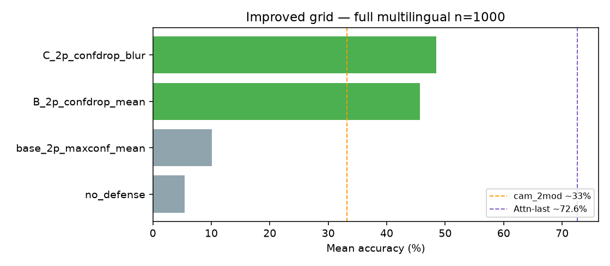

# Paper Draft — First-pass prose (in progress)

**Working title (placeholder):** Cross-Lingual Attention Intersection as a Spatial Defense Against Typographic Attacks on Multilingual CLIP  
**Status:** Skeleton aligned to mentor outline (Abstract → teaser → Intro → Materials & Methods → Results → Discussion → Limitations → Conclusion). §1 prose; §2–§3 still outline-heavy with locked tables. Tables: [`paper_tables_final.md`](paper_tables_final.md) (export); [`tables_index.md`](tables_index.md) (working index).  
**Scope of this draft:** Thread B defense line (separate per-language CLIPs + typographic attacks + saliency masking). Thread A (shared multilingual CLIP + PGD) can be mentioned briefly as motivation / contrast, not as the main contribution.  
**Last synced:** 2026-08-02 — Match mentor skeleton; add past-attempts Intro block; split Discussion / Limitations / Conclusion; GradCAM already removed.  
**Target venue:** [Journal of High School Science (JHSS)](https://jhss.scholasticahq.com/) — [For Authors](https://jhss.scholasticahq.com/for-authors/). Likely type: **Original article** (quantitative defense results) or **Technical note** if framed as a concise method demo.

---

## JHSS standards (official) + draft gap check

Source: JHSS For Authors (Scholastica). This section is a **submission checklist**, not part of the manuscript body.

### Required manuscript structure (Original article)

JHSS: *“Research papers must contain Introduction, Materials and Methods, Results and Discussion, Conclusion and References. Results and Discussion may be combined into one section if appropriate.”*

| JHSS section | In this draft? | Notes |
|---|---|---|
| Title page (title, authors, affiliations, corresponding author, school address, email/phone) | ❌ Missing | Needed before submit |
| Abstract (one paragraph: aims, principal results, major conclusions; keywords in abstract; no refs) | ⚠️ Partial | Abstract exists; not yet submission-polished |
| Keywords (**≥ 10**) | ❌ Missing | JHSS: no less than 10 |
| Introduction | ✅ | Mentor-aligned; still needs formal citations |
| Materials and Methods | ✅ | Rename already matches JHSS |
| Results and Discussion | ⚠️ Split | We have §3 Results + §4 Discussion (+ §5 Limitations). JHSS allows split or combined; for submit, keep both or merge into **Results and Discussion**; fold Limitations into Discussion |
| Conclusion | ✅ §6 | Short form OK |
| References (numbered `(1)` in text; DOI live links; consistent style, APA preferred) | ❌ Missing | Critical gap |
| Acknowledgements | ❌ Missing | Optional but usual (mentor, compute, funding) |

**Mentor-only blocks (remove or demote for JHSS submit):** “Paper at a glance”, writing checklist, appendix ideas, internal status headers, notebook path dumps.

### Quick-guide formatting (submission file)

1. Submit **`.docx`** (one column), **Times New Roman 12**, line spacing **1.15**, L/R margins **1"**, T/B **0.5"**. Blank line between paragraphs; **do not indent**. No page/word limit on body.
2. Subheading # + title **bold**; deeper levels per JHSS heading rules. Tables in the text at appropriate locations.
3. Each figure = **separate JPEG/PNG**; figure legends in a **separate `.docx`** (not inside the image).
4. References numbered sequentially in text in **curved parentheses** `(1)`, `(2-5)`; punctuation after the citation.
5. Equations numbered `(eqX)` (distinct from refs).
6. Reference list: consistent style (APA strongly preferred); ≤6 authors list all; >6 list first 6 + et al.; **live DOI** after each entry.

### Content / scientific standards JHSS emphasizes

- **Original article:** quantitative results; conclusions follow from observations; **statistical analysis** and adequate sample size; no “I believe / I think”; avoid superlatives/opinionated phrasing.
- **Materials and Methods:** enough detail to **replicate**; cite published procedures; name equipment/products with manufacturer + location; note hazards if any.
- **Statistical approach:** number of repeats and **variance** shown in text/figures; reasonable significant figures.
- **Figures/tables:** Arabic numerals in citation order; Word **table** function (not tab-spaced); self-explanatory legends; do not abbreviate “Figure” or “Table”; no footnotes.
- **Writing style (JHSS videos):** prefer **third person**, past tense / past perfect; no superlative language; present data in tables when possible; error bars on graphs when variance applies; positive/negative controls where relevant.
- **Ethics:** human/animal rules only if applicable (N/A for CIFAR-10 model eval); originality; disclose conflicts / funding; student primary author (grades 9–12 eligibility).

### Current draft vs JHSS — verdict

**Structurally close, not submission-ready.**

| Area | Status |
|---|---|
| Section skeleton (Intro → Methods → Results → Discussion → Conclusion) | ✅ Close (after 2026-08-02 mentor reshape) |
| Title page, ≥10 keywords, References with `(n)` cites | ❌ Blockers |
| Word formatting / separate figure files + legends | ❌ Still markdown working draft |
| Reproducible Methods detail | ⚠️ Strong protocol notes, but needs JHSS-style manufacturer/spec prose + less notebook-path voice |
| Statistics / variance / error bars | ⚠️ n=1000 reported; mostly point accuracies — add variance/CI or justify single-run protocol |
| Results vs Discussion separation | ⚠️ Results still interpret a lot; JHSS prefers Results = findings, Discussion = interpretation (mentor Discussion helps) |
| “Paper at a glance” / checklists | ❌ Internal only — strip for `.docx` |
| Third-person / past tense / no “we” | ❌ Draft uses first person “we” throughout |

**Before JHSS submit:** (1) title page + ≥10 keywords, (2) numbered References + in-text `(n)`, (3) export clean `.docx` to format rules, (4) peel figures/legends into separate files, (5) tighten Results vs Discussion, (6) add stats/variance or an explicit single-seed protocol sentence, (7) rewrite to third person past tense, (8) remove mentor/internal scaffolding.

---

## Abstract (draft)

Vision–language classifiers such as CLIP can be fooled by typographic attacks that overlay adversarial class names on an otherwise unchanged image. We defend four separate per-language CLIP models (English, Chinese, Korean, Japanese) by intersecting last-layer attention maps between English and a partner language, shaping the agreed region with connected-component bounding boxes, and filling it with solid black—but only when an Attn-last heatmap-shape detector predicts an attack. On a frozen dual-box CIFAR-10 protocol (n=1000), undefended models collapse to **7.1%** mean accuracy; gated `cc_bbox_black` recovers partner bilingual MIXED2000 scores of **81.65 / 78.35 / 82.53%** (ZH/KO/JA) with near-zero clean-image damage. Ablations show that glyphs—not white pads—drive both hijack and localization, and that the detector gate is required to avoid large clean drops on KO/JA.

---

## Paper at a glance — intro + method + results

**Problem.** Typographic stickers (adversarial class-name overlays) collapse zero-shot CLIP accuracy even though the depicted object is unchanged.  
**Method.** For each partner \(L \in \{\mathrm{ZH}, \mathrm{KO}, \mathrm{JA}\}\), intersect English and L **last-layer CLS→patch attention**, shape the agreed region with `cc_bbox`, and fill with **solid black**—but only when a lightweight Attn-last heatmap-shape classifier (PCA/SVM-style features) predicts attack. Full stack: gated **`cc_bbox_black`**.  
**Results (CIFAR-10, dual-box, n=1000).** Undefended mean atk **7.1%**; gated black recovers bilingual MIXED2000 **81.65 / 78.35 / 82.53%** (ZH/KO/JA) at near-zero Clean Δ. Four locked tables in [`tables_index.md`](tables_index.md).

*Figure 1 (paper). Dual-box typographic attack, black occlusion, and EN CLIP class probabilities before vs after defense.*

---

## 1. Introduction

### 1.1 What we are trying to solve — and why it matters

Vision–language models in the CLIP family perform zero-shot image classification by matching an image embedding to a bank of text embeddings for class names (1). That same text-reading ability creates a striking failure mode: **typographic attacks** overlay an adversarial class name on the image and flip the prediction even though the depicted object is unchanged (2, 3). Unlike invisible pixel-level adversarial noise, these overlays are obvious to humans, yet they remain effective against models that treat written labels as strong visual evidence. Any deployed CLIP-like classifier that consumes photos containing signs, stickers, or UI text is therefore exposed.

### 1.2 Multilingual angle — four languages from the start

A natural hope is that **multiple languages** make attacks harder: an overlay tuned to one language might fail on another. On a *shared* image encoder, however, language disagreement is often a weak detector under gradient attacks (Thread A; background only). This paper instead studies **four separately trained per-language CLIP models**—English (EN), Chinese (ZH), Korean (KO), and Japanese (JA)—each fit on a different image–text corpus. Every partner still sees some English in pretraining, but also carries a **language-specific prior** from its own data (Chinese / Korean / Japanese captions and glyphs). We exploit that structure: stickers that hijack both towers must sit where those distinct priors still agree. The defense is always **EN ∩ L**: English CLIP attention intersected with a partner-language CLIP \(L \in \{\mathrm{ZH}, \mathrm{KO}, \mathrm{JA}\}\). All three partners are first-class throughout Methods and Results, not a late transfer from an EN/ZH case study.

#### 1.2.1 Why English anchors every pairing (and most attacks)

Early 4×4 typographic landscape experiments (attack language × model) showed that **English overlays are the universal, highest-ASR threat** across all four models. Native-script stickers transfer poorly to foreign models, and Pure L attacks on KO/JA are often already weak. We therefore always pair EN with partner L for the spatial defense, and we center evaluation on **Pure E** and **E + L** (the hard cases). Pure L remains for completeness and to expose EN-attention limits on non-Latin glyphs—not because native-only stickers are the main threat. In short: English text is the dominant cross-model typographic threat, so every defense pairing includes the English CLIP and every hard attack includes at least one English sticker.

#### 1.2.2 Why CLIP “reads” stickers — glyphs, not blank pads

Typographic attacks look like painted labels to humans, but the model’s failure mode is more specific: **last-layer attention locks onto the letterforms**, not onto a generic rectangular anomaly. Web-trained CLIP image towers see Latin (and other) glyphs co-occurring with captions throughout pretraining, so class-name overlays become strong visual evidence for the written label. That explains both the high ASR of English stickers across languages (§1.2.1) and why a spatial defense that finds **where both models attend** can neutralize the attack without OCR.

Two controlled checks support this claim (numbers in §3.2.1 and [`tables_index.md`](tables_index.md) Table 2). First, blank white pads barely hijack classification and are poorly localized, while black letters alone nearly match the full sticker’s ASR and gated recovery (text_only gated EN **75.8%** vs full **72.9%**). Second, readable non-text animal stickers can still fool the classifier, and EN attention often finds them, but **bilingual EN∩ZH agreement stays weak until letters appear**. The production intersection mask is therefore a **typographic / glyph** localizer, not a universal anomaly detector. CLIP is distracted by readable text; our defense finds those glyphs via cross-lingual attention agreement, not by looking for white rectangles.

### 1.3 What attempts have been made in the past

Prior defenses against typographic / text-on-image attacks fall into a few families (expanded later as Related Work):

1. **Prediction-level detectors** — flag attacks when models disagree or confidence looks anomalous. Useful as alarms, but **disagreement alone does not restore the correct label**.
2. **Naive spatial search** — e.g. try covering 1/16-image patches (4×4 grid occlusion). Model-agnostic, but coarse, expensive (cost ~62), and a weak floor (~**48.5%** mean atk on our protocol).
3. **OCR-based repair** — detect text boxes with a recognizer, then blur/occlude. Strong when OCR fires (our **spatial upper bound** on EN+ZH), but assumes a working multi-script OCR stack and is not training-free w.r.t. that external model.
4. **Prompt / prefix interventions** — e.g. Defense-Prefix learns a soft prompt while freezing CLIP (4). Competitive on EN-only MIXED, but transfers poorly once a second language is in scope.
5. **Mechanistic head interventions** — Dyslexify (5) and SamplingTAR (6) ablate “typographic” attention heads. Heads-only variants fail on dual-box attacks; attn-blur hybrids recover somewhat but still trail gated black occlusion.

**Gap.** Detection alone is not enough: we need a **spatial** defense that finds and neutralizes sticker region(s), then reclassifies. Always-on spatial repair also risks **clean-image damage**—especially for EN∩KO and EN∩JA—so the defense must include a learned **attack detector** that applies occlusion only when stickers are present. The gate is a core pipeline stage, not an optional post-hoc addon.

### 1.4 Novelty of our approach / main achievements

We mask where English CLIP and partner CLIP L both attend (intersection) for each \(L \in \{\mathrm{ZH}, \mathrm{KO}, \mathrm{JA}\}\), using **last-layer CLS→patch attention (Attn-last)** from the Vision Transformer image tower (7) as the saliency signal. The agreed region is post-processed into sticker-shaped boxes (`cc_bbox`) and occluded with **solid black fill**. An Attn-last heatmap-shape detector **gates** occlusion so Clean Δ stays near zero while attacked accuracy is retained. We call the full stack gated **`cc_bbox_black`**. Evaluation uses three dual-box attack types—**Pure E**, **E + L**, **Pure L**—on all three partners, and compares against a **naive 4×4 grid occlusion** baseline, **OCR+blur** as a spatial upper bound (when OCR fires), Defense-Prefix (4), and Dyslexify (5) / SamplingTAR (6) head interventions (plus attn-blur hybrids). Locked numbers live in [`tables_index.md`](tables_index.md).

**Contributions**

1. **EN ∩ L attention intersection** (\(L \in \{\mathrm{ZH}, \mathrm{KO}, \mathrm{JA}\}\)) recovers accuracy under dual-box typographic attacks on a frozen, class-balanced CIFAR-10 n=1000 set; Raw CLIP mean atk is only **7.1%**.
2. Separately trained language CLIPs carry **shared English exposure plus language-specific priors**; Attn-last EN∩L exploits where those priors still co-attend sticker glyphs (forward-only, cost 4).
3. **`cc_bbox` + solid black fill**, applied only when an Attn-last **detector gate** fires, is the production stack (gated Clean Δ **0.0 / −0.2 / 0.0 pp** for ZH/KO/JA); always-on KO/JA Clean Δ ≈ **−11 pp** motivates the gate.
4. The recipe transfers across partners: bilingual MIXED2000 under gated black is **81.65 / 78.35 / 82.53%** (ZH/KO/JA); EN MIXED **79.35%** (atk **72.9%** / clean **85.8%**). Fill ranking on EN: **black > mean > blur > neglect**.
5. On the same protocol, naive **4×4 grid occlusion** (~**48.5%** mean at cost 62) is a weak floor; **OCR+blur** is the spatial upper bound on EN+ZH; Defense-Prefix (4) wins EN-only MIXED (**81.65%** vs our **79.35%**) but collapses once ZH is included; head interventions (5, 6) fail and hybrids still trail.
6. Glyphs—not blank pads—drive hijack and EN∩ZH localization; gated black recovers typographic stickers well, hybrid partially, animal-only poorly. Production geometry is **font 24 / 2 boxes**.

### 1.5 Paper roadmap

Section 2 (Materials and Methods) specifies the CIFAR-10 dual-box protocol, four language models, gated `cc_bbox_black` pipeline, metrics, and baselines. Section 3 reports four locked tables with interpretation, ablations, and qualitative examples. Section 4 discusses the PCA/SVM-style gate, why the method works, and generalization limits. Section 5 states limitations; Section 6 concludes. Ablation detail: [`ablation_study.md`](ablation_study.md).

---

## 2. Materials and Methods

### 2.1 Dataset and evaluation protocol
- **Source dataset:** CIFAR-10 (8) (10 object classes: airplane, automobile, bird, cat, deer, dog, frog, horse, ship, truck), loaded via HuggingFace `uoft-cs/cifar10` (standard test split).
- **Evaluation set (current, frozen):**
  - From the CIFAR-10 test split, build a **balanced 1000-image sample**: exactly **100 images per class**, drawn randomly within each class with seed 0, then shuffled.
  - Saved as [`lib/notebooks/image_samples/CIFAR10_BALANCED_1000_SAMPLE.json`](../lib/notebooks/image_samples/CIFAR10_BALANCED_1000_SAMPLE.json) (indices + true labels).
  - Replaces an earlier seed-0 random 1000 draw that was class-imbalanced (e.g. cat over-represented, horse under-represented), and supersedes early Thread B STL-10 / n=200 exploratory runs for all main claims.
  - **Attack geometry frozen in the same JSON** under `attack_pos`: per-image top-left anchors for the two dual-box slots (`en` = slot 0, `l` = slot 1), baked once with a fixed reference box size (`131×44`) so every defense / baseline notebook shares identical sticker placement (see [`PROTOCOL.md`](../lib/notebooks/PROTOCOL.md)).
- **Protocol knobs (production setting, 2026-07-21+):**
  - Upscale images to 224×224 for overlays and CLIP inference.
  - Tune percentile thresholds on a **100-image** subset (10 per class), then set `threshold = max(threshold_free, 0.95)` for the full **n=1000** run; log both values.
  - Report Clean Δ on the same 1000 images **without** attack stickers under the **gated** pipeline (always-on Clean Δ kept as ablation).
  - Cite thr-floor four_lang always-on numbers for localization/transfer evidence; EN∩ZH always-on blur case-study **74.9% / −1.5 pp** remains useful design history (pre-freeze RNG geometry).
- **Metrics:**
  - Top-1 accuracy after attack / after defense (per model and mean of the EN+L pair).
  - Attack success rate (ASR) where useful.
  - **Clean Δ:** accuracy change when the same defense policy is applied to unattacked images (side-effect cost).
  - **MIXED2000:** `0.5 * attacked_acc + 0.5 * clean_policy_acc` on the same 1000 indices once clean + once attacked (equal weight).
  - **Coverage:** fraction of pixels masked (tight vs over-masking).
  - **Cost:** forward/backward / OCR / intervention passes per image.

### 2.2 Models (separately trained per-language CLIPs)

Four **independent** CLIP checkpoints (1) — not adapters on one shared tower. Each was trained on a different image–text mixture:

| Lang | Checkpoint | Pretraining bias (qualitative) | Cite |
|---|---|---|---|
| **EN** | OpenAI ViT-B/32 via `open_clip` | English-dominant web image–text (WIT-style) | (1, 9) |
| **ZH** | Chinese-CLIP ViT-B/16 (`OFA-Sys/chinese-clip-vit-base-patch16`) | Chinese captions / glyphs; residual English | (10) |
| **KO** | `Bingsu/clip-vit-base-patch32-ko` | Korean-centric mixture; residual English | (11) |
| **JA** | `llm-jp/llm-jp-clip-vit-base-patch16` | Japanese-centric mixture; residual English | (12) |

**Why this matters for the defense.** Partners are not interchangeable copies of one multilingual encoder. Each has (i) some English exposure — so Latin stickers can still hijack ZH/KO/JA — and (ii) a **language-specific prior** from its own corpus (script, captions, visual co-occurrences). EN ∩ L is designed to exploit that structure: a sticker that fools both towers must occupy a region where those distinct priors still agree to look. Agreement across independently trained biases is a stronger spatial cue than single-model saliency alone.

- Clean accuracy ballpark on the balanced n=1000: EN ~85.9%, ZH ~91.4%, KO ~89.6%, JA ~92.5%.
- Defense always pairs **EN with one partner L** (never a ZH-only pipeline).

### 2.3 Attack construction (typographic)
- Method: render adversarial class name as text on the image (`draw_word`), following the typographic-attack threat model (2, 3); no gradients.
- **Dual-box geometry** (main threat model):
  - Two non-overlapping white text boxes at frozen `attack_pos` coordinates.
  - **Font size fixed at 24** @ 224×224 for all main / baseline tables. Sensitivity to font size (12 / 24 / 40) and box count (1 / 2 / 3) is reported in Results (§3.10).
- **Three attack types** (poster names; notebook codes in parentheses):

| Poster name | Notebook code | Box 0 | Box 1 |
|---|---|---|---|
| **Pure E** | `uni_en` | English | English |
| **E + L** | `multi` | English | Partner language L |
| **Pure L** | `uni_l` | Partner L | Partner L |

- For each partner `L ∈ {ZH, KO, JA}`, evaluate all three attack types under the same EN ∩ L defense.
- Earlier single-box 4×4 confusion matrices (attack language × model) provide attack-landscape background.

*Figure: evaluation protocol — four CIFAR-10 classes (distinct frozen `attack_pos`) × Clean / Pure E / E+L / Pure L (partner L = ZH shown; identical geometry for KO/JA). Paper asset: [`docs/figures/dataset/`](figures/dataset/).*

#### 2.3.1 English-centric attack design (pointer)
- Rationale already stated in **§1.2.1**; Methods only operationalizes it: slot 0 is always the EN box position; Pure E / E+L / Pure L matrix uses the same frozen geometry for every partner L.
- Brief reminder if needed: English = highest-ASR attack language; Pure L retained as the weak / completeness cell.

#### 2.3.2 Diagnostic attack variants (protocol only)

Same frozen dual-box `attack_pos` and production mask settings; full interpretation in **§3.2** / §3.10:

- **Glyphs vs pads:** `full` / `white_only` / `text_only` ([`attack_component_ablation/`](../lib/notebooks/attack_component_ablation/)).
- **Content control:** `all_text` / `mixed` / `all_sticker` animal patches ([`animal_sticker_ablation/`](../lib/notebooks/animal_sticker_ablation/)).
- **Geometry:** font ∈ {12, 24, 40}; boxes ∈ {1, 2, 3} ([`attack_geometry_ablation/`](../lib/notebooks/attack_geometry_ablation/)).

### 2.4 Defense pipeline (main method)
Describe as a fixed sequence for any partner `L ∈ {ZH, KO, JA}`. Production policy is **gated** — occlude only when the detector fires:

0. **Attack detector (core):** Attn-last heatmap-shape classifier decides clean vs attacked (§2.5). If clean → skip to reclassify (no occlusion). If attacked → continue.
1. **Attn-last saliency** from EN and partner L (§2.6): one forward per model yields a spatial heatmap (no backward).
2. **Intersection** EN ∩ L via elementwise `min` after aligning both maps to 224×224 (agreement = both models attend the same region).
3. **Percentile threshold** on the intersection heatmap (tuned on n=100; **enforce thr ≥ 0.95**).
4. Optional **dilation** (default 3×3×3; KO/JA may use tighter dilate).
5. **Mask shaping (`cc_bbox`):** keep top-2 connected components → snap each to axis-aligned bounding box (match sticker rectangles).
6. **Fill (primary = black):** solid **black** inside the mask. Alternative fills (blur / mean / neglect) are compared in Results (§3.6–§3.7).
7. **Reclassify** both models on the defended image.

Name the full production stack: gated **`cc_bbox_black`** (Attn-last intersection + `cc_bbox` + black fill + detector gate).

*Figure 2. Method overview. (a) Attn-last EN ∩ L localization → thr / dilate / `cc_bbox`. (b) Attack-detector gate → black fill (attacked) or skip (clean) → reclassify. CLIP encoders frozen; L = ZH shown (same for KO / JA). Script: [`figures/method/make_method_figure.py`](figures/method/make_method_figure.py).*

*Figure: qualitative stages on E+L dual-box examples for partners ZH, KO, and JA (pipeline viz currently shows blur fill; production fill is black — reinterpret final stage / regenerate when writing prose).*

### 2.5 Attack detector gate (core) — PCA/SVM-style clean vs attack
- Motivation: always-on occlusion still hurts clean KO/JA (~−11 pp); production defense must occlude **only when stickers are present**.
- **Features (26 scalars)** from Attn-last EN / L / intersection maps: entropy, top-k mass, Gini, kurtosis, cov95, CC count, EN–L corr/IoU, etc. (PCA used for visualization / analysis of linear separability; see Discussion §4.1).
- **Classifier:** logistic + calibrated linear SVM (14); image-level 70/15/15 split; choose val threshold for **attack-recall ≥ 0.99** (keep gated atk drop <1 pp).
- **Production policy:** **`gated` only** for reporting — apply `cc_bbox_black` iff detector says attack.
- Code: [`lib/notebooks/attack_detector/`](../lib/notebooks/attack_detector/); evaluated on `multi` for ZH/KO/JA.

### 2.6 Attn-last saliency

**Attn-last (production saliency; cost 4 for EN∩L).** Each CLIP image tower is a Vision Transformer (7): the image is patchified and a learnable **CLS** token is prepended; after the stack of self-attention blocks, the CLS pooling (or its projection) is the image embedding used for zero-shot classification. Attn-last turns that token’s last-layer attention into a spatial heatmap:

1. One forward through the vision encoder (classification can be fused with the same pass).
2. Read the self-attention tensor of the **final** transformer block: shape `(heads, tokens, tokens)`.
3. Average over heads; take the **CLS→patch** row (`attn[0, 1:]`), dropping the CLS→CLS entry.
4. Reshape to the patch grid (EN/KO ViT-B/32 → 7×7; ZH/JA ViT-B/16 → 14×14), min–max normalize to \([0,1]\), and bilinear-resize to 224×224.

EN ∩ L is then the elementwise minimum of the two resized maps. No gradients are required: attention weights are a byproduct of the forward pass. Implementation note: `open_clip` EN/JA hardcode `need_weights=False`, so EN/JA weights are recomputed from QKV inside a forward hook on each `attn` module; HF vision towers (ZH/KO) expose `output_attentions=True`.

**Why this signal:** typographic stickers hijack late-layer attention onto glyph patches. Independently trained EN and L towers still often co-attend those glyphs (§2.2); Attn-last reads that hijack one hop from the decision, so the intersection lands tightly on text at low coverage. Code lineage: [`attention_defense/`](../lib/notebooks/attention_defense/).

### 2.7 Baselines (same frozen dual-box protocol)

Living numbers: [`docs/baseline_comparison.md`](baseline_comparison.md). Code: [`lib/notebooks/paper_baselines/`](../lib/notebooks/paper_baselines/), [`_test_grid/`](../lib/notebooks/_test_grid/). Comparison target for “ours” is **gated `cc_bbox_black`**.

**Framing.** Spatial methods span a floor → upper-bound spectrum:

| Role | Method | What it does | Scope | Cost |
|---|---|---|---|---:|
| **Naive floor** | **4×4 grid occlusion** | Split image into 16 equal patches; greedily black/blur the 1–2 patches that most reduce the pre-defense top-1 confidence (conf-drop); reclassify | EN+ZH | ~62 |
| **Spatial upper bound** | **OCR + blur** | EasyOCR (13) (`en`+`ch_sim`) text boxes → Gaussian blur r=12 → reclassify — strong when OCR localizes stickers | EN+ZH | 3 |
| Peer | **Defense-Prefix** (4) | Learned prompt prefix; CLIP frozen. Retrain 10 ep on CIFAR-10 train (EN + ZH tokens; eval held out) | EN+ZH | 2 |
| Peer | **Dyslexify hybrid** (5) | Mine typographic heads + attn-guided patch blur | EN-only | 3 |
| Peer | **SamplingTAR hybrid** (6) | Circuit / head ablation + attn-guided patch blur | EN-only | 3 |

OCR+blur is a **spatial upper bound** (near-oracle text boxes when recognition works), not a method we claim to beat on every cell. Grid occlusion is the **model-agnostic naive baseline**: no attention, only 1/16-image cover-ups. Heads-only Dyslexify / SamplingTAR (5, 6) are negatives; hybrids are the reportable peers. Smoke ladder for published ports: n=16 → n=100 → **n=1000**.

### 2.8 Implementation notes (short)
- Shared protocol: [`lib/notebooks/PROTOCOL.md`](../lib/notebooks/PROTOCOL.md).
- Notebooks: `attention_defense`, `heatmap_defense_improvements`, `four_lang_cc_bbox_blur`, `ko_ja_clean_damage`, `attack_detector`, `en_neglect_vs_blur`, `en_occlusion_beat_dp`, `attack_component_ablation`, `animal_sticker_ablation`, `attack_geometry_ablation`, `paper_baselines/*`, grid: `_test_grid`.
- Living tables: [`4_lang_table.md`](4_lang_table.md) (main + lang detail), [`ablation_study.md`](ablation_study.md) (Results appendix).
- Thresholds chosen on tune set with thr ≥ 0.95 floor; report frozen thr / coverage alongside accuracy.
- Pipeline figure regenerator: `four_lang_cc_bbox_blur/make_pipeline_viz.py` (EN ∩ ZH / KO / JA examples; **still need black-fill regen** — current PNGs show blur).

---

## 3. Results

Paper tables are locked in [`tables_index.md`](tables_index.md) (Tables 1–4). Detail and appendix narrative: [`4_lang_table.md`](4_lang_table.md); [`ablation_study.md`](ablation_study.md). Headline set: Raw CLIP mean atk **7.1%** (Scope MIXED **48.5%**); gated `cc_bbox_black` EN **72.9% / 85.8% / 79.35% MIXED**; partner bilingual black mean **80.84%** (ZH/KO/JA **81.65 / 78.35 / 82.53%**). The subsections below keep outline bullets for Methods-aligned claims; expand to full prose after Related Work is drafted.

**How to read this section (mentor skeleton).** Interpret each of the four locked tables; for ablation tables, state the ablation setting before the claim. Qualitative recoveries / failures are in §3.7; sticker-based attack visualization is in the dataset figure (§2.3) and animal/text occlusion gallery (§3.2.2).

| Table | Setting | What to interpret |
|---|---|---|
| **1** | Main vs baselines (same frozen dual-box protocol) | Atk acc / Clean Δ / MIXED2000 / Cost; always note **Scope** (methods do not share identical language coverage) |
| **2** | Attack details (glyphs vs pads; font / box geometry) | Glyphs drive hijack; production threat model = font 24 / 2 boxes |
| **3** | Sticker / hybrid / text occlusion recovery | Typographic defense, not universal anomaly repair |
| **4** | Occlusion algorithm / design path to gated black | Why `cc_bbox` + black + gate |

**Metric reminder.** Prefer quoting **attacked accuracy** and **MIXED2000** (`0.5 * atk + 0.5 * clean_policy`) separately — never present MIXED as attacked-only. Clean Δ is the side-effect cost of the same gated policy on unattacked images.

Under undefended dual-box `multi` attacks, all four language models collapse (EN/ZH/KO/JA **4.5 / 6.4 / 11.6 / 6.0%**). The rest of this section asks whether gated black occlusion restores accuracy without harming clean images, how attack geometry and sticker content change that picture, and how our method compares to published baselines.

### 3.1 Clean-image side effects (no attack) — lead claim
- **Production (gated, `multi`):** Clean Δ → **0.0 / −0.2 / 0.0 pp** for ZH / KO / JA — the Clean-Δ story for the paper.
- EN gated black: Clean Δ ≈ **−0.1 pp** (clean **85.8%**; gate fire on clean **0.4%**).
- **Why the gate is necessary (always-on ablation, thr≥0.95):** EN∩ZH ≈ **−1.5 pp**; EN∩KO / EN∩JA ≈ **−11.2 / −11.5 pp** (restored from free-tune collapses to −25 / −23 when thr fell to 0.85/0.90).
- Poster takeaway: the detector gate is the **default** defense policy — not “use when Clean Δ matters.”

### 3.2 Attack landscape (brief)
- English text overlays are a **universal** threat across EN/ZH/KO/JA models; native-script Pure L attacks are often weaker on KO/JA.
- Point to 4×4 accuracy / ASR matrix from CIFAR-10 typographic study if needed for context.
- Disagreement detector: works modestly (above chance) but is not the main contribution — spatial repair **with** the heatmap-shape gate is.

#### 3.2.1 Glyphs vs pads vs animal stickers (supports §1.2.2)

**White / letters / full** (EN∩ZH `cc_bbox`, n=1000; clean floors EN 85.9% / ZH 91.4%):

| Mode | EN ASR | ZH ASR | EN∩ZH IoU | EN∩ZH det@IoU≥0.1 |
|------|-------:|-------:|----------:|------------------:|
| full | **95.3%** | **93.6%** | **0.691** | **100%** |
| white_only | 2.3% | 2.1% | 0.083 | 41.1% |
| text_only | **89.8%** | **84.5%** | **0.669** | **100%** |

**Gated black recovery** ([`content_occlusion_n1000.json`](../lib/notebooks/attack_component_ablation/results/content_occlusion_n1000.json); Table 2 in [`tables_index.md`](tables_index.md)):

| Mode | EN acc (no def) | EN acc (gated) | ZH acc (gated) |
|------|----------------:|---------------:|---------------:|
| white_only | **75.5%** | 70.9% | 75.0% |
| text_only | 9.6% | **75.8%** | **82.7%** |
| full | 4.5% | **72.9%** | **76.5%** |

**Takeaway:** blank pads do not hijack and are weakly localized; letters alone ≈ full sticker on ASR and gated recovery (text_only gated EN **75.8%** ≈ full **72.9%**). Attention follows **glyphs**.

**Animal / mixed / text** (same protocol; animals 96×96, no white pad):

| Mode | EN ASR | ZH ASR | EN∩ZH IoU | EN∩ZH det@IoU≥0.1 | Notes |
|------|-------:|-------:|----------:|------------------:|-------|
| all_sticker | **76.6%** | **87.7%** | 0.117 | 51.1% | EN-only det@.1 **99.3%**; ZH det@.1 **1.1%** |
| mixed | **98.7%** | **97.6%** | 0.310 | **99.8%** | one text box restores bilingual detect |
| all_text | **95.3%** | **93.6%** | **0.691** | **100%** | tightest EN∩ZH |

**Takeaway:** non-text stickers can fool the classifier, but **EN∩ZH localization is text-favoring**.

#### 3.2.2 Black occlusion recovery — sticker / hybrid / text

Gated / always-on / EN-only / oracle GT black on the same three modes ([`occlusion_n1000.json`](../lib/notebooks/animal_sticker_ablation/results/occlusion_n1000.json); full tables in [`ablation_study.md`](ablation_study.md) §A.3 / §B.2).

**Paper Table 3 shape** ([`tables_index.md`](tables_index.md); n=1000):

| Mode | Raw CLIP EN | Ours EN∩ZH | Ours EN-only | EN ASR (EN∩ZH) | Clean Δ EN (EN∩ZH) |
|------|------------:|-----------:|-------------:|---------------:|-------------------:|
| all_text (typographic) | 4.5% | **72.9%** | 68.0% | 3.7% | −0.1 pp |
| mixed (hybrid) | 1.3% | **43.5%** | 40.2% | 27.3% | −0.1 pp |
| all_sticker (visual / animal) | 11.0% | 20.6% | **32.9%** | 54.2% | −1.8 pp |

Oracle GT black ceilings: all_text EN **74.6%**; mixed **64.3%**; all_sticker **56.9%**.

**Claims**
1. Production EN∩ZH black is a **typographic** defense — `all_text` near oracle; `mixed` partial; `all_sticker` barely moves.
2. EN-only helps animals more than bilingual (32.9% vs 20.6%) but costs clean accuracy; still far below oracle → **localization**, not fill, is the bottleneck.
3. Animal-mode gates are leakier on clean (fire_clean **26%**) than typographic spikes (~0–1%).

*Figure: raw | EN∩ZH black | EN-only black for animal / mixed / text.*

### 3.3 Four-language transfer (L ∈ {ZH, KO, JA}) — localization evidence
- Design matrix: for each L, evaluate **Pure E / Pure L / E + L** with always-on EN ∩ L `cc_bbox_blur` under **frozen `attack_pos` + thr ≥ 0.95** — shows the mask recipe transfers before gating/black fill.
- Always-on mean defended acc (thr-floor, n=1000):

| Cell | Atk mean | Def mean | Clean Δ |
|---|---:|---:|---:|
| zh / Pure E | 14.3% | **60.2%** | −1.5 |
| zh / Pure L | 56.1% | **67.2%** | −1.5 |
| zh / E+L | 5.5% | **74.0%** | −1.5 |
| ko / Pure E | 8.3% | **63.7%** | −11.2 |
| ko / Pure L | 74.1% | **68.4%** | −11.2 |
| ko / E+L | 7.9% | **69.9%** | −11.2 |
| ja / Pure E | 3.5% | **72.3%** | −11.5 |
| ja / Pure L | 78.0% | **72.8%** | −11.5 |
| ja / E+L | 4.8% | **75.9%** | −11.5 |

- Claims:
  - ZH **E + L** nearly reproduces the EN/ZH case-study winner (74.0% vs 74.9%; −0.9 pp under frozen geometry).
  - Hard attacks (Pure E, E + L) recover to mid-60s–mid-70s mean for KO/JA as well.
  - Pure L often already weak on KO/JA (defense can slightly hurt); ZH Pure L is the exception where defense helps more.
  - Always-on KO/JA Clean Δ is the language-dependent failure mode — **production numbers are gated `cc_bbox_black`** (§3.7); partner bilingual black **81.65% / 78.35% / 82.53%** (ZH/KO/JA). Fill ablations retained; KO blur +0.15pp is not a protocol fork.
- Protocol note (appendix / one paragraph): free thr-tune under freeze had dropped multi thr to 0.85–0.90 and inflated Clean Δ; flooring at 0.95 restored accuracy and clean cost. Report both if reviewing sensitivity.
- Figure: language × attack panel of attacked vs defended mean acc + clean Δ.

### 3.4 Main results — ours vs baselines (averages + lang detail)

Canonical sources: [`tables_index.md`](tables_index.md) Table 1; [`4_lang_table.md`](4_lang_table.md). Prefer **MIXED2000** as the joint headline; always show Scope (methods do not share identical language coverage).

#### Table A — averages (paper main table)

| Method | Scope | Atk acc (avg) | Clean Δ (avg) | MIXED2000 (avg) | Cost |
|--------|-------|--------------:|--------------:|----------------:|-----:|
| Raw CLIP (no defense) | EN+ZH+KO+JA | **7.1%** | 0.0 pp | **48.5%** | 1 |
| 4×4 grid occlusion (naive) | EN+ZH | 48.5% | — | — | 62 |
| **Gated `cc_bbox_black` (ours)** | EN∩ZH / EN∩KO / EN∩JA | **73.3%** | **≈ 0.0 / −0.2 / 0.0 pp** | **80.84%** | 4 |
| OCR + blur (spatial upper bound) | EN+ZH | 73.8% | −0.7 pp | 80.88% | 3 |
| Defense-Prefix | EN+ZH | 59.2% | +0.5 pp | 74.90% | 2 |
| SamplingTAR hybrid | EN only | 67.3% | −8.3 pp | 72.45% | 3 |
| Dyslexify hybrid | EN only | 66.9% | −8.1 pp | 72.35% | 3 |

Ours avg MIXED = mean of partner bilingual black **81.65 / 78.35 / 82.53%**. Ours avg atk = mean of partner mean-atk **74.7 / 69.4 / 75.9%**. Raw CLIP from four-way `never` (EN/ZH/KO/JA **4.5 / 6.4 / 11.6 / 6.0%**).

#### Table B — language detail (ours gated black)

| Pairing | EN atk | L atk | Mean atk | EN MIXED | Bilingual MIXED | Gate fire (atk / clean) |
|---------|-------:|------:|---------:|---------:|----------------:|-------------------------:|
| EN∩ZH | **72.9%** | **76.5%** | **74.7%** | **79.35%** | **81.65%** | 99.8% / 0.4% |
| EN∩KO | 65.6% | 73.1% | 69.4% | 75.45% | **78.35%** | 99.4% / 2.5% |
| EN∩JA | 68.9% | 82.8% | 75.9% | 77.40% | **82.53%** | 99.8% / 0.3% |

Baseline per-lang cells (OCR/DP EN+ZH with ZH MIXED; hybrids EN-only): [`4_lang_table.md`](4_lang_table.md) Table 1.

#### Talking points
- Lead with **Raw CLIP** collapse (mean atk **7.1%**) so defended gains are absolute, not only relative to peers.
- **Naive floor:** 4×4 grid conf-drop blur reaches only **48.5%** mean atk at cost **62** — proves blind 1/16 cover-ups are not enough (§3.5).
- **Spatial upper bound:** OCR+blur EN+ZH MIXED **80.88%** / mean atk **73.8%** — ours bilingual mean MIXED **80.84%** sits next to this bound without requiring OCR.
- **Do not claim** occlusion-only beats DP on EN MIXED2000 — gated black EN **79.35%** is **−2.30 pp** vs DP EN **81.65%**.
- **Do claim** cross-language spatial advantage: ours partner-mean MIXED **80.84%** vs DP EN+ZH MIXED **74.90%** / mean atk **59.2%**.
- Heads-only Dyslexify / SamplingTAR (20.0% / 11.6% EN) are negatives; hybrids (~67% EN / ~72.4% MIXED) confirm occlusion drives recovery but still trail gated black.

### 3.5 Naive baseline — 4×4 grid occlusion (1/16 cover-ups)

Model-agnostic floor for spatial repair (no attention / OCR). Split each 224×224 image into a **4×4** checkerboard of 16 patches; try covering patches and keep the choice that most reduces the pre-defense top-1 confidence (**conf-drop**), then reclassify. Winner under the cost bar: greedy **2-patch** + conf-drop + blur fill (`C_2p_confdrop_blur`).

| Method | Cost | EN atk | ZH atk | Mean atk |
|---|---:|---:|---:|---:|
| no defense | 2 | 4.5% | 6.4% | 5.5% |
| 2-patch max-conf (old scoring) | 62 | 5.4% | 14.8% | 10.1% |
| **2-patch conf-drop blur (naive baseline)** | **62** | **47.8%** | **49.2%** | **48.5%** |
| Exhaustive C(16,2) pairs (max-conf, n=100) | ~240 | — | — | ~11.5% |

**Interpretation.** Conf-drop scoring is what makes grid non-trivial (~11% → **48.5%**), but a coarse 1/16 patch is still a blunt instrument: stickers can sit across patch boundaries, and the search costs **~10×** our Attn-last pipeline. Exhaustive pair search does not fix the geometry. Hit-pattern analysis (E+L): covering the **English** box matters far more than ZH-only; hit-both best (~68% conditional). Role in the paper: **naive floor** under OCR’s spatial upper bound — not a production method.

Source: [`_test_grid/results/comparison_n1000.json`](../lib/notebooks/_test_grid/results/comparison_n1000.json).

### 3.6 Design ablations — path to gated `cc_bbox_black`

Interpretation of frozen design choices (full tables: [`ablation_study.md`](ablation_study.md)). Methods only specify the production stack; the “why” lives here.

**Mask / fill path (EN∩ZH E+L, design history).** Always-on Attn-last intersection → blur_fill → `cc_bbox` → **`cc_bbox_blur`** (~**74.9%** mean / **−1.5 pp** Clean Δ) established localization. After the same `cc_bbox` masks under the gate, fill ranking on EN MIXED2000 is **black > mean > blur > neglect** (§3.7) — so production fill is solid black.

**What failed or helped little (compact).**
- **Union masks (EN ∪ L)** — over-masks; hurts clean images.
- **Peakiness / disagreement gating** — rarely fires or too aggressive; superseded by the learned Attn-last detector (§3.7).
- **Peaked-heads only; EN ViT-B/16 instead of B/32** — no gain / worse clean Δ.
- **Attn + conf-drop hybrid** — better than full grid, worse than plain Attn-last at higher cost.
- **Always-on KO/JA geometry tweaks** (thr floor 0.95, tight dilate, no bbox) — shave residual clean damage but do not replace the gate.
- **OCR∪Attn black** — EN MIXED2000 **79.70%** (+0.35 pp vs Attn-only); production localization stays Attn-only (no OCR dependency).

**Residual gap.** Black lifts EN atk by **+3.0 pp** vs gated blur but does **not** close ~**13 pp** EN residual (clean ~85.9% − atk 72.9%); oracle GT boxes + black only reach **74.6%** EN atk — localization/coverage still limits recovery.

### 3.7 Gated defense — headline results (`multi`)
- Attn-last heatmap features separate clean vs attacked almost perfectly (test AUC ≈ 1.0 for ZH/JA; 0.999 for KO).
- Phase C detector quality (attack-recall target **0.99**; fill in that log was blur — localization/gate story):

| L | Always atk | Gated atk | Δ atk | Always Clean Δ | Gated Clean Δ |
|---|---:|---:|---:|---:|---:|
| zh | 74.0% | **73.9%** | −0.10 | −1.45 | **0.00** |
| ko | 69.9% | **69.45%** | −0.45 | −11.25 | **−0.20** |
| ja | 75.9% | **75.7%** | −0.20 | −11.50 | **0.00** |

- **MIXED2000 always vs gated** (gate evidence; Phase-C logs used blur fill):

| L | Always MIXED2000 | Gated MIXED2000 (blur log) | Gated − always |
|---|---:|---:|---:|
| zh | 80.60% | **81.28%** | +0.68 |
| ko | 73.20% | **78.50%** | +5.30 |
| ja | 76.80% | **82.45%** | +5.65 |

- **Production partner MIXED2000 (gated black)** — quote these going forward:

| L | Gated bilingual MIXED2000 (black) | vs gated blur |
|---|---:|---:|
| zh | **81.65%** | +0.37pp |
| ko | **78.35%** | −0.15pp |
| ja | **82.53%** | +0.08pp |

- **EN gated black headline** (production fill; [`en_neglect_vs_blur`](../lib/notebooks/en_neglect_vs_blur/)):

| Metric | Value |
|---|---:|
| EN attacked acc | **72.9%** |
| EN clean (gated) | **85.8%** |
| EN Clean Δ | **−0.1 pp** |
| EN MIXED2000 | **79.35%** |
| EN ASR (after defense) | 3.7% |
| Gate fire (atk / clean) | 99.8% / 0.4% |

- **Qualitative grids** (Attacked vs Ours): recoveries [`qualitative_figure.png`](figures/qualitative/qualitative_figure.png); failures [`qualitative_failures.png`](figures/qualitative/qualitative_failures.png). Script: [`make_qualitative_figure.py`](figures/qualitative/make_qualitative_figure.py).

*Figure. Qualitative recoveries of gated `cc_bbox_black` on dual-box E+L attacks (ZH / KO / JA). % = CLIP top-1 softmax classification probability.*

*Figure. Qualitative residual failure cases after detector-gated black fill (one per partner).*

- **Fill ranking (gated EN MIXED2000):** neglect **73.20%** < blur **77.90%** < mean **78.15%** < **black 79.35%** (+1.45 pp vs gated blur; +3.0 pp EN atk).
- Defend coverage (full n=1000): attacked 99.4–99.8%; clean false-occlude 0.3–2.5% (KO highest).
- Biggest win: KO/JA Clean Δ **≈ −11 pp → ~0** with <0.5 pp attacked-acc sacrifice; MIXED2000 makes gated the clear winner over always-on.
- Honesty notes: (1) **79.35% is MIXED2000, not attacked-only**; (2) production fill is **black for all langs** — partner bilingual MIXED ZH **81.65%** / KO **78.35%** / JA **82.53%** (KO blur +0.15pp in ablation only; do not fork protocol); (3) Pure E / Pure L under the gate and adaptive placement still open.

*Detector separation figure and interpretation moved to Discussion §4.1 (PCA of Attn-last heatmap-shape features).*

### 3.8 KO/JA clean-damage mitigation (always-on ablations)
- Show baseline vs thr_floor_095 / tight_dilate / no_bbox.
- Main story: thr=0.90 (or lower) on Pure E / multi was self-inflicted overshoot; flooring at **0.95** recovers large Clean Δ without losing defended acc (sometimes gains).
- Geometry tweaks shave residual always-on clean damage but do not reach ZH’s −1.5 pp — remaining gap is **heatmap quality**.
- Interpretation: always-on residual gap is EN∩KO / EN∩JA heatmap quality, not just threshold choice — **production policy is the detector gate** (§3.7), not a tweaked always-on stack.

### 3.9 Summary table for the reader (results closer)
- **Locked paper tables:** [`tables_index.md`](tables_index.md) — Table 1 (main + Raw CLIP), Table 2 (attack details), Table 3 (sticker/text/hybrid), Table 4 (occlusion algorithm).
- **Detail / appendix:** [`4_lang_table.md`](4_lang_table.md); [`ablation_study.md`](ablation_study.md).
- Highlight recommended config: **Attn-last + `cc_bbox` + black fill + detector gate**; thr ≥ 0.95; **font 24 / NUM_BOXES=2**.

### 3.10 Attack geometry — font size and number of boxes

Full tables: [`tables_index.md`](tables_index.md) Table 2; [`ablation_study.md`](ablation_study.md) §B.3–B.4. Code: [`attack_geometry_ablation/`](../lib/notebooks/attack_geometry_ablation/). EN∩ZH gated `cc_bbox_black`, n=1000.

**Font (dual-box)**

| Font | never EN ASR | gated EN | gated ZH | Clean Δ EN |
|-----:|-------------:|---------:|---------:|-----------:|
| 12 | 89.9% | **76.0%** | 83.9% | +0.0 pp |
| **24** | **95.3%** | **72.9%** | **76.5%** | −0.1 pp |
| 40 | 96.9% | 58.3% | 56.3% | −0.4 pp |

**Boxes (font 24; `top_k = num_boxes`)**

| Boxes | never EN ASR | gated EN | gated ZH | Clean Δ EN |
|------:|-------------:|---------:|---------:|-----------:|
| 1 | 94.1% | **78.2%** | 82.9% | −0.1 pp |
| **2** | **95.3%** | **72.9%** | **76.5%** | −0.1 pp |
| 3 | 97.5% | **45.9%** | **56.1%** | −0.8 pp |

**Claims:** Font **24** and **2 boxes** stay production (font-24 / boxes-2 cells reproduce EN gated **72.9%**). Font 40 is a harder spatial threat (−14.6 pp gated EN). Three boxes with matched `top_k=3` recover gated EN to **45.9%** (was **8.5%** under production `top_k=2`). Mention font size 24 explicitly in the threat-model paragraph.

---

## 4. Discussion

### 4.1 PCA/SVM-based attack/clean selection — effectiveness

The production gate is a lightweight Attn-last **heatmap-shape** classifier (26 scalars from EN / L / intersection maps: entropy, top-k mass, Gini, kurtosis, cov95, CC count, EN–L corr/IoU, etc.; logistic + calibrated linear SVM; image-level 70/15/15; attack-recall ≥ 0.99). Clean vs attacked Attn-last features separate almost perfectly (test AUC ≈ 1.0 for ZH/JA; 0.999 for KO). PCA / feature-space plots show the same structure:

*Figure. PCA of Attn-last heatmap-shape features (ZH `multi` example): clean vs attacked are linearly separable, which is why a simple SVM/logistic gate works without retraining CLIP.*

**Why the gate matters.** Always-on `cc_bbox` still hurts clean KO/JA (~**−11 pp**). Gating restores Clean Δ to **0.0 / −0.2 / 0.0 pp** (ZH/KO/JA) with <0.5 pp attacked-acc sacrifice, so MIXED2000 clearly prefers gated over always-on (§3.7). The detector is therefore not a post-hoc nicety: it is what makes the spatial recipe deployable across partners with noisier heatmaps.

### 4.2 Why the method is effective — strengths

1. **Training-free w.r.t. CLIP.** Encoders stay frozen. Localization uses forward-only Attn-last (cost 4 for EN∩L); the only learned piece is a tiny image-level attack/clean classifier on heatmap scalars, not a finetuned vision tower.
2. **Exploits how language CLIPs are trained.** Independently trained EN and L towers share some English exposure but carry **language-specific priors**. Stickers that hijack both must occupy patches where those priors still co-attend — typically **glyphs**, not blank pads (§1.2.2 / §3.2.1). Intersection turns that training structure into a spatial cue stronger than single-model saliency.
3. **Spatial repair, not only an alarm.** Unlike prediction-disagreement detectors, EN∩L + `cc_bbox_black` removes the distractor and reclassifies, recovering mean atk from **7.1%** toward the mid-70s while Clean Δ stays near zero under the gate.
4. **Selective black occlusion.** Detect → localize EN∩L → black out → reclassify beats always-on blur when partner heatmaps are noisy; soft blur remains a useful ablation, not the production fill. On gated EN MIXED: **black > mean > blur > neglect**.
5. **Cross-language transfer.** The same recipe works for ZH, KO, and JA partners; bilingual MIXED under gated black is **81.65 / 78.35 / 82.53%**. Spatial localization also beats pure mechanistic head ablation on this dual-box protocol (hybrids confirm occlusion, not heads alone, drives recovery).

### 4.3 Possibility of generalizing to visual anomalies (stickers)

Animal-sticker / hybrid ablations (§3.2.2) show the **possibility** of treating non-text overlays as distractors, but also the limit of the current recipe:

| Mode | Gated EN∩ZH black | Notes |
|---|---:|---|
| all_text (typographic) | **72.9%** | Near oracle GT black (**74.6%**) — main claim |
| mixed (hybrid) | **43.5%** | Partial recovery |
| all_sticker (animal) | **20.6%** | Barely moves; EN-only better (**32.9%**) but still ≪ oracle (**56.9%**) |

EN∩L is a **glyph / typographic** localizer: bilingual agreement is weak until letters appear. Non-text stickers can fool the classifier and EN-only attention sometimes finds them, but we should **not** claim a universal visual-anomaly defense. Generalization to arbitrary stickers remains an open direction (stronger EN-gated repair; different saliency), not a result we have demonstrated.

### 4.4 Broader implications and next steps

- Separate encoders + spatial agreement may complement prediction-disagreement detectors.
- English text remains the dominant transfer threat — defenses should prioritize localizing **glyphs**, not generic white rectangles.
- Future: close residual gap to clean under attack; extend the gate to Pure E / Pure L and adaptive placement; test higher-res / realistic text; optional stronger animal / multi-sticker localization (`top_k` matched to box count).

---

## 5. Limitations

**Mentor-facing must-includes**
- **Visual-anomaly defense only shows possibility.** Animal-only / hybrid recovery is weak (§3.2.2 / §4.3); the production claim is typographic (glyph) defense, not universal sticker/anomaly robustness.
- **Multi-language requirement.** The method needs a partner CLIP L and runs as EN∩L. A single monolingual tower does not instantiate this defense; always-on KO/JA clean damage further shows that partner heatmap quality — and therefore language choice — matters.

**Protocol and evaluation honesty**
- Evaluated on CIFAR-10 dual-box stickers with **frozen** placement — not ImageNet-scale scenes, not adaptive attackers that place text to evade attention or the detector.
- Detector / gated results reported for **E + L (`multi`)**; Pure E / Pure L under the gate still open.
- Pure L (especially ZH-only) stickers remain harder for the EN half of the intersection.
- Partner fill ranking is tighter than EN (KO blur +0.15pp bilingual); protocol still freezes **black for all** so tables stay comparable.
- Residual gap to clean under attack (~**13 pp** EN: 72.9% vs ~85.9%) unsolved — black fill and gating remove clean cost / improve atk, but do not close the residual; oracle GT+black only **74.6%** EN atk.
- Occlusion-only does **not** beat Defense-Prefix on EN MIXED2000 (−2.30 pp).
- Three simultaneous stickers need matched `top_k=3` for recovery (gated EN **45.9%**); production stays dual-box / `top_k=2`.
- Font 40 drops gated EN by **−14.6 pp** vs protocol 24 — larger glyphs are harder for the current mask budget.
- Dyslexify / SamplingTAR (5, 6) are style ports (open_clip ViT-B/32 openai), not identical paper checkpoints.
- Grid / hybrid search not competitive enough to recommend despite scoring and exhaustive-search fixes.
- Main-table averages mix scopes (ours 3 partners; OCR/DP EN+ZH; hybrids EN-only) — always show Scope.

---

## 6. Conclusion

Undefended Raw CLIP collapses under dual-box typographic attack (mean atk **7.1%**). Cross-lingual Attn-last intersection (EN ∩ L for ZH/KO/JA), shaped with `cc_bbox` and filled with solid black **only when** an Attn-last heatmap-shape detector fires, recovers partner bilingual MIXED2000 to **81.65 / 78.35 / 82.53%** at near-zero Clean Δ — a practical spatial defense, not only a disagreement alarm. The recipe is training-free w.r.t. CLIP, transfers across Chinese, Korean, and Japanese partners, and is driven by **glyph** co-attention rather than blank pads. Against peers, naive 4×4 grid is a weak floor; OCR+blur is the spatial upper bound on EN+ZH; ours sits next to that bound without OCR. Limitations remain: typographic (not universal anomaly) scope, multi-language pairing, frozen CIFAR-10 dual-box geometry, and a residual gap to clean under attack.

Multilingual CLIP defenses need not stop at “do the languages agree?” — detect when heatmap shape says “attack,” ask **where** EN and L agree to look, black that region out, and reclassify: most accuracy returns under typographic attack at low compute cost with near-zero clean-image damage.

---

## 7. References (TEMP numbered order — keep until Word export)

**Rule:** Cite in text as `(n)`. This list is the **temporary stable order** for drafting. Before JHSS submit, re-sort so numbers match first appearance in the final `.docx`, then paste into the References section (one paragraph per entry; live DOI/URL). Full notes: [`references.md`](references.md).

**(1)** Radford, A., Kim, J. W., Hallacy, C., Ramesh, A., Goh, G., Agarwal, S., et al. (2021). Learning transferable visual models from natural language supervision. *Proceedings of the 38th International Conference on Machine Learning (ICML)*, PMLR 139, 8748–8763. https://proceedings.mlr.press/v139/radford21a.html https://doi.org/10.48550/arXiv.2103.00020

**(2)** Materzyńska, J., Torralba, A., & Bau, D. (2022). Disentangling visual and written concepts in CLIP. *Proceedings of the IEEE/CVF Conference on Computer Vision and Pattern Recognition (CVPR)*, 16410–16419. https://doi.org/10.1109/CVPR52688.2022.01592

**(3)** Goh, G., Cammarata, N., Voss, C., Carter, S., Petrov, M., Schubert, L., et al. (2021). Multimodal neurons in artificial neural networks. *Distill*. https://doi.org/10.23915/distill.00030

**(4)** Azuma, H., & Matsui, Y. (2023). Defense-Prefix for preventing typographic attacks on CLIP. *Proceedings of the IEEE/CVF International Conference on Computer Vision Workshops (ICCVW)*, 3644–3653. https://doi.org/10.1109/ICCVW60793.2023.00392

**(5)** Hufe, L., Venhoff, C., Purelku, E., Dreyer, M., Lapuschkin, S., & Samek, W. (2025). Dyslexify: A mechanistic defense against typographic attacks in CLIP. arXiv. https://doi.org/10.48550/arXiv.2508.20570

**(6)** Liu, B., Ye, W., Xiong, G., He, Z., Sinha, S., & Zhang, A. (2026). Towards robustness against typographic attack with training-free concept localization (SamplingTAR). *European Conference on Computer Vision (ECCV)*. https://doi.org/10.48550/arXiv.2607.02494

**(7)** Dosovitskiy, A., Beyer, L., Kolesnikov, A., Weissenborn, D., Zhai, X., Unterthiner, T., et al. (2021). An image is worth 16×16 words: Transformers for image recognition at scale. *International Conference on Learning Representations (ICLR)*. https://doi.org/10.48550/arXiv.2010.11929

**(8)** Krizhevsky, A. (2009). Learning multiple layers of features from tiny images (Technical Report). University of Toronto. https://www.cs.toronto.edu/~kriz/learning-features-2009-TR.pdf

**(9)** Ilharco, G., Wortsman, M., Wightman, R., Gordon, C., Carlini, N., Taori, R., et al. (2021). OpenCLIP. Zenodo. https://doi.org/10.5281/zenodo.5143773

**(10)** Yang, A., Pan, J., Lin, J., Men, R., Zhang, Y., Zhou, J., & Zhou, C. (2022). Chinese CLIP: Contrastive vision-language pretraining in Chinese. arXiv. https://doi.org/10.48550/arXiv.2211.01335

**(11)** Bingsu. (n.d.). clip-vit-base-patch32-ko [Computer software]. Hugging Face. https://huggingface.co/Bingsu/clip-vit-base-patch32-ko

**(12)** llm-jp. (n.d.). llm-jp-clip-vit-base-patch16 [Computer software]. Hugging Face. https://huggingface.co/llm-jp/llm-jp-clip-vit-base-patch16

**(13)** Jaided AI. (n.d.). EasyOCR [Computer software]. GitHub. https://github.com/JaidedAI/EasyOCR

**(14)** Pedregosa, F., Varoquaux, G., Gramfort, A., Michel, V., Thirion, B., Grisel, O., et al. (2011). Scikit-learn: Machine learning in Python. *Journal of Machine Learning Research, 12*, 2825–2830. http://jmlr.org/papers/v12/pedregosa11a.html

### Quick lookup (where cited in draft)

| # | Short name | First used roughly |
|---:|---|---|
| 1 | CLIP (Radford) | §1.1, §2.2 |
| 2 | Materzyńska (written vs visual) | §1.1, §2.3 |
| 3 | Goh (multimodal / typographic) | §1.1, §2.3 |
| 4 | Defense-Prefix | §1.3, §2.7 |
| 5 | Dyslexify | §1.3, §2.7 |
| 6 | SamplingTAR | §1.3, §2.7 |
| 7 | ViT (Dosovitskiy) | §1.4, §2.6 |
| 8 | CIFAR-10 | §2.1 |
| 9 | OpenCLIP | §2.2 EN |
| 10 | Chinese-CLIP | §2.2 ZH |
| 11 | KO CLIP (HF) | §2.2 KO |
| 12 | JA CLIP llm-jp (HF) | §2.2 JA |
| 13 | EasyOCR | §2.7 |
| 14 | scikit-learn (SVM/logistic) | §2.5 |

---

## Appendix ideas (optional, not required for first draft)

- Full ablation tables: [`ablation_study.md`](ablation_study.md) (fill, gate, 4-lang, text vs white, sticker/text/hybrid defense, font size, box count) plus failed ideas (peakiness gate, free-tune vs thr-floor under freeze, always-on vs gated MIXED2000).
- Fill-ranking table (neglect / blur / mean / black) and oracle GT-box ceiling.
- Model cards / Hugging Face IDs and prompt templates.
- Example defended images (attacked → heatmap → mask → **black** → prediction) — update from `four_lang_cc_bbox_blur/results/pipeline_*.png` (ZH/KO/JA).
- Conf-drop grid hit-pattern contingency table; exhaustive-grid comparison JSON.
- Baseline smoke-ladder tables (n=16 / n=100 / n=1000) from `paper_baselines/*/results/`.
- Detector Phase A PCA/t-SNE + feature-importance plots per partner.
- Notebook index for reproducibility (`PROTOCOL.md` + folder README).

---

## Writing checklist (when expanding outline → prose)

- [x] Abstract draft + §1 first-pass prose (2026-07-30).
- [x] Mentor skeleton: Abstract → teaser → Intro → Materials & Methods → Results → Discussion → Limitations → Conclusion (2026-08-02).
- [x] Intro past-attempts block (§1.3); novelty / contributions (§1.4); GradCAM removed.
- [x] Discussion §4 (PCA/SVM gate + fig; training-free strengths; anomaly generalization); Limitations §5; short Conclusion §6.
- [x] Starter References list in [`references.md`](references.md) + TEMP §7 list in draft; `(n)` wired into §1 / §2 (2026-08-03).
- [ ] Lock final title; polish abstract to 150–200 words.
- [ ] Expand §1.3 into full Related Work prose (cites already placed).
- [ ] Expand §2–§3 remaining outline bullets → full prose (cite models/dataset/baselines).
- [ ] Before JHSS Word export: re-number §7 to strict first-appearance order; upgrade KO/JA from HF cards if papers exist.
- [x] §2.6 Attn-last construction (CLS→patch, last block, head-avg, resize, ∩ = min; EN hooks vs HF attentions) — 2026-08-01.
- [x] GradCAM comparison removed; language-prior model story in §1.2/§2.2; Methods ablations moved to Results; grid naive + OCR upper bound in baselines — 2026-08-01.
- [ ] Decide whether Thread A appears only in Related Work / Discussion or is omitted.
- [x] Paper figures frozen for draft (black fill); `detector_pipeline.png` optional / out of main set — [`paper_figures_and_notes.md`](paper_figures_and_notes.md).
- [x] Tables 1–4 locked in [`tables_index.md`](tables_index.md) (Raw CLIP; gated text/white; sticker/hybrid; single Table 4).
- [x] Main avg + lang-detail synced into **§3.4**; animal occlusion **§3.2.2**; font/boxes **§3.10**.
- [x] Four languages (EN/ZH/KO/JA) front-loaded in Intro + Methods.
- [x] Attack types named Pure E / E + L / Pure L; **why English** in **§1.2.1**; **why letters** in **§1.2.2**.
- [x] Dataset + frozen `attack_pos` + thr ≥ 0.95; **font 24 / NUM_BOXES=2** stated as production threat model.
- [x] Grid baseline covers conf-drop **and** exhaustive search.
- [x] Published baselines on §3.4 leaderboard (OCR, DP, Dyslexify/SamplingTAR hybrids).
- [x] Attack detector is a **core** pipeline stage; gated Clean Δ + MIXED2000 for ZH/KO/JA `multi`.
- [x] Primary fill = **black**; EN gated black **72.9% / 85.8% / 79.35% MIXED**; partner mean MIXED **80.84%**.
- [x] Honesty: do not quote 79.35% as attacked-only; do not claim beat DP on EN MIXED; production fill = black for all langs; animal/3-box limits stated.
