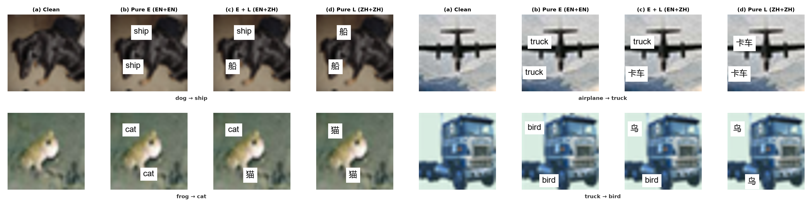
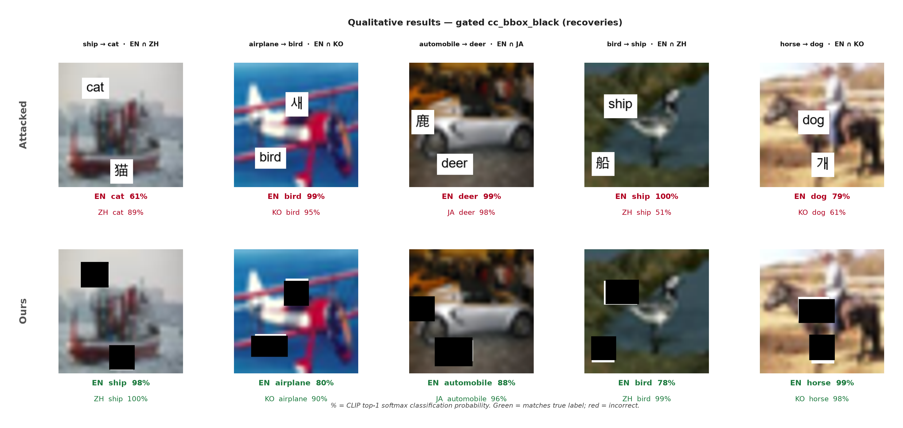
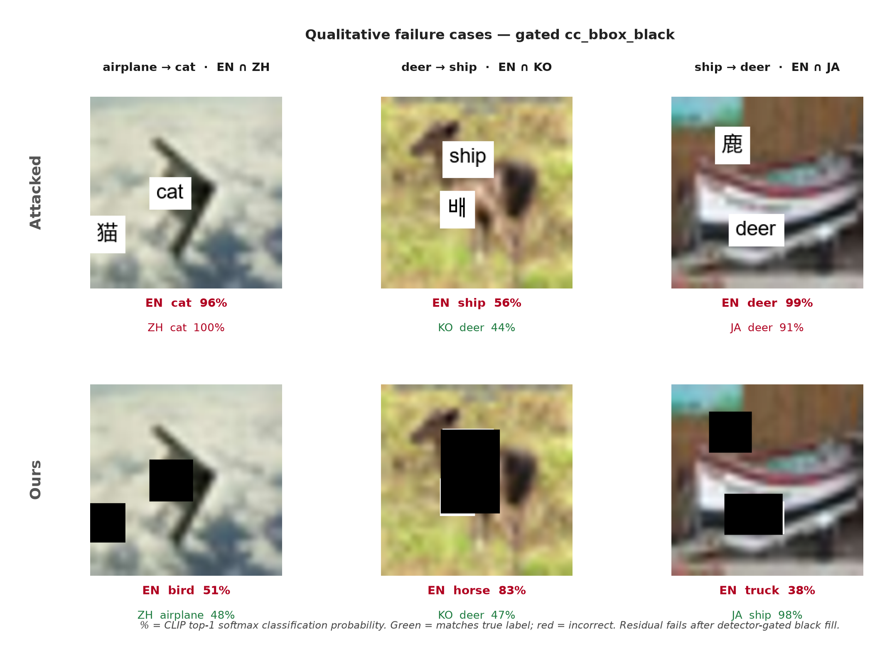
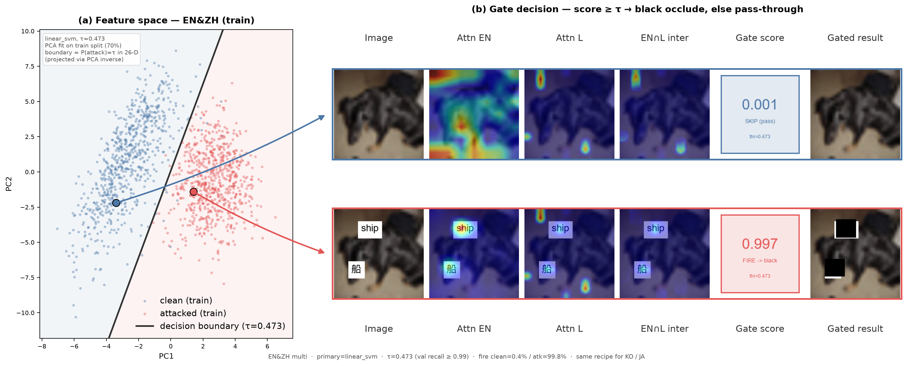

# Paper Figures & Writing Notes

**Companion to:** `[paper_draft.md](paper_draft.md)`  
**Purpose:** Track which paper figures are done, embed each finished figure under its section, and keep writing-style notes in one place.

**How to use:** When a figure is ready for the paper, mark its checkbox `[x]` and paste the image (or path) in the **Figure** slot directly below that item.

---

## Figures checklist

### 1. Introduction figure — typographic attack → occlusion → recovery

- [x] **Introduction figure**

**Intent:** Show a typographic attack, the occluded (defended) image, and EN CLIP class probabilities (true vs sticker) on both images — model-paper style.

**Paper home:** §1 Introduction (teaser / motivation).

**Assets:**

| Panel               | Path                                                                               |
| ------------------- | ---------------------------------------------------------------------------------- |
| Attacked            | `[figures/intro/1_attacked.png](figures/intro/1_attacked.png)`                     |
| Occluded            | `[figures/intro/2_occluded.png](figures/intro/2_occluded.png)`                     |
| Class distribution  | `[figures/intro/3_class_distribution.png](figures/intro/3_class_distribution.png)` |
| Composite (a)(b)(c) | `[figures/intro/intro_figure.png](figures/intro/intro_figure.png)`                 |
| Script              | `[figures/intro/make_intro_figures.py](figures/intro/make_intro_figures.py)`       |

**Example (EN CLIP, dog ← ship E+L):** attacked dog **2.5%** / ship **97.5%**; after black occlusion dog **99.3%** / ship **0.7%** (2-class softmax).

**Figure:**

Intro figure

*Figure 1 idea. (a) Dual-box typographic attack (E+L). (b) Solid black occlusion over sticker boxes. (c) EN CLIP 2-class probabilities on attacked vs occluded inputs (CLIP vs CLIP + Ours).*

---

### 2. Method figure

- [x] **Method figure**

**Intent:** Pipeline overview — attacked image → Attn-last EN ∩ L → intersection → `cc_bbox` → black fill → gated reclassification.

**Paper home:** §2 Method / Materials.

**Assets:**

| Panel                  | Path                                                                           |
| ---------------------- | ------------------------------------------------------------------------------ |
| Method overview (a)(b) | `[figures/method/method_overview.png](figures/method/method_overview.png)`     |
| Script                 | `[figures/method/make_method_figure.py](figures/method/make_method_figure.py)` |

**Related qualitative stage strip:** `[../lib/notebooks/four_lang_cc_bbox_blur/results/pipeline_steps.png](../lib/notebooks/four_lang_cc_bbox_blur/results/pipeline_steps.png)` (blur-era; keep as optional stage grid).

**Figure:**

Method overview

*Figure 2. Method overview. CLIP image encoders stay frozen. (a) Attn-last maps from EN and partner L are intersected, thresholded, and shaped with* `cc_bbox`*. (b) An Attn-shape attack detector gates occlusion: black fill on attacked images; skip on clean (Clean Δ ≈ 0). L = ZH shown; same recipe for KO / JA.*

---

### 3. Dataset figure

- [x] **Dataset figure**

**Intent:** Show the evaluation setup — CIFAR-10 balanced sample, dual-box typographic attacks (Pure E / E+L / Pure L), languages EN / ZH / KO / JA, clean vs attacked mix if relevant (e.g. MIXED2000).

**Paper home:** §2.1 Dataset and evaluation protocol.

**Assets:**

| Panel                  | Path                                                                         |
| ---------------------- | ---------------------------------------------------------------------------- |
| Clean (dog row)        | `[figures/dataset/1_clean.png](figures/dataset/1_clean.png)`                 |
| Pure E (dog row)       | `[figures/dataset/2_pure_e.png](figures/dataset/2_pure_e.png)`               |
| E+L (dog row)          | `[figures/dataset/3_e_plus_l.png](figures/dataset/3_e_plus_l.png)`           |
| Pure L (dog row)       | `[figures/dataset/4_pure_l.png](figures/dataset/4_pure_l.png)`               |
| Composite (4×4)        | `[figures/dataset/dataset_figure.png](figures/dataset/dataset_figure.png)` |
| Picks                  | `[figures/dataset/picks.json](figures/dataset/picks.json)`                   |
| Script                 | `[figures/dataset/make_dataset_figure.py](figures/dataset/make_dataset_figure.py)` |

**Rows:** dog→ship · airplane→truck · frog→cat · truck→bird (distinct frozen `attack_pos` per row). Partner L = ZH shown.

**Figure:**

*Figure 3. Evaluation protocol. Columns: (a) clean CIFAR-10 samples from the balanced n=1000 set; (b–d) dual-box typographic attacks Pure E / E+L / Pure L on the same image and frozen `attack_pos` (partner L = ZH shown; identical geometry for KO / JA). Rows show four classes with different sticker placements. MIXED2000 scores the same 1000 indices once clean and once attacked (equal weight).*

---

### 4. Qualitative results

- [x] **Qualitative results figure**

**Intent:** Side-by-side examples — clean / attacked / defended images with predicted labels (success and failure cases). Prefer all three partners (ZH, KO, JA) or a clear multi-panel layout.

**Paper home:** §3 Results (qualitative subsection).

**Assets:**

| Panel                         | Path                                                                                               |
| ----------------------------- | -------------------------------------------------------------------------------------------------- |
| Recoveries (2×5)              | `[figures/qualitative/qualitative_figure.png](figures/qualitative/qualitative_figure.png)`         |
| Failures (2×3)                | `[figures/qualitative/qualitative_failures.png](figures/qualitative/qualitative_failures.png)`     |
| Picks (indices / preds)       | `[figures/qualitative/picks.json](figures/qualitative/picks.json)`                                 |
| Script                        | `[figures/qualitative/make_qualitative_figure.py](figures/qualitative/make_qualitative_figure.py)` |

**Recoveries (5):** ZH ship→cat · KO airplane→bird · JA automobile→deer · ZH bird→ship · KO horse→dog (both stickers well covered; EN+L fooled then both recover). Dog-true examples skipped (intro/method).  
**Failures:** ZH airplane→cat · KO deer→ship · JA ship→deer (gate-on residual EN fails).

**Figures:**

*Figure 4a. Qualitative recoveries of gated `cc_bbox_black` on dual-box E+L attacks. Top: undefended; bottom: Ours. Five examples spanning ZH / KO / JA. % = CLIP top-1 softmax classification probability; green = correct, red = incorrect.*

*Figure 4b. Qualitative failure cases after detector-gated black fill (one residual fail per partner). Same label convention as Figure 4a.*

---

### 5. Gating mechanism — decision boundaries

- [x] **Gating / decision-boundary figure**

**Intent:** Explain how the Attn-last attack detector decides when to occlude — feature space / decision boundary (PCA, t-SNE, ROC, or process diagram), not only a black-box “gate on/off.”

**Paper home:** §2 Method (detector / gate) and/or §3 gated results.

**Assets:**

| Panel                        | Path                                                                               |
| ---------------------------- | ---------------------------------------------------------------------------------- |
| Composite (a)(b)(c)(d)       | `[figures/gating/gating_figure.png](figures/gating/gating_figure.png)`             |
| Script                       | `[figures/gating/make_gating_figure.py](figures/gating/make_gating_figure.py)`     |
| Summary                      | `[figures/gating/gating_figure_summary.json](figures/gating/gating_figure_summary.json)` |
| Draft per-lang panels (ref.) | `[figures/attack_detector/](figures/attack_detector/)` (PCA, t-SNE, ROC/CM, process) |

**Figure:**

*Figure 5. How the gating decision boundary is made (EN&ZH shown; same recipe for KO / JA). (a) Train-split 26-D Attn-last shape features (PCA view) with the gate decision boundary at P(attack)=τ (calibrated linear SVM; τ = highest val threshold with attack recall ≥ 0.99). (b) Example trajectories from each cluster: Attn EN / L / ∩ → gate score → SKIP (pass-through) on clean, or FIRE (`cc_bbox_black`) on attack.*

---

## Writing notes

### Paper model (structure / tone)

- Example paper (similar vision–language / defense style): [arxiv.org/pdf/2304.04512](https://arxiv.org/pdf/2304.04512)
- Use that PDF as a **layout and clarity** reference (figure placement, method diagrams, result presentation) while keeping our claims and protocol.

### Tables

- Make tables **easy to scan** — prefer clear column headers over dense abbreviations without a legend.
- Column headers should be self-explanatory (or defined once in the caption / a short note).
- Prefer one idea per table; split leaderboards vs ablations when mixing hurts readability.
- Numbers: consistent decimals; highlight the main metric (e.g. MIXED2000, Clean Δ) in caption, not with decorative formatting overload.
- Source tables for the draft: `[tables_index.md](tables_index.md)` (paper Tables 1–4), `[4_lang_table.md](4_lang_table.md)`, `[ablation_study.md](ablation_study.md)`.

### Citation / style

- **APA format** for in-text citations and the reference list.
- Keep figure captions informative but short (what the reader should see + protocol cue if needed).
- Figure numbering should match paper section order once figures are locked in.

---

## Status snapshot

| #   | Figure                                               | Done? |
| --- | ---------------------------------------------------- | ----- |
| 1   | Introduction (attack / occlude / class distribution) | [x]   |
| 2   | Method                                               | [x]   |
| 3   | Dataset                                              | [x]   |
| 4   | Qualitative results                                  | [x]   |
| 5   | Gating decision boundaries                           | [x]   |

**Figures frozen for draft (2026-07-30):** All five paper figures above use production **black** fill (not blur-era). Optional extra asset [`figures/gating/detector_pipeline.png`](figures/gating/detector_pipeline.png) is **out of the main paper set** (keep as appendix / slide material only). Tables locked in [`tables_index.md`](tables_index.md).

