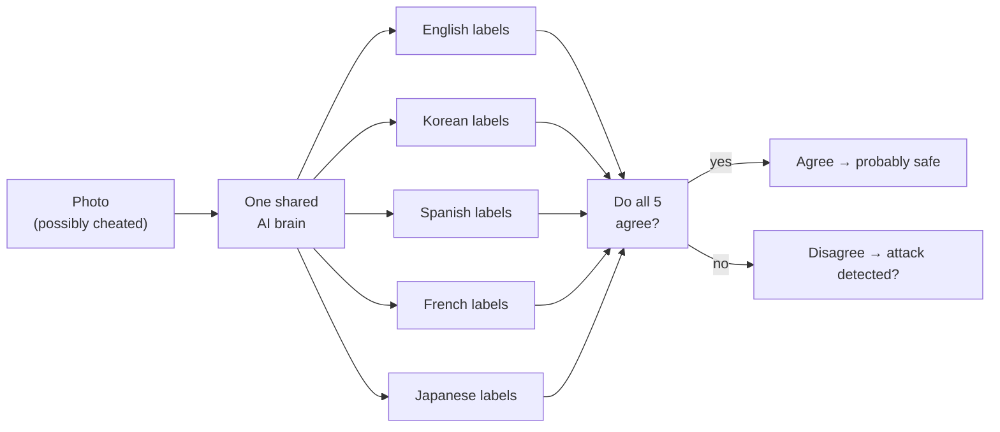

# Research Goal: Does Using Many Languages Make an AI Harder to Fool?

## The Big Picture

Modern AI models can look at a photo and label it — "that's a cat" — without ever being
trained on that specific example. They do this by comparing the image to written
descriptions ("a photo of a cat") and picking the best match. But these systems have a
known weakness: someone can make tiny, invisible changes to a photo that completely fool
the AI, even though the image looks identical to a human eye. These are called
**adversarial attacks**.

A research paper proposed a clever defence: use the same AI in **five languages at once**
(English, Korean, Spanish, French, Japanese). The idea was that a cheat designed to fool
the English labels would leave the Korean and Spanish labels unaffected — so the
languages would *disagree*, and that disagreement could be used to detect or fix the
attack. **This notebook tests whether that idea actually works.**

---

## How the System Works

Think of it like five translators who all read the same textbook. They should all agree
on what's in a photo. If one gets confused by a cheat, the others should catch it.

---

## What the Experiment Tests

- **Q1 — Does cheating in English stay in English?** If an attack is built to fool only
  the English labels, do Korean, Spanish, French, and Japanese stay correct?
- **Q2 — Can disagreement spot an attack?** If the languages start disagreeing, can we
  use that as a warning signal?
- **Q3 — Can a "cleaner" undo the damage?** A small neural network is trained to repair
  cheated images. Does it restore the correct answer — even when the attacker knows the
  cleaner is there?

---

## What Was Found

| Question | What we hoped | What actually happened |
|---|---|---|
| Q1 — Does cheating in English stay local? | Other languages stay correct | All 5 languages collapse to **0% accuracy** at the same time |
| Q2 — Does disagreement detect attacks? | Disagreement rises, alarm fires | Languages agree *more* under attack — detector performs **worse than a coin flip** |
| Q3 — Does the cleaner work? | Repaired images score correctly | Non-adaptive: partial recovery. Adaptive (attacker fights back): **0% accuracy** |

---

## Why This Happens (the one-sentence explanation)

All five languages share a **single AI brain** for processing images, so any invisible
change to a photo shifts that one brain — and all five language scores move together,
making a language-specific cheat geometrically impossible.

---

## What This Means

The defence's core assumption — that languages would disagree under attack — does not
hold for the type of AI it was designed for. The experiment shows this is not a
coincidence or a flaw in the attack; it is a mathematical property of the architecture.
As long as one shared image-processing brain is used for all languages, the proposed
defence cannot work in its current form.

> **Notebook:** `lib/notebooks/updated_multilingual_consensus_colab.ipynb`
> **Dataset:** CIFAR-10 (10 object classes, 500 test images, 300 attacked)
> **Model:** multilingual CLIP (`xlm-roberta-base-ViT-B-32`, trained on LAION-5B)
