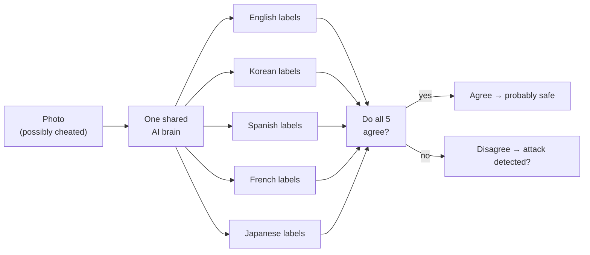
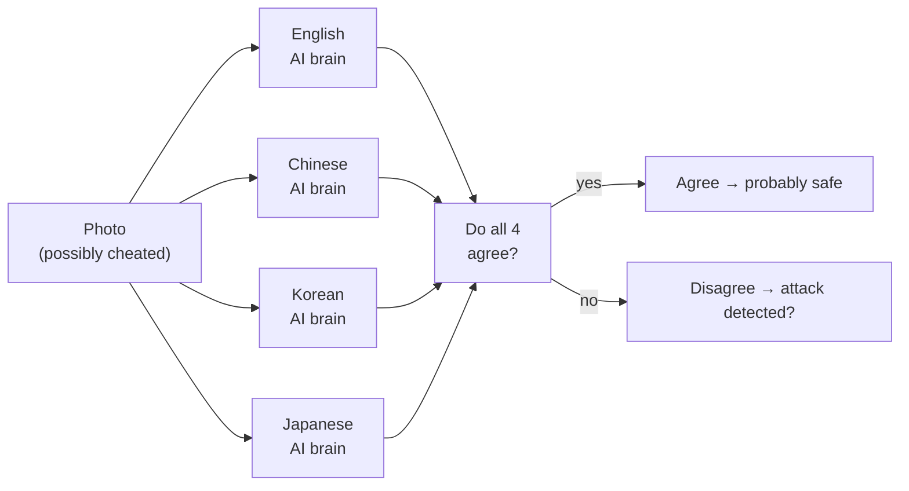

# Research Goal: Does Using Many Languages Make an AI Harder to Fool?

## The Big Picture

Modern AI models can look at a photo and label it — "that's a cat" — without ever being
trained on that specific example. They do this by comparing the image to written
descriptions ("a photo of a cat") and picking the best match. But these systems have a
known weakness: someone can make tiny, invisible changes to a photo that completely fool
the AI, even though the image looks identical to a human eye. These are called
**adversarial attacks**.

A research paper proposed a clever defence: use the same AI in **five languages at once**
(English, Korean, Spanish, French, Japanese). The idea was that a cheat designed to fool
the English labels would leave the Korean and Spanish labels unaffected — so the
languages would *disagree*, and that disagreement could be used to detect or fix the
attack. **This project tests whether that idea actually works — and what happens when you
change the architecture.**

---

## Two Experiments

### Thread A — One Shared AI Brain (Original Defence)

Think of it like five translators who all read the same textbook. They should all agree
on what's in a photo. If one gets confused by a cheat, the others should catch it.

### Thread B — Four Separate AI Brains

What if each language had its own independently trained AI? A cheat optimised against
the English brain might not fool the Chinese brain — because they learned from different
training data and have different internal representations.

---

## What the Experiments Test

**Thread A (shared brain, invisible pixel-level cheating):**
- **Q1 — Does cheating in English stay in English?** If an attack is built to fool only the English labels, do the other languages stay correct?
- **Q2 — Can disagreement spot an attack?** If the languages start disagreeing, can we use that as a warning signal?
- **Q3 — Can a "cleaner" undo the damage?** A small neural network is trained to repair cheated images.

**Thread B (separate brains, visible text overlay cheating):**
- **Q1 — Does an English word on the image fool all four separate models?** Or do non-English models ignore it?
- **Q2 — Can counting disagreements detect the attack?** Do the four separate models disagree more on attacked images than clean ones?

---

## What Was Found

| Question | What we hoped | What actually happened |
|---|---|---|
| **Thread A** | | |
| Q1 — Does cheating in English stay local? | Other languages stay correct | All 5 languages collapse to **0% accuracy** at the same time |
| Q2 — Does disagreement detect attacks? | Disagreement rises, alarm fires | Languages agree *more* under attack — detector performs **worse than a coin flip** |
| Q3 — Does the cleaner work? | Repaired images score correctly | Non-adaptive: partial recovery. Adaptive (attacker fights back): **0% accuracy** |
| **Thread B** | | |
| Q1 — Does an English word fool all four separate models? | Non-English models unaffected | All 4 models are fooled, but Chinese model stays at **33% accuracy** while others drop to 5–14% |
| Q2 — Can disagreement detect the attack? | Disagreement rises, alarm fires | **Yes** — models disagree significantly more on attacked images (AUC = **0.574**, modest but above chance) |

---

## Why Thread A Fails (the one-sentence explanation)

All five languages share a **single AI brain** for processing images, so any invisible
change to a photo shifts that one brain — and all five language scores move together,
making a language-specific cheat geometrically impossible.

## Why Thread B Partly Works

Each language uses a **completely separate AI** trained on different data. An English text
overlay exploits patterns learned by models trained on English-captioned images. The
Chinese AI was trained on Chinese-captioned data and is less sensitive to Latin-script
text — so it is harder (but not impossible) to fool with English words, and its
disagreement with the other models is a real detection signal.

---

## Thread A Details

> **Notebook:** `lib/notebooks/updated_multilingual_consensus_colab.ipynb`
> **Dataset:** CIFAR-10 (10 object classes)
> **Model:** multilingual CLIP (`xlm-roberta-base-ViT-B-32`, trained on LAION-5B)
> **Best Q2 modification:** Dual encoder (Experiment G) — first to exceed 50% adversarial retention at moderate attack budgets

## Thread B Details

> **Notebook:** `lib/notebooks/cifar10_typographic_attack_confusion.ipynb`
> **Dataset:** CIFAR-10 (200 test images)
> **Models:** 4 independent CLIPs — OpenAI EN, Chinese CLIP (ZH), Bingsu KO, llm-jp JA
> **Attack:** typographic — write the adversarial class name as text on the image (no gradient computation)
